# Scenario for Blender: UI style guide

The N-panel is drawn with Blender's `UILayout`, so it wears the user's Blender theme (colours, corner radius, fonts). We cannot change those; what we control is structure, spacing, wording and icons. This guide keeps the whole plugin coherent. The floating composer is custom gpu/blf drawing and mirrors the same language.

## Project scope in Preferences

Place **Project ID (optional)** in the Account box after the credential fields,
with **Blank uses the API key's default scope** below it. The same explicit choice
applies to saved and environment credentials. Do not populate a project from the
first discovery result. A changed selection clears prices and connection status;
new generation requires a fresh quote. Drawing reads the selection only.

Installed tests cover scoped SDK quotes, stale approvals and callback rejection,
local saved-job isolation, normalized-equivalent edits and invalid IDs. The exact
candidate ZIP `3bd0a4b03ec9afe792e9bc36ed8805f1c5df06c38dccc46d5e98bdea2d831764`
passes 1,065 installed tests on each macOS arm64 Blender 5.0.1, 5.1.2 and 5.2.1
(two Windows-only skips per run).

Native mouse/keyboard input and screenshot inspection pass on macOS 27.0.1 arm64,
Blender 5.1.2, using that unchanged ZIP from source `29de2245b22e64bde6f1713797fd40d3eeb844c9`
in an isolated offline profile. The fixture contains synthetic credentials and
one saved job per default/project scope. Native edits exercise blank → project A
→ project B → project A → blank; a store observation confirms only the
selected scope's saved job is returned. Enter and Tab commit edits, Tab moves
focus to the next field, Escape preserves the previous value, and surrounding
whitespace selects the same normalized scope. A URL entered as the project ID
fails local validation with no catalog and no silent default fallback.

Changing the selection clears the fixture's prior connection status. Switching
to Environment keeps the explicit project field and selection; clearing it
returns to the default saved job. After closing Preferences, native viewport
selection, wheel zoom and the front-view key work. Captures show the complete
field label and helper text without overlap, at the tested default scale and
window size. The installed package and archive remain byte-identical, no Python
socket connection/bind attempts occur, and the normal Blender profile is unchanged.
Two preliminary input runs exited through an automation select-all shortcut;
the completed run uses Home/Shift-End selection instead.

These synthetic checks do not establish live project permissions, other OS/DPI
interaction, paid generation, or integrated release acceptance under #68.

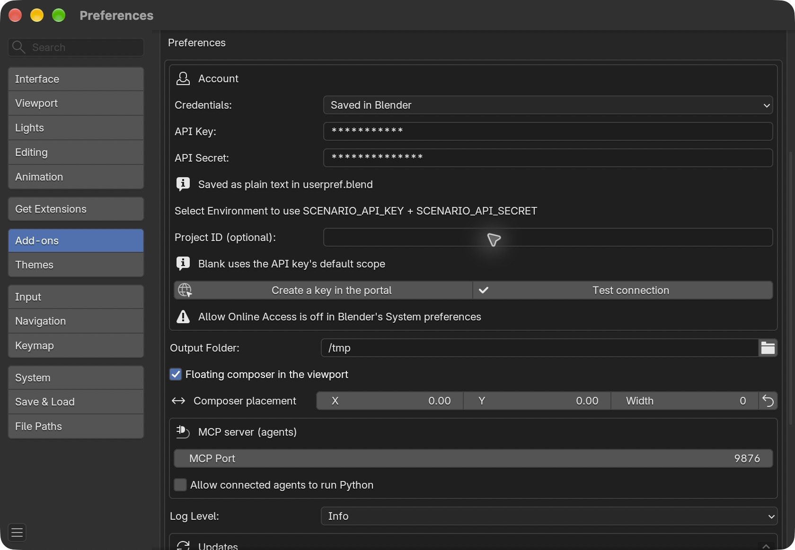
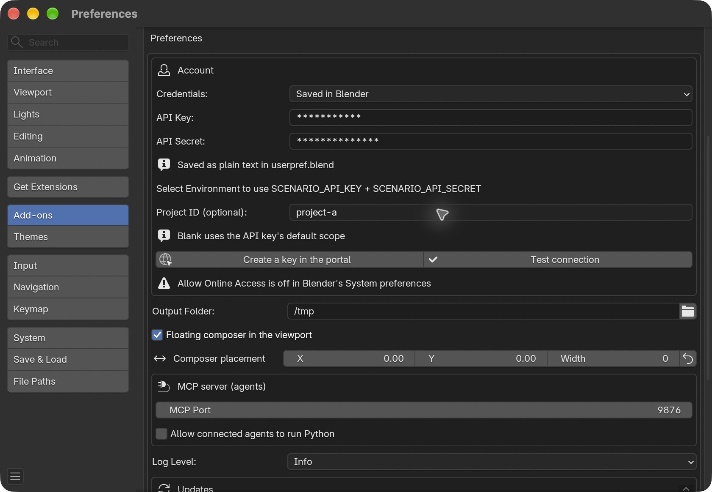
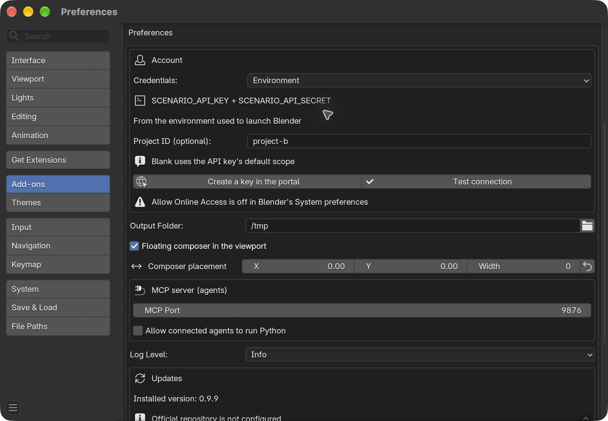
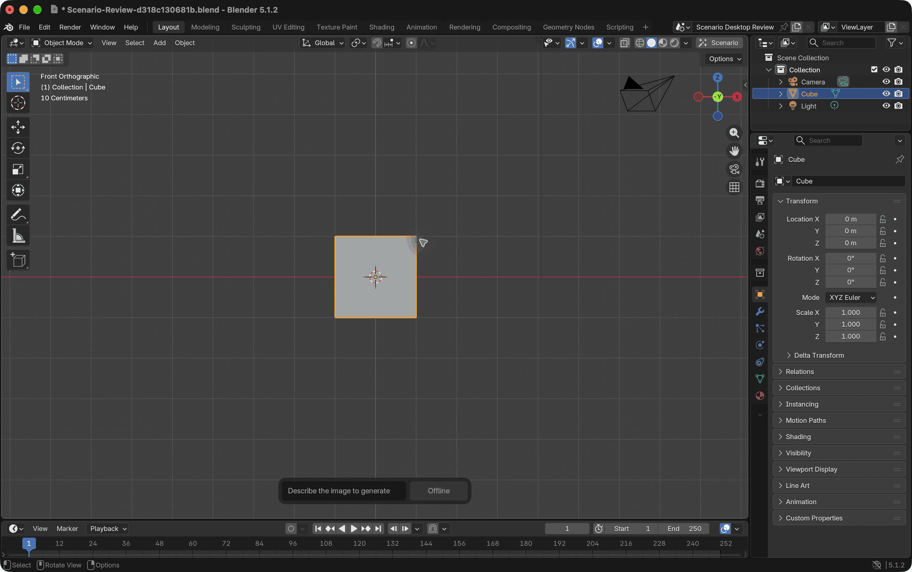

## Tabs and segmented choices

A row of mutually exclusive choices (lane tabs, picker modality tabs and category chips, Edit 3D tasks) is a **continuous segmented control**: cells touch (no gaps), each takes an equal share of the full width, and the icon sits next to its label with the pair centred in the cell.

- Use `panels.equal_segments(row, struct, prop, values)` (or `panels.draw_enum_tabs(layout, struct, prop, rows)` for multiple rows). It draws each value with `prop_enum` inside an `align=True` row (Blender merges the borders) and forces equal widths with a chain of even `split()`s.
- Never use `prop(..., expand=True)` for these (it pins the icon to the left edge) or `grid_flow` (it leaves gaps).

## Sections

Each group of controls is a `layout.box()` with a one-line header: `box.label(text="Title", icon=...)`. Order inside a lane: Model, Prompt, References, Settings, then the Generate button. Put `layout.separator(factor=0.5)` between the tabs and the form, and above the Generate button.

Every section header carries an icon so the panel reads as a stack of peers: `Model` (`NODE_MATERIAL`), `Clip to render` (`RENDER_ANIMATION`), `Camera path` (`CAMERA_DATA`), `Rendering Style` (`BRUSH_DATA`), `Settings` (`PREFERENCES`). Sections do not collapse (no chevron): a header is a static label, not a toggle, so the form is always visible.

## Buttons

- The **Generate** button is the one primary action: `row.scale_y = 1.5`, icon `PLAY`, and it always shows the live price (`Generate (15 CU)` / `Generate (from N CU)` / `Generate (estimating...)`).
- Icon-only buttons keep Blender's fixed size; a button that must fill a row carries a short label (Blender never stretches an icon-only button). The three prompt tools are `New`, `Rewrite`, `Translate`.
- Destructive actions (`Delete`, `Clear path`) ask for confirmation (`invoke_confirm`).

When Blender online access is disabled, the composer shows **Offline** on its
disabled generation button and **Online access disabled** instead of a loading
message when no model is available. Pending edits retain their estimate request
until online access and credentials are available. The generation controls
remain disabled until a ready quote handle exists; the submission path still
rechecks its exact inputs, origin and approval. A model list is only described as
loading while a catalog request is active.

## The model chooser

A `Model` section (a box with a `NODE_MATERIAL` header, like the others) holds a wide button (icon + model name) that opens the picker, with the native dropdown as a small fallback on the right. Its one-line description belongs in the picker, not the panel.

A form is described as loading its model only while that description read is
pending. A failed read shows its sanitized reason in the form and composer note,
with **Retry loading model** repeating the same background read. A later read,
success, another model or changed credentials clear it; drawing never retries.
Online, a form with neither a pending read nor a failure recorded this session,
such as one in a reopened file, offers the same retry instead of a saved error.
A model-load error saved with the file is not drawn in the form, below Generate
or in the composer note unless this session recorded it. With online access disabled, the form says so and offers no retry. An MCP call
needing the description, such as `model_schema`, reports a recorded failure once
while it starts the next read.

## Duration and Match timeline

The video model's `Duration (cost)` drives the camera-path duration for **Render
Video** when **Match timeline** is on. The planner tells users to build the path
before capture. Capture uses the displayed preview/scene range without implicit
padding or trimming. Uploaded clips remain unchanged when timeline/model settings
change. The base **Video** lane keeps the reverse setting direction: the model's
duration follows the scene frame range through `generation.apply_match_timeline`.

## Reference inputs

A file input's add options match its kind (`props.addable_sources_for`): a **3D** input offers a model file and **Upload selected mesh** when a mesh is selected; an **image** input offers Upload plus the viewport/camera stills and the render result; a **video** input offers Upload plus the clip captures. Never offer a source that produces the wrong asset type (no image capture on a 3D character input).

A selected mesh appears as a candidate for each empty **3D** input. **Upload
selected mesh** explicitly exports the selection as one GLB and uploads that
snapshot. A pending or completed explicit reference replaces the pinned candidate;
do not offer a second mesh upload into an occupied slot. Edit 3D still requires
an input mesh. Later scene edits do not change an already uploaded snapshot.

Across generation forms, attaching a local file does not send it. Image inputs
also support explicit viewport, camera and Render Result snapshots. Video inputs
support viewport/camera clips over the preview range, or scene range when no
preview is enabled, without implicit padding or audio. Grey clay capture is
applied when selected. Do not offer an image Render Result for a video input.
The separate **Upload reference** button sends an immutable snapshot before a
final price can be requested. Show upload progress and **Inspect uploads** when
review is needed. Do not offer automatic retry for uncertain uploads or mutate
the reference during drawing. The maintenance pump attaches a completed asset
only to the unchanged original scene, lane, model, input type and reference slot,
then invalidates the old price. A removed/edited slot must never receive a late upload result.
Transient timer context without the originating scene pauses attachment. Local
validation rejected before task admission permits correcting and retrying the input;
uncertain admitted work retains its duplicate-upload guard.

**Inspect uploads** offers explicit known-status refresh, unclaimed preparation
cancellation and finished staging cleanup; cancellation/cleanup require confirmation.
**Use saved upload** and an input's **Saved uploads** open the same paginated
view. Offer attachment only for imported uploads matching the input kind
(image, audio, video or 3D). Attaching one needs a separate confirmation of its
scene, lane, model, input and reference destination. A changed destination must
be reviewed again. Pending or uncertain marked uploads block generation so the
prototype path cannot upload the same file a second time. Recheck that destination
on confirmation, keep drawing read-only and invalidate the prior generation price after attachment.

Render forms show **Capture and upload scene** in their scene/clip section, with
that slot's progress, inspection and removal controls. Render Video's optional
first frame always exposes a file field and native folder picker, followed by a
separate **Upload first frame** action after choosing an image. Do not draw these slots
again as style references. The scene snapshot precedes styles; a first frame
precedes other images in the same array. Disabled first frames are omitted without
canceling or deleting their upload. Changed first-frame paths require explicit
replacement. Result reuse must not silently replace a role-tagged single-file
scene or first-frame slot; require explicit removal first. Changing the path or automatic Spark option invalidates the price.
An empty look with automatic Spark enabled blocks quoting; display its unavailable
status until separate Spark approval is integrated. Drawing remains read-only.

## Generations

**Reload parameters** is available only when a result records a supported
generation lane or kind. Film tasks and generic jobs without that information
keep their saved-result controls; they must not overwrite the Image form.

**Remove background** prepares the Image form and never submits directly. Its
message tells users to upload the reference, review the price and choose
**Generate**. Validate the file and available model/schema before replacing the
form; reset the old prompt/settings/references and invalidate the previous quote.
Existing jobs and admitted uploads keep their own lifetime and origin guards.

Each result collapses on its own; the panel header has a **Collapse all / Expand all** toggle. A failed result shows a red error control in its header whose tooltip is the whole message (with the Error ID) and which opens the full text with a Copy button on click (a `description()`-driven operator, since Blender labels have no per-instance tooltip). Never truncate an error to a single clipped line as the only way to read it. The prompt box carries a trash button that deletes its text, greyed out when empty.

## Wording

- Verbs on buttons say exactly what happens: `Generate`, `Add to scene`, `Use as reference`, `Refresh cloud`, `Save for recovery`.
- Singular/plural is correct: `1 Job` / `3 Jobs`, `1 marker` / `3 markers`.
- Prompt helpers request a free exact server price first. Show the formatted CU amount below the tools with a separate action-labelled approval button. Do not use a fixed price or a tooltip as spending authorization. Keep pending/error text readable; an uncertain job offers inspection, never automatic resubmission.
- CU labels follow the web generation indicator: up to three decimal places,
  no trailing zeros, and thousands separators below 10,000; at or above 10,000,
  use K/M/B/T with three significant digits (`0.123 CU`, `1,234.568 CU`,
  `12.3K CU`). This is display formatting only. Keep the original server decimal
  in the quote, approval action and saved job; never reconstruct it from the label.
- No internal names in user text (a person sees `Reference Images`, not `referenceImages`).

## Tooltips

Every operator sets `bl_description`: one sentence, action first, the cost when it spends credits. Blender adds the trailing period.

## Icons

Modality icons (image, video, audio, 3d) are Scenario's own PNGs (`scenario/icons/`, loaded by `blender/icons.py`, `icons.kwargs(name)` with a built-in fallback for headless). Section and action icons are Blender built-ins chosen to read at a glance.

## Status messages

`runtime.set_message(...)` lines are transient: `runtime.message_visible()` hides them after 8 s so a stale line never reads as current.

## Experimental status

Film and capabilities whose result handling is not accepted keep an explicit
experimental status. It describes acceptance only: it never hides or blocks a
model, task, estimate or approval. Use the built-in `EXPERIMENTAL` icon and
short wording. Drawing reads the status and changes nothing.

- The **Film** sidebar panel shows **Experimental** on the right of its header,
  visible while collapsed and above its nested panels. Studio reuses panel bodies
  only, so it draws the same line on every Film page.
- For models offering `audio2txt` or `video23d`, the model picker's
  highlighted-model box and the persistent **Model** row show a read-only
  **Experimental: speech-to-text not accepted** or
  **Experimental: video-to-motion not accepted** label. The Model row is shared
  by the sidebar and Studio lanes, Render Image/Video and Edit 3D; the viewport
  composer's model chip does not show it. These models can be submitted and
  results stay in saved jobs; provider behavior and result handling are not
  accepted. Generic Import is offered by file type, so a returned GLB or media
  file may import, but motion and transcription handling is not accepted ([#190](https://github.com/scenario-labs/blender-plugin/issues/190)).

Installed native tests assert the registered header preset draw call, the Studio
line, the picker status and the Model row status. Physical placement in a desktop
session has not been captured.

## Composer placement

With region overlap, Blender draws the 3D View toolbar and sidebar over the
viewport's main region. The floating composer therefore places itself in the
span those regions leave uncovered, not in the whole region. Each draw and each
pointer event measures every visible toolbar or sidebar region whose x-range
overlaps the main region, from its actual position, so a flipped sidebar counts
on the left. Without region overlap they sit beside the viewport and change
nothing.

- The pill and card start at the bottom centre of that span.
- A saved or resized width shrinks to the span minus margins. A span too small
  for the minimum card drops the margins, then narrows the card down to the pill
  minimum of 200 px times the UI scale. Below a span that wide, the card keeps
  that width from the toolbar edge and runs under the sidebar; without an
  overlapping toolbar it ends at the sidebar edge instead.
- A saved or dragged offset stops at a toolbar or sidebar edge, so Generate and
  the minus button stay clickable. A bare viewport edge keeps the earlier rule:
  at least 40 px of a dragged composer stay visible at 1x UI scale (the minimum
  scales with it).
- A move or resize starts from the placement as drawn. A composer parked past an
  edge before the sidebar opened therefore follows the pointer at once instead of
  waiting for it to cover the hidden excess. Releasing a move stores the drawn
  offset, and releasing a resize also stores the drawn width; Esc during the drag
  restores the saved placement.
- Drawing and hit testing share one layout, so every control is drawn exactly
  where a click reaches it.

Installed tests cover these rules with synthetic overlapping regions, including
the modal's move, resize and release handlers with the sidebar opened and
closed, and the background viewport's real regions. Physical desktop drags and
screenshots with the sidebar open remain a separate acceptance check under #66.

## What Blender cannot do (so we do not fake it)

- Text is left, centre or right aligned, never justified.
- A panel text field is single line; a taller prompt box grows the field, it does not wrap for editing.
- Dialogs and the sidebar cannot take the composer's custom colours; their layout follows this guide, their palette is the Blender theme's.

## Prompt approval interaction evidence

These earlier offline Blender 5.1.2 macOS arm64 captures show the price before
approval and the delivered text afterward. The model, price and transport are
synthetic; they are not current service pricing or live generation evidence.
They predate the shorter CU labels described above. The price request made no
submission; the separate approval produced exactly one.
Native field editing, focus transfer and viewport selection/zoom were exercised.
Computer-control focus guards interrupted some typing attempts; this does not
establish exhaustive keyboard or clipboard acceptance. The isolated run exited
cleanly and left the normal profile unchanged. A disposable Blender copy used a
distinct application identifier and local development signature to distinguish
its window; the extension ZIP was unchanged. Supported-version packaged tests
remain separate from this single-version desktop check and unresolved #263.

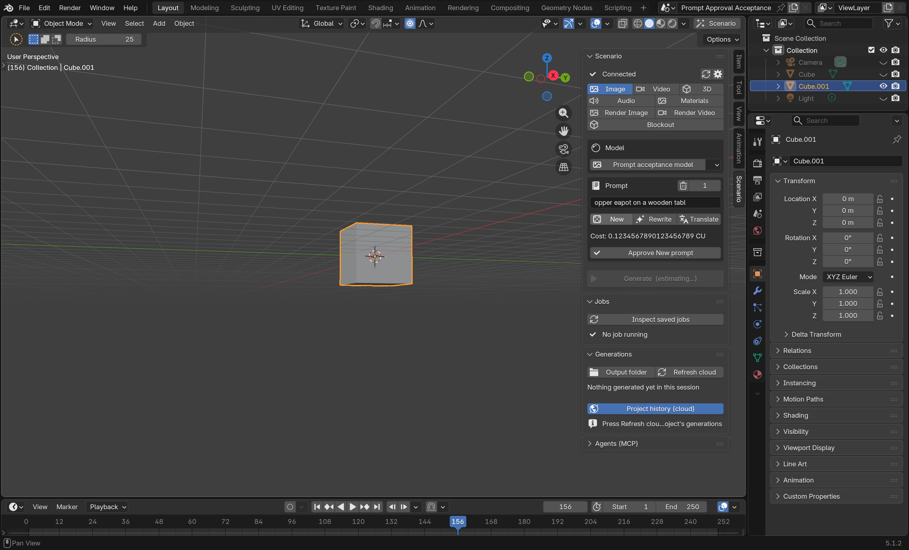

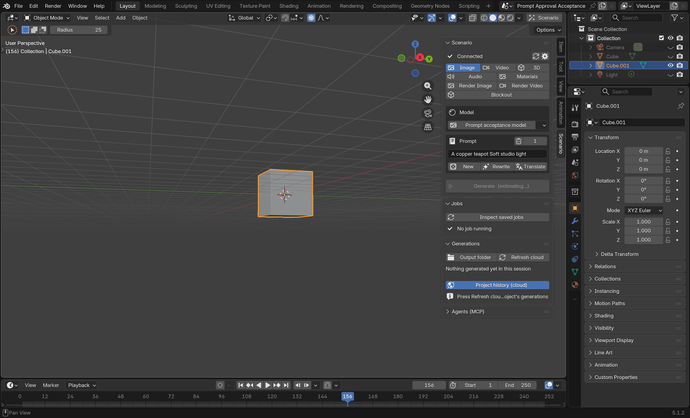

Render forms label the empty-look option **Prepare look with Prompt Spark**.
Its price and approval remain inside the Look section, separate from Generate.
The following offline Blender 5.1.2 macOS arm64 fixture shows that boundary before
and after one synthetic approval. Native focus, a keyboard edit and viewport
selection/zoom were checked; the run exited cleanly with the normal profile
unchanged. As above, the test-only Blender app identifier/signature differed,
while the candidate extension ZIP was unchanged. This is not live render evidence.

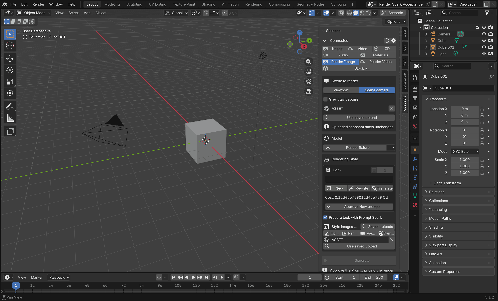

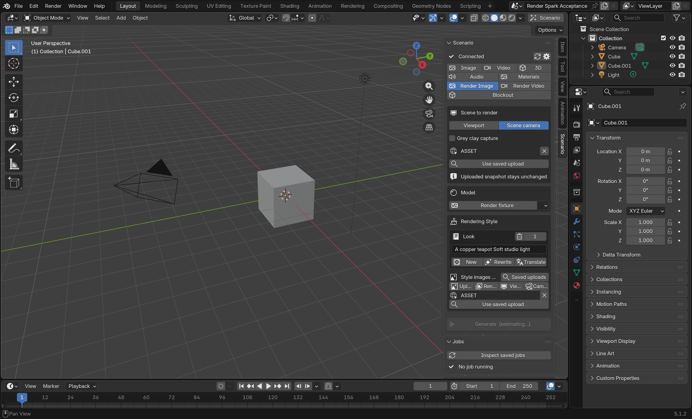

## Saved video and audio confirmation

Shared saved jobs show a separate **Add video/audio strip (N)** action for each
supported result. Its confirmation states the destination scene, exact frame,
one-strip operation, unused channel, unchanged timing and local-file dependency;
video additionally states that embedded audio is omitted. Cancel discards the
approval. Drawing reads the prepared fields without accessing files or changing
jobs. A changed scene, frame, record or credential context requires new review.

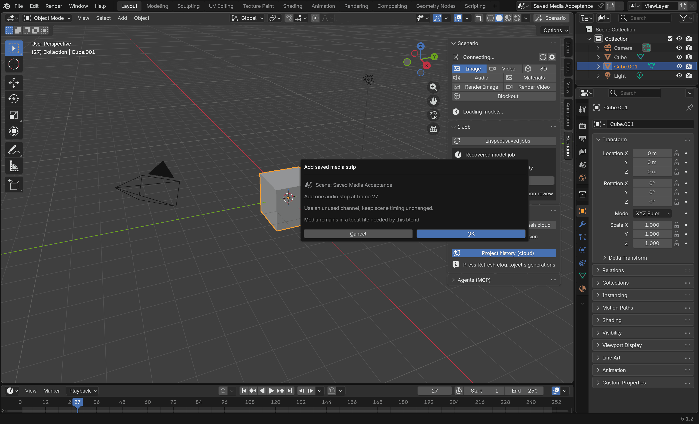

Offline desktop acceptance used the exact packaged ZIP
`3d831dc70efe10e0e5c2cf377e2044015e49f32814ed2da6b8649822ff76a2d2`
in an isolated Blender 5.1.2 profile on macOS arm64. The fixture began with one
mock generation and a saved WAV; mouse approval inserted one sound strip at
frame 27 without another mock submission or request. Viewport selection/zoom,
editor switching, scene selection and the Home key in the Sequencer worked.
Blender exited cleanly and the normal profile fingerprint was unchanged. The
test-only app copy used a distinct bundle identifier and local ad-hoc signature
for reliable window targeting; the vendor executable code and extension ZIP
were unchanged. This is desktop interaction evidence, not human listening,
paid provider acceptance, other OS desktop coverage or resolution of #263.
Native exact-ZIP tests separately decode synthetic MP4, WebM, MP3, WAV and OGG.

## Saved static model confirmation

Show **Import static model (N)** for each supported GLB result. The confirmation
names the selected scene and cursor coordinates, states that it adds one model
group with packed textures, preserves existing objects/selection, and excludes
rigged, animated and external-file GLBs. A changed cursor or scene requires fresh
approval. Drawing only reads prepared values.

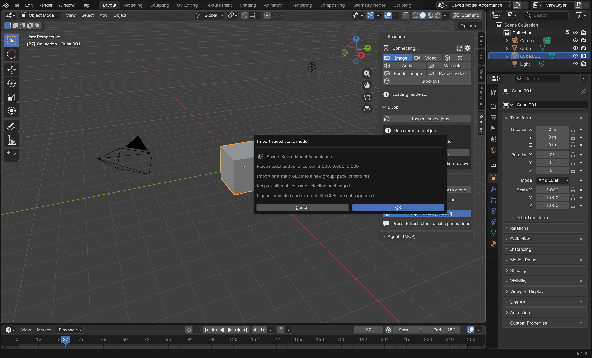

Offline desktop acceptance on macOS arm64 Blender 5.1.2 used the exact ZIP
`bac52e333078c09bc1581e5a530dac67a749d94c179b230a3d0ace7b2afb410f`. Mouse confirmation imported one textured
triangle hierarchy into one new group at cursor (3, 0, 0), without another mock
generation or request. Existing selection stayed intact. Viewport clicking,
front-view keyboard input and zoom worked after import. Blender exited cleanly
and the normal-profile fingerprint was unchanged. The test-only app copy used
a distinct bundle identifier and local ad-hoc signature for window targeting,
with vendor executable code and the extension ZIP unchanged. Synthetic tests
and desktop evidence do not establish paid provider acceptance, rig/animation or
in-place editing, other OS desktop behavior, release readiness or #263 resolution.

## Saved panorama approval and restoration

**Set panorama as World (N)** prepares one PNG, JPEG or OpenEXR result and
identifies the selected scene and current World. A **Selected** line states the
saved media type's declared format, using the same wording as MCP `format`:
PNG or JPEG as LDR, or OpenEXR as float with ACES AP0 in ACES2065-1.
Invoke computes that text; drawing only displays it. Explain the
2:1/equirectangular requirement, packed image, preserved original World, LDR/HDR
distinction and session-local restore limit. The action's presence is a
media-type offer; byte compatibility is checked during application, never in
drawing. Cancel discards the prepared handle.

After completed application, **Restore previous World** uses a separate prepared
approval. It names the current scene/World and explains that edited owned data
prevents restoration. Do not silently clear edits, reapply the job or reset its
completed state after restoration. Reference [the user guide](USER_GUIDE.md#apply-a-saved-panorama-to-world)
for screenshots and [the World guide](WORLD_APPLICATION.md#saved-result-ui-and-mcp-approval)
for reuse and file-load restoration boundaries.

Offline desktop acceptance on macOS arm64 Blender 5.1.2 used exact ZIP
`c570617fdcc2e4ff5e5b424e08768843186a38a95eb6e58252cec6c471b262f1`.
Mouse approval applied a synthetic saved 2:1 PNG as one packed World; a separate
confirmation restored the original World and removed the restore action while
the job stayed applied. Mock submissions and request counts remained unchanged.
Viewport selection, front-view keyboard input and zoom worked afterward. Blender
exited cleanly and the normal-profile fingerprint was unchanged. The test-only
app copy used a distinct bundle identifier and local ad-hoc signature for window
targeting; vendor executable code and the extension ZIP were unchanged. This does
not establish actual HDR/seam quality, other OS desktop support, resolution of
#263 or release acceptance. That capture predates the **Selected** format line
and the JPEG and `image/aces` offers. Headless native tests cover their invoke,
draw and cancel handling, and every new dialog line stays within 59 characters,
the longest line verified in that capture. Desktop interaction with the new
wording is not yet recorded; that check is an open follow-up under #98.

## Saved material approval

**Apply saved material** names the scene, mesh, slot and saved texture roles.
Explain packing, replacement of that slot only, height-as-bump, retained AO/edge
nodes and the absence of a global undo entry. Preparation requires a local UV
mesh with one object user in one scene; drawing reads the prepared snapshot and
never opens files or changes assignments. Cancel discards its approval. A changed
mesh, slot or scene revision requires a new review rather than retargeting.

Offline desktop acceptance on macOS arm64 Blender 5.1.2 used exact ZIP
`b30a62ff2864507ad62dfd8eb743d3b17a17e7487bf1c94185072efcff405f67`,
which passes 607 full native tests on each of Blender 5.0.1, 5.1.2 and 5.2.1.
Mouse confirmation applied one synthetic saved albedo map as a packed material
to the approved mesh slot. The job became applied with mock submission/request
counts unchanged. Material preview, viewport and Outliner selection, front-view
and orbit keyboard input, zoom and material-property inspection worked afterward.
Blender exited cleanly and the normal-profile fingerprint was unchanged. The
test-only app copy used a distinct bundle identifier and local ad-hoc signature;
vendor executable code and extension ZIP were unchanged. The earlier attempt
could not access the window; it was not counted as interaction evidence.
This check does not establish live provider quality, other OS desktop support,
full Materials acceptance or resolution of #263. See the
[user guide](USER_GUIDE.md#materials) for the approval and result screenshots.

## Completed-result reuse approval

Completed shared jobs show **Reuse saved results** above the supported saved
application actions. Each native approval adds **Use saved results again; no new
generation.** while retaining its destination, selected assets and limitations.
Drawing uses the prepared snapshot only. Unfinished local claims suppress new
application actions; a known receipt failure offers persistence-only recovery.

Offline desktop acceptance on macOS arm64 Blender 5.1.2 used exact ZIP
`28d7dced697249cf9389ddbc0c7bb300d99faa66623c0ffc0caaf2303ba1e6eb`,
which passes 619 full native tests on each of Blender 5.0.1, 5.1.2 and 5.2.1.
An already imported synthetic albedo result was applied as a packed material to
the approved mesh slot through the visible reuse confirmation. The original job
stayed applied, its separate material application completed, and mocked request
and submission counts did not increase. Material preview, viewport and Outliner
selection, front-view keyboard input, zoom and material-property inspection
worked. Blender exited cleanly with the normal-profile fingerprint unchanged.
The test-only app copy had a distinct bundle identifier and local ad-hoc signature;
vendor executable code and extension ZIP were unchanged. See the
[user guide screenshots](USER_GUIDE.md#reuse-saved-results). This does not establish
live provider quality, other OS desktop support, resolution of #263 or release
acceptance. An earlier window-targeting attempt was not counted as interaction
proof.

## Saved mesh edit review

**Apply mesh edit (N)** names the captured scene, source mesh and selected saved
GLB. The dialog shows the replacement policy, scene/local coordinate placement
and Keep original choice before confirmation. Explain geometry/UV/material
replacement, exact-topology UV/retexture restrictions, no automatic fitting, preserved
object context and the dependence of undo on Blender settings. Defaults keep an
original copy. Explain that history changes affect the scene only, not saved jobs
or spending.

Option changes use `check()`, outside drawing, and revise the existing captured
approval instead of selecting a new target. A stale target or scene requires
cancellation and fresh review. `draw()` only reads the prepared labels and
operator properties. Completed-result reviews retain the reuse notice.

Mirrored or zero-scale source transforms cannot use scene-coordinate mapping.
The native dialog opens with **Object local coordinates** and a visible
explanation for those sources. Review and confirmation remain explicit; choosing
the unsupported scene-coordinate option cannot start verification or application.
For **Apply to captured source**, inspect the retained source's transform before
choosing that default. A different selected object's transform must not affect it.

A captured-source follow-up on macOS arm64 Blender 5.1.2 uses ZIP SHA-256
`03074fe0f5ff70e360e392502a14064f36312dd463058866edeeee58077c541e`,
which passes 719 native tests on each supported Blender series. With another
positive-scale mesh selected, mouse input opens the mirrored captured mesh's
review with object-local coordinates and its explanation. Escape preserves both
meshes and the saved job; Return applies only to the captured mesh, retaining
its negative scale and Keep original copy. Native Edit > Undo/Redo restores the
source and copy without changing durable job state or request counts. Viewport
selection, front-view keyboard input and zoom work after the dialogs. The
synthetic transport makes no additional service requests or submissions during
review, application or history changes. The isolated run exits cleanly, removes
its profile and leaves the normal profile unchanged. Zero-scale and reversed
selection cases have native regression coverage; other OS desktop and live
provider acceptance remain separate.

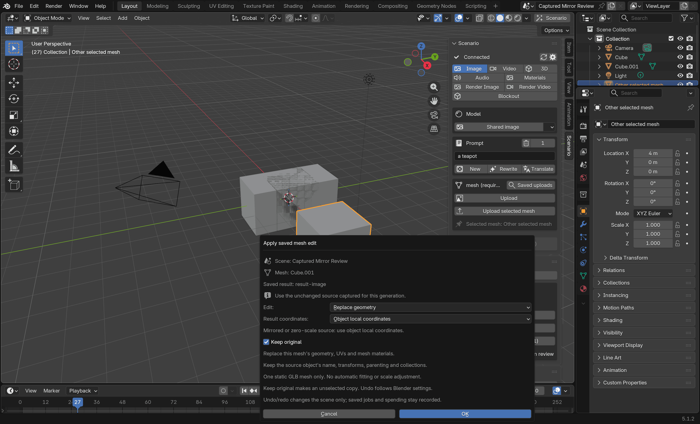

An isolated macOS arm64 Blender 5.1.2 desktop check used ZIP
`21edce46cf2c0e94095ba27668c2acef3b6b68968dc0dc0082921f1bd0760000`,
which passes 670 installed native tests on each of Blender 5.0.1, 5.1.2 and 5.2.1.
The mirrored-source dialog opened with local coordinates selected. Escape
cancelled; selecting scene coordinates showed rejection, and returning to local
coordinates allowed Return confirmation. Source scale remained negative, Keep
original retained a copy, and a second explicit reuse persisted `mesh_edit`
without more mock requests or submissions. Viewport selection, front-view input
and zoom worked. Blender exited cleanly with the normal profile unchanged.
The test app used a distinct local bundle identity with unchanged vendor
executable code. This synthetic check does not establish provider alignment,
other OS desktop behavior, global undo or release acceptance.

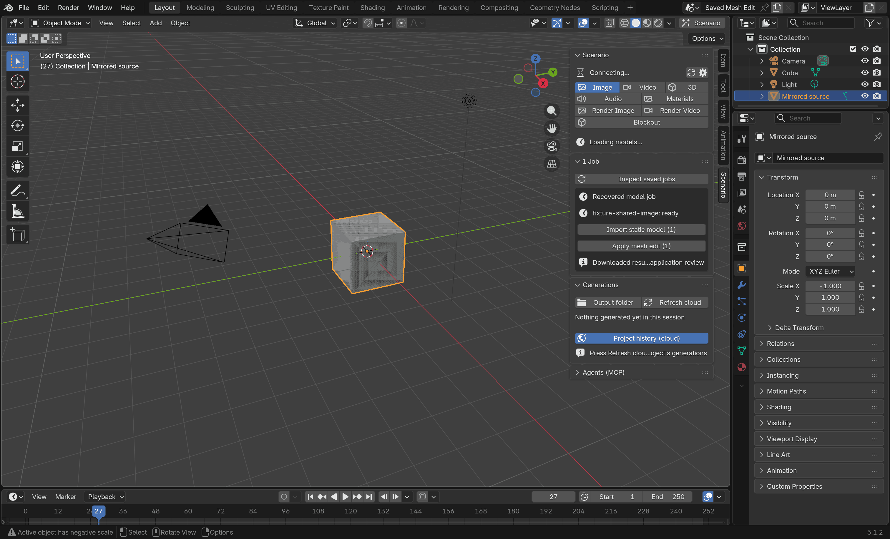

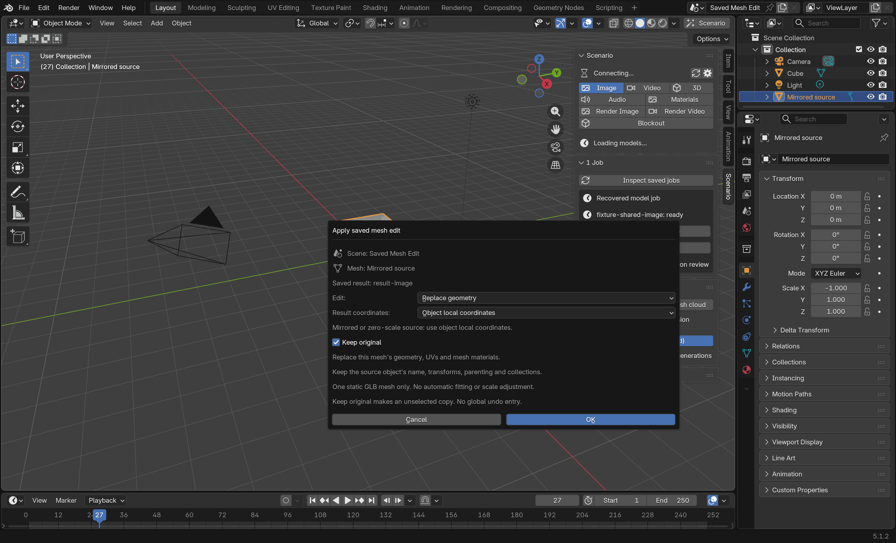

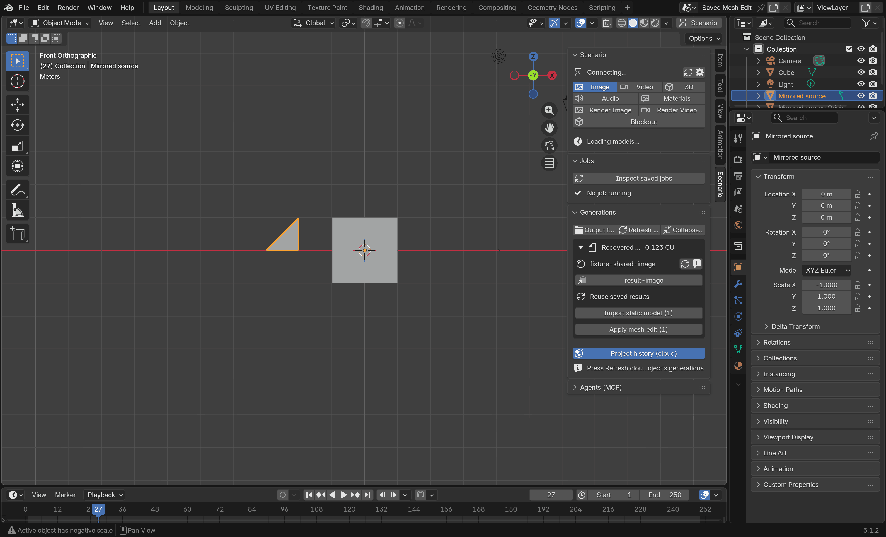

Offline desktop acceptance on macOS arm64 Blender 5.1.2 used final ZIP
`e1eed465de2c9376231e54a7e623f1391974f4102ba54f2845fddbec369dda38`,
which passes 659 full native tests each on Blender 5.0.1, 5.1.2 and 5.2.1.
Mouse input opened the explicit source review. Escape cancelled without applying;
viewport selection and front-view keyboard input then worked. A fresh review
named the selected source, and Return confirmed geometry replacement with Keep
original enabled. The source became the synthetic three-vertex result, its
original copy remained, and the durable job became applied without another mock
submission or request. The temporary message acknowledges approval rather than
continuing to describe verification after it has already finished.

The preceding desktop check used ZIP
`cc603cfa3c98e29430d5ea72c2c54a1ce6f7480324695c158d460f5f437e42f0`;
the only subsequent production change was that message text. It additionally
verified both policy and coordinate menus, Keep original toggling, cancellation,
viewport focus after application and explicit completed-result reuse confirmed
with Return. Reuse preserved the completed generation and recorded one separate
applied local claim without another mock request or submission.

Both isolated Blender processes exited cleanly and their normal-profile
fingerprints were unchanged. The test-only app copy had a distinct bundle ID and
local ad-hoc signature; vendor executable code and extension ZIP were unchanged.
The fixture freezes catalog loading and mocks service responses; its loading
labels are not live connection evidence. These checks do not establish provider
alignment, pre-generation source binding, remaining edit policies,
other OS desktop behavior, #263 resolution or release acceptance.

[Before application](images/saved-mesh-edit-before.png),
[approved replacement result](images/saved-mesh-edit-result.png).

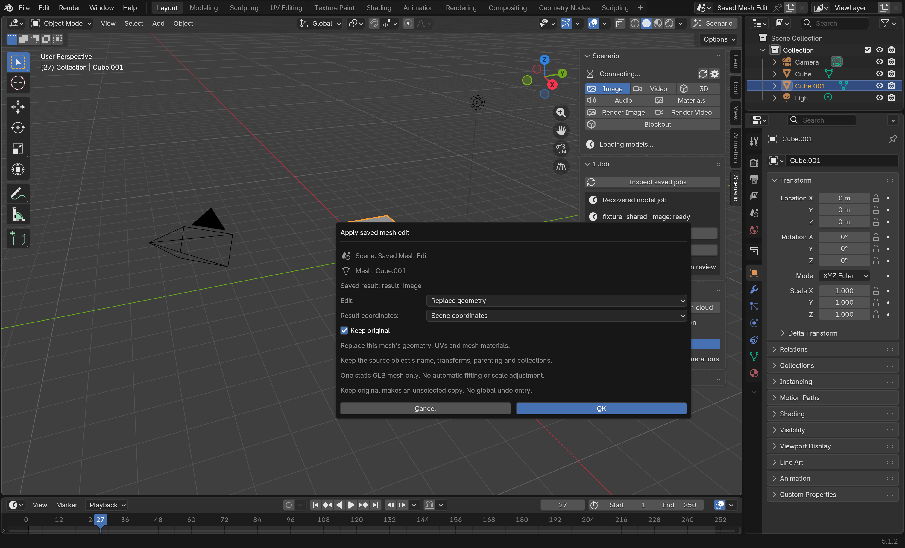

## Captured mesh source interaction evidence

The saved-job **Apply to captured source (N)** action opens the existing mesh
review with the original exported object, independently of active selection.
Its extra line identifies the unchanged captured source. **Apply mesh edit (N)**
keeps explicit current-destination review; both require confirmation.

On macOS arm64 Blender 5.1.2, an isolated installation of ZIP SHA-256
`f9f57e8efd3679bf8143713067e938eb4545d433ff5e27cc349a938a61fac976`
was exercised with synthetic transport and a real source export. With another
mesh active, mouse activation named `Cube.001` as the captured source. Escape
canceled without changing the saved ready record or either mesh; viewport focus
and numpad front view still worked. Reopening and confirming with Return replaced
the source's eight vertices with the saved three-vertex fixture, retained an
original copy, and left the other active mesh at eight vertices. The job became
applied with no additional mock submission, service request or download. The
normal Blender profile was unchanged and the isolated process exited cleanly.

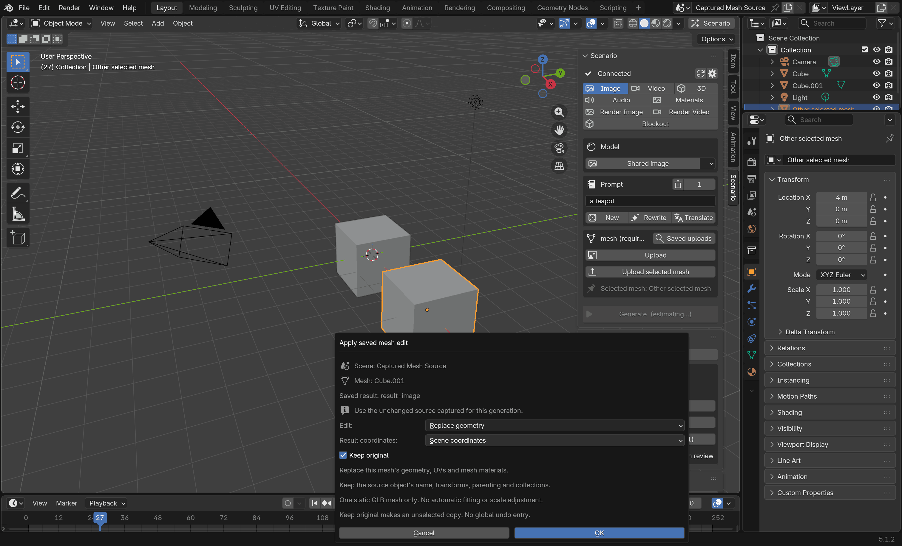

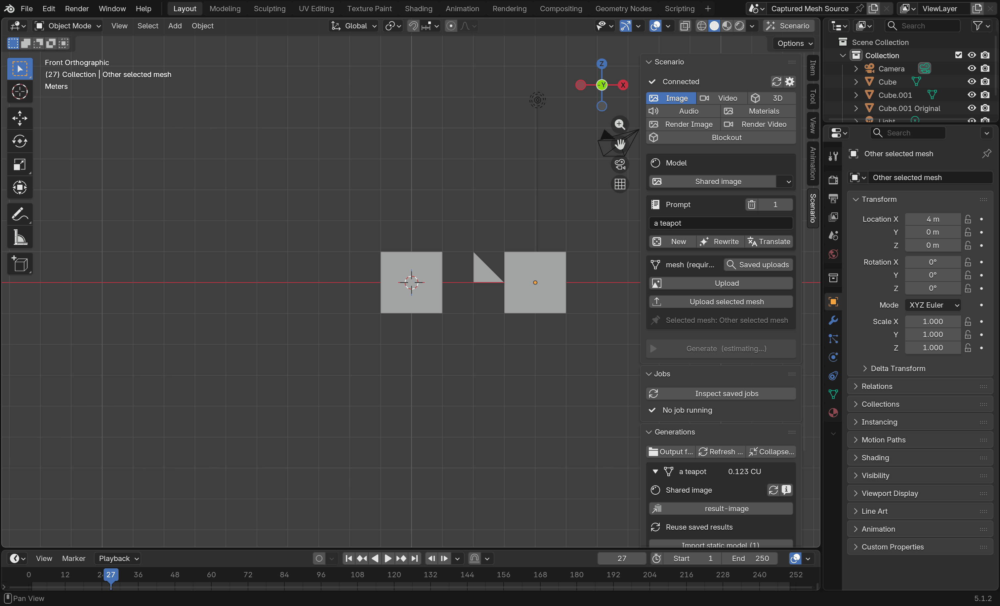

The same interaction was repeated with the integrated export/quote changes on
macOS arm64 Blender 5.1.2 using ZIP SHA-256
`a2254eb9ae5b24608eacf1e850dbbb95d9a1e4ff7b6b4b881bd4de2ef5e56610`.
Mouse activation again identified the exported source despite a different active
mesh. Escape preserved the ready job and both meshes; viewport focus and numpad
front view remained usable. Return applied the three-vertex result to the source,
kept its original copy and left the other mesh at eight vertices. Mock request,
submission and download counts stayed unchanged through application; a socket
guard recorded no network attempts. Installed bytes were verified before and
after the run, the normal profile was unchanged, and the process exited cleanly.
The images above remain captures from the earlier named artifact.

This proves the local source-selection, cancellation and confirmation interaction.
The synthetic form's pending estimate is not live pricing evidence. It does not
establish provider alignment, other OS desktop behavior, #263 resolution, remaining
edit policies or release acceptance. See
[the source contract](MESH_APPLICATION.md#applying-to-the-captured-mesh-source).

## Retexture review

The mesh review's **Replace textures** choice preserves geometry and adopts all
result UV layers and mesh material assignments. Its two explanation lines name
that replacement and require exactly matching indexed topology and positions.
Keep original and coordinate placement remain explicit, and drawing stays read-only.
Both current-destination and captured-source review use this policy.

Offline interaction on macOS arm64 Blender 5.1.2 used exact ZIP
`53587fc3756f6eb9acaa40df066b0fc8dc80defb5a009059ec3148f5ecf54b61`,
which passed 683 installed tests on each of Blender 5.0.1, 5.1.2 and 5.2.1.
Mouse selection exposed the new policy and its geometry-preservation explanation.
Escape canceled without changing materials, geometry or local claims. A fresh
review selected the policy using the native menu and keyboard; Return applied
it with Keep original enabled. Vertex positions stayed identical, the saved
material replaced the fixture's blue material, and one separate local claim
became applied while the completed generation stayed applied. Mock submissions
and requests remained unchanged. Viewport click, front-view and orbit keys,
Outliner selection and zoom worked. The isolated process exited cleanly and the
normal profile was unchanged. The test-only application identifier/signature
changed for window targeting; executable code and extension ZIP were unchanged.

The fixture uses synthetic transport and pauses catalog loading. These images
are local interaction evidence, not live pricing or provider appearance quality.
Provider indexing/alignment, other OS desktop behavior, #263 and
full release acceptance remain unverified.

[Before retexture](images/saved-retexture-before.png),
[applied retexture with original retained](images/saved-retexture-result.png).

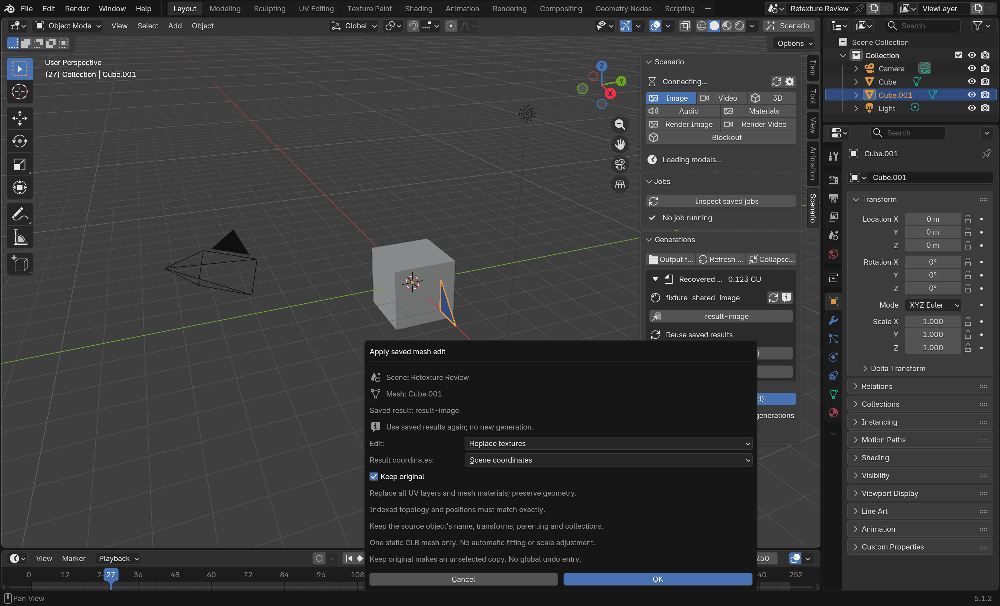

## Saved mesh undo interaction

The approval dialog explains that Keep original retains an unselected copy,
Blender settings control undo, and history changes leave jobs and spending
recorded. The shared command uses native history for all three mesh policies;
see [the contract](MESH_APPLICATION.md#native-undo-for-saved-mesh-edits).

An isolated macOS arm64 Blender 5.1.2 desktop check used exact ZIP SHA-256
`0d0a8da1ff9667e2bf7ea289f4e73ec01183ecb0268bddc81d50305b8308c862`.
The same ZIP passed 688 installed tests on each of Blender 5.0.1, 5.1.2 and 5.2.1.
Mouse input opened captured-source review while another mesh was selected, and
Return confirmed. The source changed from eight to three vertices with its
original copy retained; the other mesh stayed at eight vertices. Edit > Undo
restored the eight-vertex source and removed the copy. Edit > Redo restored the
three-vertex result and its copy. The saved job stayed applied and mock submission
and request counts stayed unchanged throughout. Viewport zoom and front-view
keyboard input worked after Redo. The isolated process exited cleanly and the
normal profile fingerprint was unchanged.

This is synthetic local interaction evidence, not live pricing/provider output,
other OS desktop acceptance, resolution of #263 or complete release acceptance.
The fixture pauses catalog loading. Its test-only application identifier and
signature differ for window targeting; executable code and extension ZIP do not.

After review, ZIP `3f36db535d94416bdf351b086a1356ea1993fb1d4c482c1d7759275a32e0e072`
passed 689 installed tests on all three versions. A fresh isolated 5.1.2 desktop
run repeated approval, menu Undo/Redo and viewport input. Public job status
remained readable throughout; `mesh_edit` became null on Undo and remained null
after Redo instead of following recreated objects by name. Geometry and original
copy restoration still worked, with unchanged durable job and mock request
counts. The process exited cleanly and the normal profile was unchanged. The
screenshots below show the preceding identical UI; the follow-up changes only
transient status ownership and adds a failed-import history regression.
A final receipt-recovery guard keeps that status retired even when saving a
pending success receipt after Undo; it changes no native UI or scene application.
Its exact ZIP and full matrix validation are recorded in the PR.

[Undo restores the source](images/saved-mesh-undone.png),
[Redo restores the edit](images/saved-mesh-redone.png).

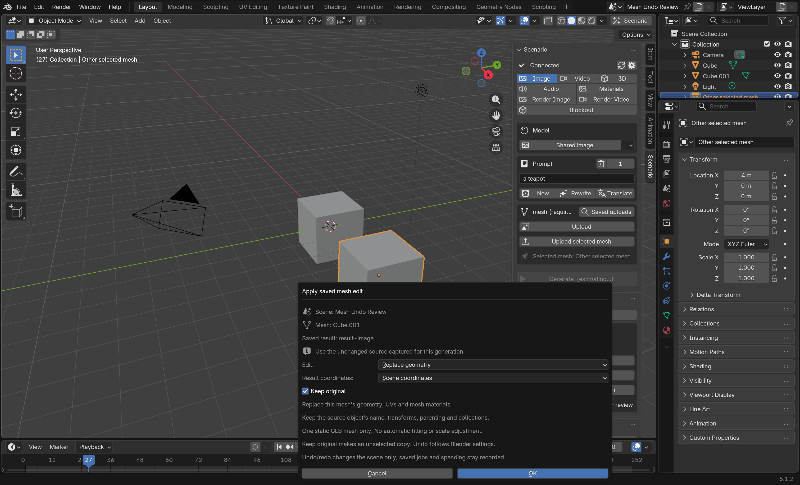

## Parts application interaction

The saved-mesh review offers **Replace with parts** as an explicit policy. Its
read-only explanation identifies the source, empty mesh parent, named children,
2-to-128 part limit, unchanged source context and Keep original behavior. It
states that every mesh in the chosen GLB is treated as a part. It does not infer
variants or automatically fit the result. The shared UI/MCP command applies the
[parts contract](MESH_APPLICATION.md#apply-static-parts).

An isolated macOS arm64 Blender 5.1.2 desktop run installed the exact ZIP with
SHA-256 `ad88e5b70dcf879d182a4805415dcb0ecab114d32a7287e711b84923f6f86be7`.
Native clicks and keyboard input selected the policy, cancelled without mutation,
then confirmed application to the captured source while another mesh remained
selected. The source became an empty mesh parent with two named triangle parts;
Keep original retained its eight-vertex copy and the other mesh kept eight
vertices. Edit > Undo restored the eight-vertex source and removed the parts and
copy. Edit > Redo restored both children and the copy. The public job stayed
applied, transient mesh status retired on undo, and mock submission/request
counts did not change. Viewport zoom/front-view input and Outliner expansion
remained usable. The owned test process exited cleanly and the normal profile
was unchanged.

Transport and result geometry were synthetic; the frozen model/estimate labels
in the screenshots are fixture state, not live provider or estimate performance
evidence. This proves the scoped local interaction, not provider alignment,
other-platform desktop behavior or integrated release acceptance.

[Applied parts and preserved selection](images/saved-mesh-parts-applied.png).

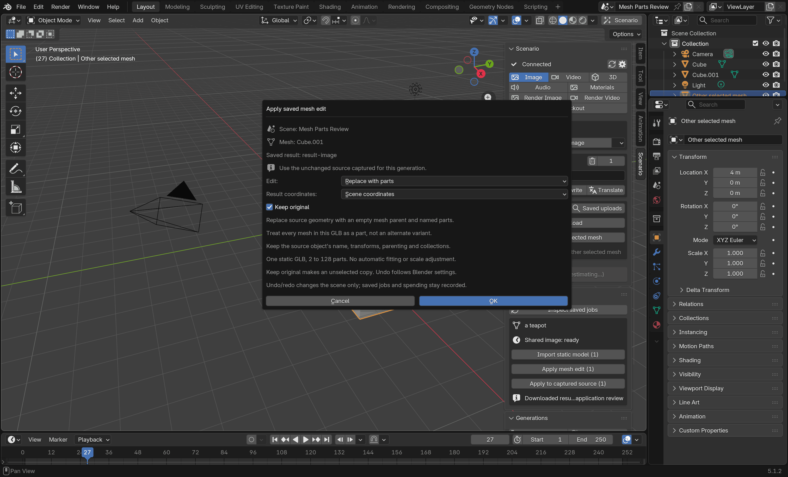

The error-message update's ZIP
`b5e207c2bd571e89e31e45e1dce24a43fd341ba1f23766bc2792e4be6445eb9c`
passed 700 installed tests on each supported Blender version on macOS arm64.
In an isolated 5.1.2 desktop check, confirming single-mesh replacement with a
two-mesh fixture failed without changing either source or selection. **Job needs
review** opened the full message identifying the saved GLB, source and edit policy.
Escape closed it and front-view keyboard input worked in the viewport. Mock
submissions, requests and downloads stayed unchanged, with no network attempts.
The process exited cleanly, its profile was removed and the normal profile was
unchanged. Earlier screenshots retain their original artifact provenance.

## Animated model import interaction

The shared saved-result button is **Import model**. Its review names the scene
and cursor and explains a new group, packed textures, preserved selection,
retained rigs/clips and unchanged timeline. Drawing remains read-only. The
[import contract](MESH_APPLICATION.md#rigged-and-animated-model-import) describes
clip timing, staging isolation and the separate in-place transfer boundary.

The exact ZIP with SHA-256
`ee5dc51cd853739685458c589975aca6acf326c460dd9e12eefecb4e74ec0adf`
passed 705 installed native tests on macOS arm64 Blender 5.0.1, 5.1.2 and 5.2.1.
An isolated 5.1.2 desktop check opened the review, cancelled without importing,
then confirmed a new character with two bones and two clips. The original cube
remained active. Native viewport zoom/front-view input and Outliner expansion
worked. Clicking frame 30 on the timeline animated the rig and skinned/morphed
triangle from its frame-zero state; evaluated vertices moved two units in X and
one unit through the morph. FPS stayed 30 and the range stayed 1 through 90.
The saved job stayed applied and mock submission/request counts stayed unchanged.
The completed test exited cleanly with the normal profile fingerprint unchanged.

Transport and geometry were synthetic. Frozen catalog/estimate labels in these
screenshots are fixture state, not live performance evidence. This scoped check
does not establish provider rig compatibility, in-place retargeting, other OS
desktop acceptance or integrated release acceptance. An earlier interrupted test
exit crashed in the fixture's temporary-preference cleanup during Python
finalization; the completed repeat used explicit fixture cleanup before quitting.

[Frame zero](images/saved-model-animation-start.png),
[frame thirty](images/saved-model-animation-end.png).

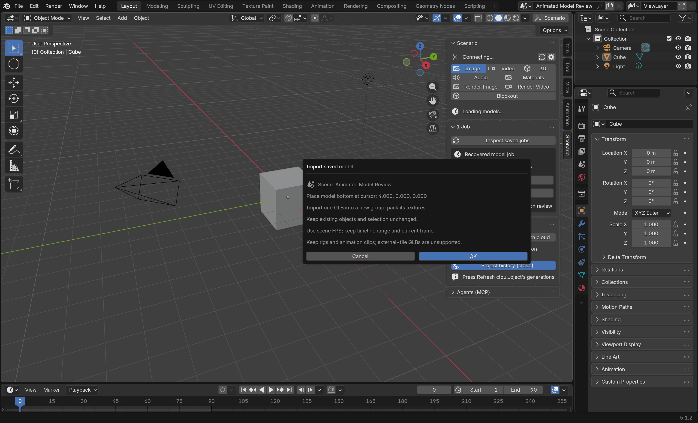

## Rig attachment interaction

The saved-mesh review offers **Attach rig**. It names the captured source and
explains matching geometry, retained source UVs/materials, bone weights and clips,
Keep original and native undo. It also explains that the source and new rig group
must move together afterward. Drawing stays read-only; the shared UI/MCP command
implements the [skin attachment contract](MESH_APPLICATION.md#attach-a-returned-rig).

The final ZIP with SHA-256
`43d303619c6eb4d0ebf9e6bad2dd40f210f4cce0890587a8bade647326264a2b`
passed 715 installed tests each on macOS arm64 Blender 5.0.1, 5.1.2 and 5.2.1.
Isolated 5.1.2 desktop input selected Attach rig, cancelled without mutation and
confirmed against the captured triangle while another mesh stayed selected.
The source retained its geometry, gained two bone groups and an armature modifier,
and Keep original retained an unselected copy. Native Edit > Undo removed the
rig, groups and copy; Redo restored them. The saved job stayed applied and its
transient mesh status retired on undo. Mock submission/request counts stayed
unchanged. Viewport zoom/front-view input and Outliner expansion worked; clicking
frame 30 moved the skinned source two units in X while the original stayed still.
The completed repeat exited through explicit fixture cleanup and verified that
the normal profile remained unchanged.

Transport and geometry were synthetic. Frozen catalog, estimate and price labels
are fixture state, not live pricing or performance evidence. This check does not
establish provider compatibility, existing-rig retargeting, other OS desktop
acceptance or integrated release acceptance. An earlier interrupted exit crashed
in the fixture's temporary-preference cleanup during Python finalization; its
interaction observations were repeated before a clean exit.

The screenshots and cancellation/selection sequence used the preceding ZIP
`8623714355635f3d3f2a36539992161547add46ed462910086f4f33e71c91fd5`.
The final ZIP differs only by formatting in one Python member (identical AST);
attachment, native undo/redo and frame-30 deformation were repeated on that final
ZIP, followed by a clean exit and unchanged normal-profile fingerprint.

[Animated source, original copy and preserved selection](images/saved-mesh-rig-animated.png).

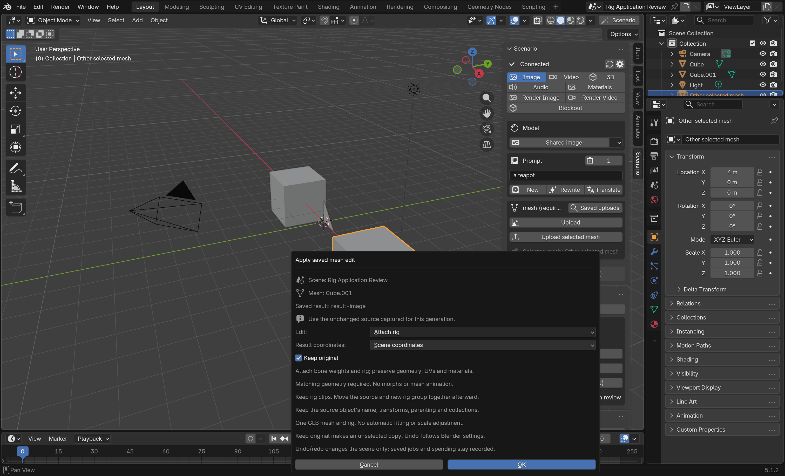

## World restoration across scenes

Reusing a panorama in another scene preserves the earlier scene's
**Restore previous World** action. Each review still identifies the selected
scene and its current World; restoration changes only that scene. The
[World contract](WORLD_APPLICATION.md#saved-result-ui-and-mcp-approval) describes
identity, ownership checks and session limits.

An isolated macOS arm64 Blender 5.1.2 desktop check used exact ZIP
`8676574595eb6fcc21cee719467184bc87c6d3f73a9986741edc643749f2e9dc`,
which passed 692 installed native tests on each of Blender 5.0.1, 5.1.2 and 5.2.1.
The synthetic fixture applied one saved panorama to two scenes. Native input
opened the first restoration review and cancelled without mutation; a fresh
confirmation restored its original World while preserving the second panorama.
The native scene selector switched to the second destination; its separate
review restored that scene's original World. Viewport focus and front-view
keyboard input worked afterward. The saved generation and local claim stayed
applied, and mock submission/request/download counts did not change. The
process exited cleanly, with no network attempts and an unchanged normal profile.
This is synthetic local restoration proof, not live panorama quality, other-OS
desktop or integrated release acceptance. Catalog loading text is fixture state.

A subsequent lifecycle correction was checked with exact ZIP
`24c7731dc6f339d55f826dfd27e68f0b90052b2c987fe9572431d5dbe6c353ca`:
694 installed native tests passed on each of the same three Blender versions.
The scene identity survives the render-thread origin revision reset; Undo/Redo
still retires live ownership, and deleted or retired destinations no longer
offer restoration. Regression tests invoke the actual render-thread and history
callbacks, verify rejection of stale approvals and prune expired handles.
They do not establish physical desktop Undo/Redo behavior.
The isolated 5.1.2 desktop flow above was repeated after the fixture invoked
the render-thread callback: cancel, independent confirmations, native scene
selection and viewport keyboard input all worked. Both original Worlds were
restored with unchanged applied records and mock counts, no network attempts,
clean exit and an unchanged normal profile. The screenshots below retain the
earlier artifact's provenance.

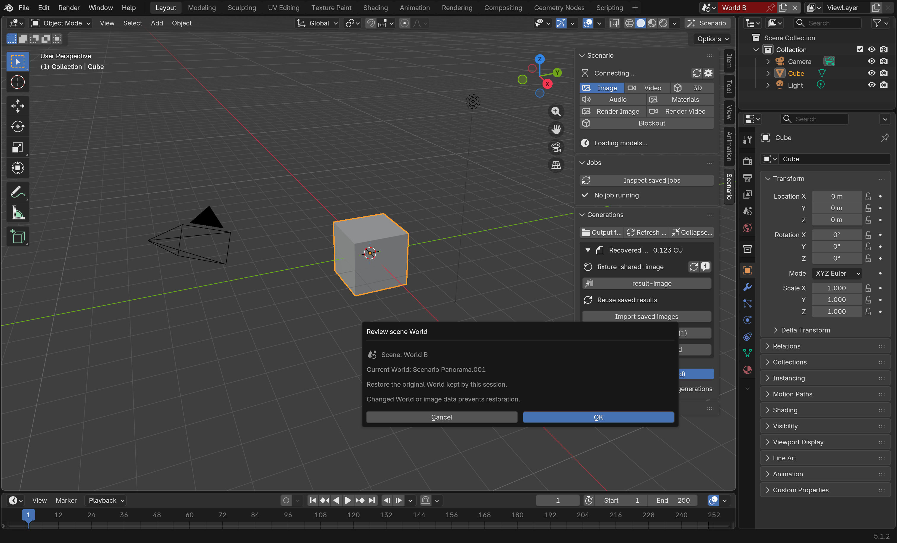

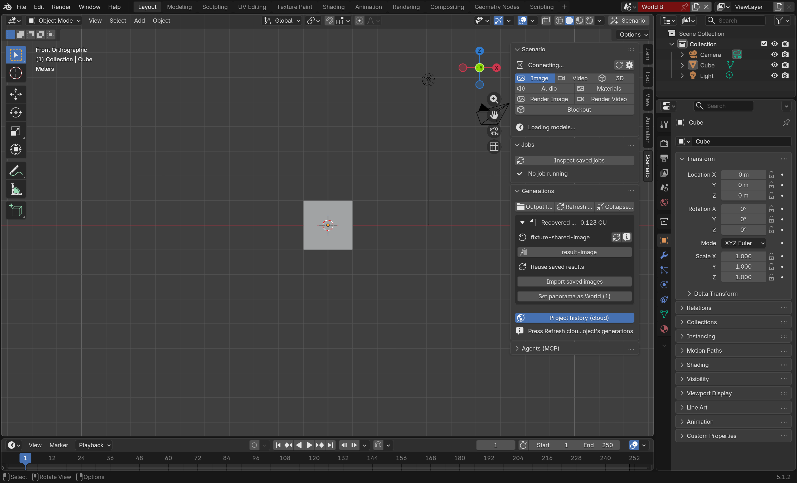

## Blockout plan approval interaction

Blockout uses **Get design price**, then **Generate plan (cost)**. Refine has its
own quote. A completed plan exposes **Build plan**; generation itself leaves
geometry unchanged. Clear opens a confirmation dialog. Drawing is read-only.

The exact ZIP with SHA-256
`44edc43008d64f1e2836c95c0cb526f5c727a4278f6468676d4d7ef71b8fc47e`
passed 732 installed native tests each on macOS arm64 Blender 5.0.1, 5.1.2 and
5.2.1. An isolated 5.1.2 desktop check edited the prompt with native input,
requested a quote with zero submissions, approved once, and received a plan
without changing geometry. Build created the grouped tower while the existing
cube remained selected. Native Edit > Undo removed the tower and restored the
earlier empty plan; Redo restored both. Cancelling Clear preserved the result.
Viewport zoom and front-view input remained available. The single mock submission
and eight total mock requests did not increase during local operations.
The test exited cleanly and verified the normal profile fingerprint unchanged.

The transport and tower were synthetic; the frozen Connecting label is fixture
state, not service performance evidence. The initial fixture failed while waiting
for the sidebar region and exited without profile changes; the completed repeat
waited for that region. Native runs retain a small Blender shutdown allocation
diagnostic. Live provider compatibility, other OS desktop behavior and explicit
recovered-plan import into a new scene are not established by these checks.

[Before quote approval](images/blockout-plan-approval.png).

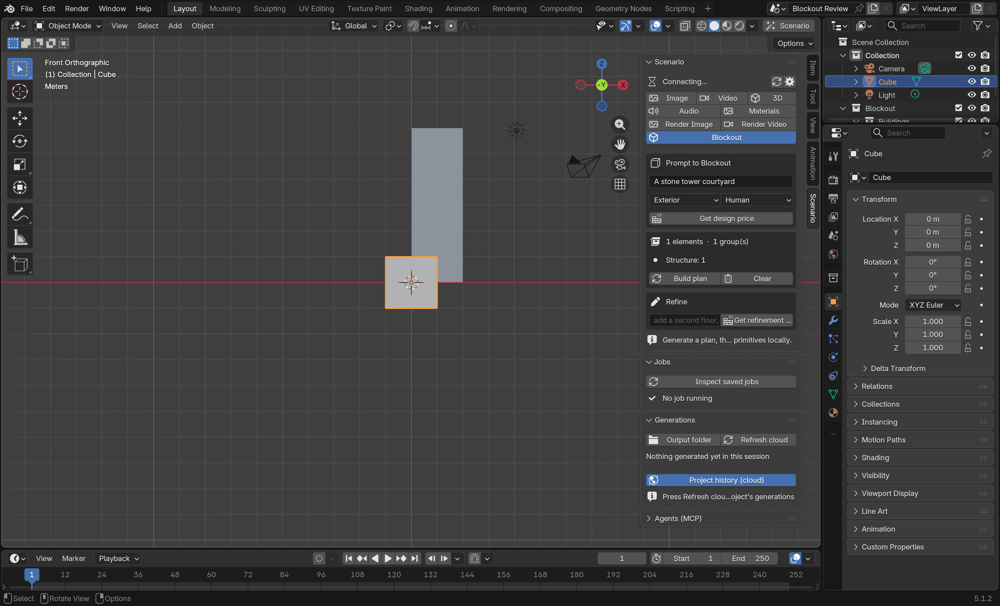

The refinement-instruction follow-up uses ZIP SHA-256
`5c66b30ebe403ab46658fa556fa906fd49dcd2a48816d7867f18c5ab83a27c42`,
with 732 installed tests passing on each of the same three Blender versions.
It replaces mixed design/refinement wording with the explicit complete-plan
update instruction. The desktop interaction and screenshots above use the
preceding ZIP; no new UI behavior or live provider acceptance is claimed here.

## Saved Blockout plan recovery

Saved jobs expose **Read saved Blockout plan**, followed by **Use saved Blockout
plan** after complete text validation. The confirmation names the scene and
element/group counts, warns before replacing an existing plan and explains that
geometry remains unchanged until a separate Build plan action. Cancellation
discards the review. Drawing does not read the service or mutate the plan.

The exact package with SHA-256
`9b9bb818f0ec81e0af4ed95ba6d70390d17e12af72c24b5040d6814316b31ed2`
passes 740 installed tests on each macOS arm64 Blender 5.0.1, 5.1.2 and 5.2.1.
These cover native operator execution, MCP parity, restart with and without a
saved manifest, discarded/single-use reviews, changed fields and scene
replacement, retired contexts, offline reads and malformed text. Saved-job
drawing skips invalid scene references, and status reports a deleted scene
without rebinding a same-name replacement.

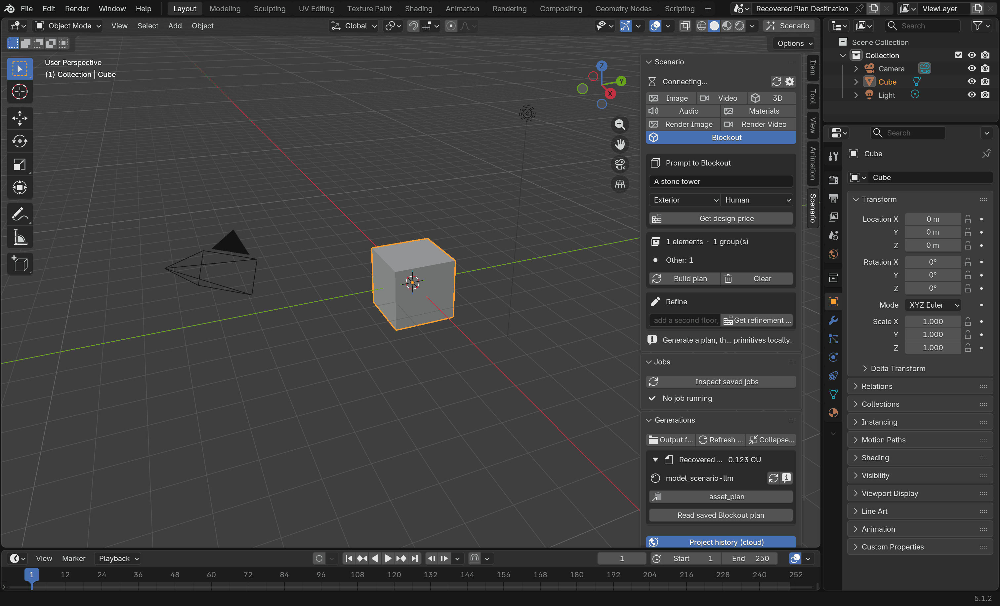

Desktop interaction with the same ZIP passes on macOS arm64 Blender 5.1.2 in an
isolated profile, using a synthetic saved job and blocked external networking:

- **Read saved Blockout plan**, then **Use saved Blockout plan**, opens the
  destination/count/replacement dialog. Escape cancels and discards the review
  while preserving the previous stored plan and all geometry.
- After a fresh read, Return confirms the dialog and replaces only the stored
  plan. Blender's **Edit > Undo** restores the previous plan; **Edit > Redo**
  reapplies the recovered plan. Geometry stays unchanged throughout.
- A viewport click selects the existing cube, and Home frames the scene,
  confirming viewport focus and keyboard navigation after the dialog.
- A separate **Build plan** click creates the recovered tower and preserves the
  existing cube, light and camera. Approval, Undo/Redo, viewport interaction and
  building issue no further service requests or submissions.

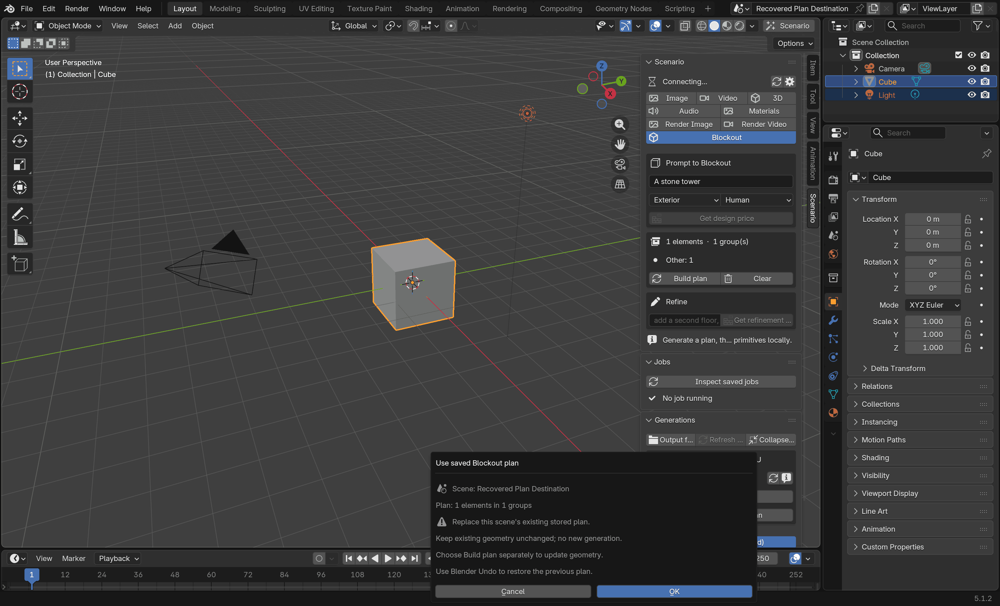

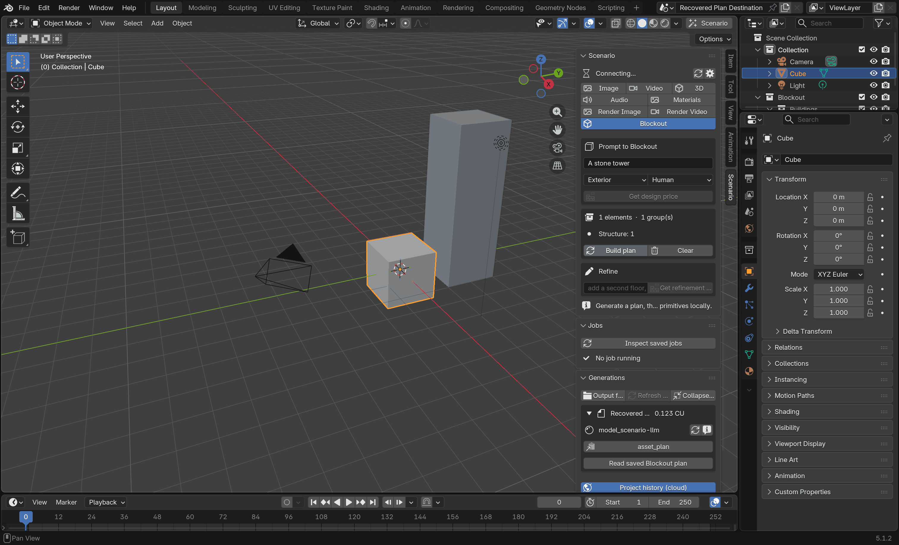

The test app uses the vendor Blender binary and the unchanged extension ZIP;
the harness removes its disposable profile after the interaction. The normal
profile remained unchanged. Transport and plan contents are synthetic, with no
live generation. This proves the scoped recovery interaction at the tested
window size, not other OS/DPI combinations, live provider behavior or integrated
release acceptance.

The recovery review fixes were retested with ZIP SHA-256
`b0bc4c291aa5d910beb53d34974526c74e5971d3462b326006cb521c697faeec`:
746 installed tests pass on each macOS arm64 Blender 5.0.1, 5.1.2 and 5.2.1.
These add deleted-destination review cleanup, pending-read drainage, finished
action reclamation without retiring uncertain jobs, and guided invalid-plan
refinement errors before any quote request. Desktop checks on Blender 5.1.2
repeat Escape cancellation, Return confirmation, stored-plan Undo/Redo and
separate Build; viewport front-view and zoom input work afterward. The synthetic
fixture establishes an Undo checkpoint after preparing its starting scene.
Local approval, Undo/Redo and Build add no service request or submission; both
disposable runs exit cleanly with the normal profile unchanged. The screenshots
above retain their original artifact provenance. These checks do not establish
live provider or integrated release acceptance.

## Cloud history recovery controls

A cloud row matched to the current scoped job store offers **Inspect saved jobs**
instead of **Download and open**. Its saved-job controls retain the explicit
download and destination-approval steps. Drawing uses the saved-ID snapshot from
explicit history reads plus live shared-job views, without database I/O, session
activation, service requests or scene/job changes. Import commands independently
recheck current storage. A changed credential selection hides the old row actions
until refresh; a failed saved read disables those actions until a successful read.

The exact ZIP with SHA-256
`30b0e2c03268e81a64ad83d0cc2924be9d0afaac8d7aebf9a80b3aafc9349b2c`
passes 749 installed tests on each macOS arm64 Blender 5.0.1, 5.1.2 and 5.2.1.
Regressions cover native operator execution, read-only draw routing, stale-page
acknowledgement, old-cache collisions, missing storage, restart and credential
changes, including rejecting MCP import with incomplete credentials. These are
synthetic installed tests.

Desktop input with the same ZIP passes on macOS arm64 Blender 5.1.2 in an isolated
profile. The fixture preloads a synthetic cloud page, a matching scoped saved
job and a colliding old cache entry. Clicking **Project history (cloud)** shows
**Inspect saved jobs** on the matching row. Clicking it opens the shared recovery
controls with a separate **Resume download** action. It does not import the old
file or change the saved record, scene objects or images. The request count stays
unchanged, and neither legacy import dispatch nor job tracking runs.

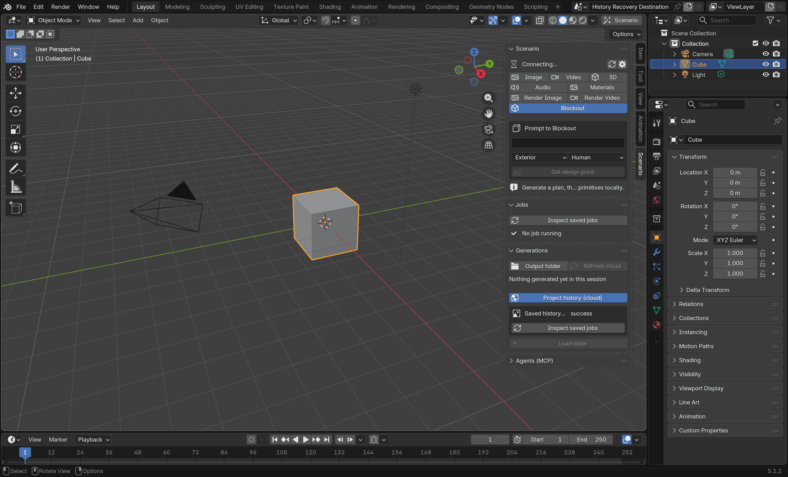

A viewport click selects the light, and Home frames the scene, confirming focus
and keyboard navigation after inspection. The harness closes the test and removes
its disposable profile; the normal profile remains unchanged. External networking
is blocked. This proves the scoped row-to-recovery interaction, not a live cloud
refresh, download/import completion, arbitrary cloud-job adoption, other OS/DPI
combinations or integrated release acceptance.

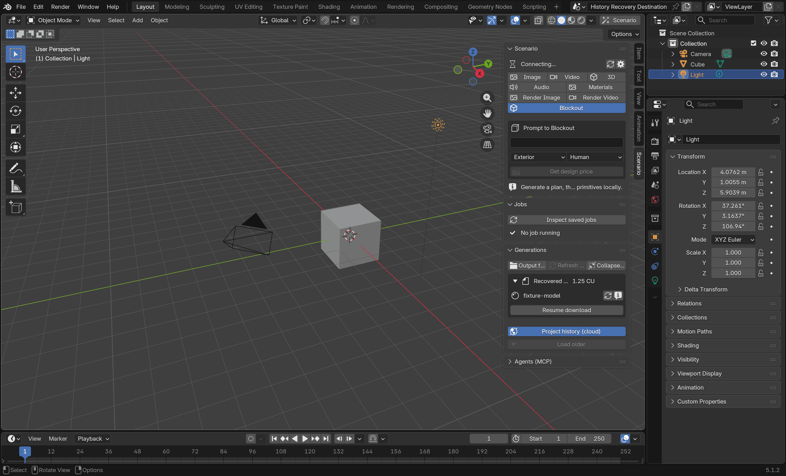

The redraw fix uses ZIP SHA-256
`27ebeece6da712d7b6fd50a8047736df8351e501679b1a4ad1503b62f82e7ac5`.
All 751 installed tests pass on each of the same three Blender versions.
Regressions reject database reads during 30 consecutive panel draws, retain
saved-job routing for late shared-view acknowledgements, and verify storage
failure/retry and credential-change invalidation. The existing screenshots and
desktop interaction evidence above belong to the preceding ZIP; desktop input
on the changed artifact remains unverified.

## Completed cloud job recovery controls

A successful cloud row without a scoped record offers **Save for recovery**.
The metadata read is available in Edit, Sculpt and Pose modes as well as Object
mode, subject to the same online-access and credential checks. Switching scenes
while it runs does not discard the saved record or authorize scene application.
Admission errors show their actionable reason, such as a different model read
already pending for that job; unexpected failures keep a generic sanitized message.
While its shared worker reads the job, the disabled label is **Reading cloud
job...**. Success exposes **Inspect saved jobs** and a paused recovery record;
download and destination approval remain separate. A sanitized read error allows
an explicit retry. Legacy cache rows and files cannot substitute their old
actions or hide this control. Drawing only inspects the current store/facade.
Saved recovery rows keep their place when prototype jobs report progress or the
application pump runs again. A shared row takes precedence over a legacy row
with the same local ID. The prototype's 50-row limit does not trim saved recovery
rows. These are display rules; they do not delete stored jobs or resume work.

The exact ZIP with SHA-256
`e572909c23aae8ddd027aa48e489f338eb34dd35b2eacdaf35cbb9a7c57f11ec`
passes 760 installed tests on each macOS arm64 Blender 5.0.1, 5.1.2 and 5.2.1.
Native desktop interaction with that same ZIP passes on macOS arm64 Blender
5.1.2 in a disposable profile. The fixture preloads one synthetic cloud row and
uses the real installed SDK adapter with a GET-only mock transport; external
Python network connections are blocked.

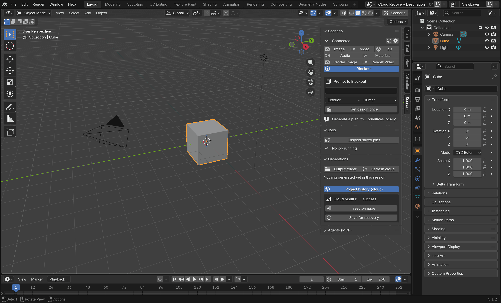

Clicking **Save for recovery** starts one job read and disables the pending
control. Pressing N closes the sidebar while that read is held by the fixture.
Releasing the synthetic response delivers one paused cloud record with the
sidebar still closed. Reopening it shows **Resume download**. Repeated
**Inspect saved jobs** does not alter the record or issue another request.
The scene's objects and images remain unchanged, with zero downloads or paid
submissions. A subsequent viewport click selects the light, and Home frames
the scene, confirming mouse focus and keyboard navigation after recovery.

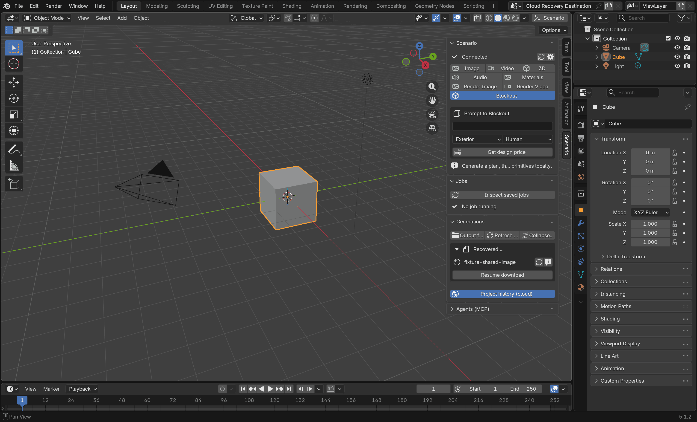

A separate run exercised a sanitized read rejection after selection changed
while the read was pending; explicit retry saved one paused record without a
submission or download. Both completed runs exit through harness cleanup, remove
their disposable profiles and leave the normal profile unchanged. The isolated
application has a test-only identifier to distinguish its window; the extension
ZIP is unchanged. These checks establish native recovery controls with synthetic
responses, not live cloud history, provider latency, completed result application,
other OS/DPI combinations or integrated release acceptance.

Scene-independent metadata delivery has separate native input proof on macOS
arm64 Blender 5.1.2, using exact ZIP SHA-256
`38f0a51edea77643f4988c737090e759b578c4b1844cdfd25f4ec43c3f3183d6`.
That ZIP passes 822 installed tests on each Blender 5.0.1, 5.1.2 and 5.2.1.
With external network connections blocked and a GET-only SDK fixture, clicking
**Save for recovery** in Edit Mode starts one metadata read. While it is held,
Tab exits Edit Mode, the scene selector switches to another scene, and N hides
the sidebar. The response saves one paused record while that sidebar is closed.
Reopening it shows **Resume download** in the second scene. Repeated inspection
leaves the record and request count unchanged; neither scene receives a result.
Returning to the original scene, selecting the light and pressing Home confirms
viewport mouse focus and keyboard framing. There are zero downloads or paid
submissions, cleanup removes the disposable profile, and the normal profile is
unchanged. Sculpt/Pose admission and actionable admission errors have installed
regression coverage; this desktop run exercised Edit Mode and scene switching.
The live-provider, other-OS and release limitations above still apply.

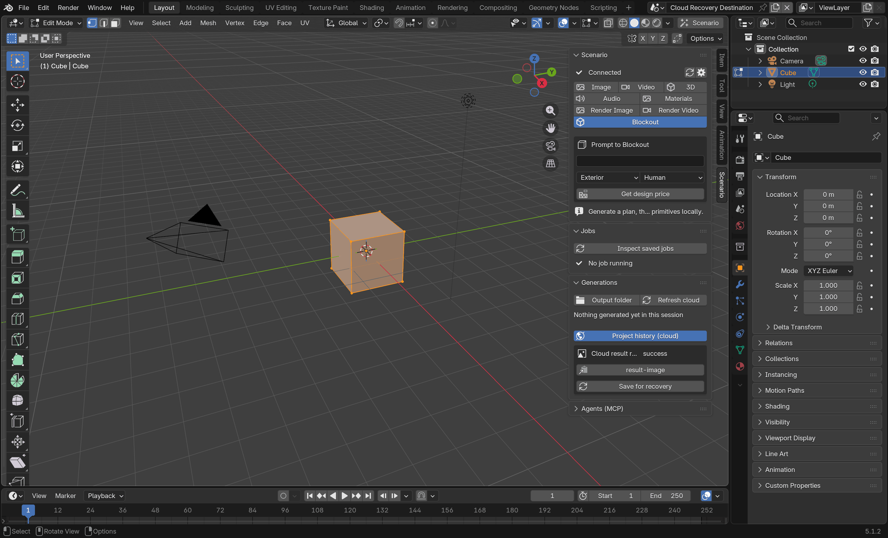

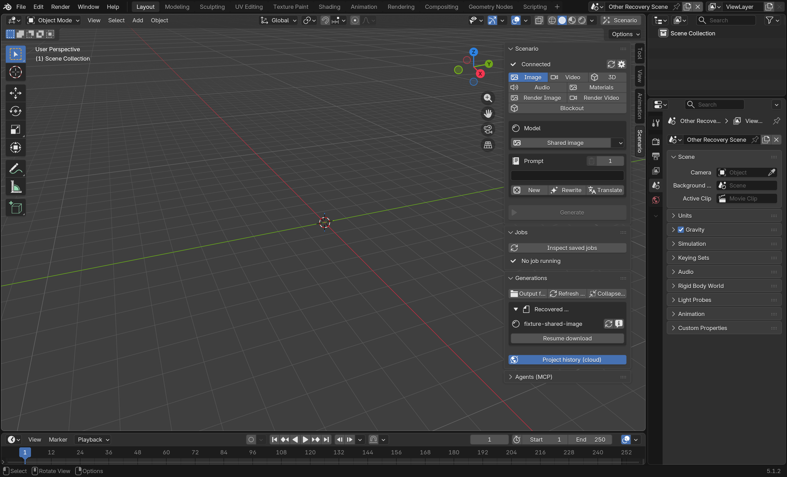

## Film task controls

Film tasks occupy an optional, initially closed **Film** sidebar panel. Loading
a recipe validates it before changing persistent scene properties and preserves
the production identity. Task rows are saved properties, not transient enums or
mutations during drawing. **New production** requires confirmation.

**Use saved upload** opens a cached list of imported uploads and confirms the
unchanged task, recipe, production, scene and connection before association.
**Estimate task** makes a free quote request; the separate **Generate** confirmation
shows its exact decimal CU price and states that results remain saved for explicit
application. The panel draws cached handles only; it does not open storage or
contact Scenario.

Current submitted and associated task rows show **Submission saved** or
**Upload associated**, without offering another estimate or association action.
The maintenance pump invalidates ready prices when their captured scene revision
changes, and approval rechecks before persistence. Drawing remains read-only.

Offline desktop acceptance on macOS arm64 Blender 5.1.2 used exact ZIP SHA-256
`b1ad71d94a1355bc7d8d825b4d1232b7a14cf91c53d8c11aa37737e4a0907590`,
which separately passed 799 installed tests on each supported Blender series.
Native mouse input loaded the JSON through Blender's file picker and selected
both task rows. Escape cancelled upload association without saving it; Return
confirmed the separate association. The Generate dialog displayed the full
synthetic price `0.1234567890123456789 CU`. Escape preserved the ready estimate
without submitting; the automated-GUI-probe guard also rejected approval without
creating a job. Discarding released that estimate.

With the fixture's SDK transport and result bytes mocked and external sockets
blocked, a fresh quote and explicit confirmation produced exactly one saved job
and one downloaded result. The result stayed ready for explicit application;
objects and image datablocks were unchanged. Re-estimating the reserved task was
rejected without another submission. Cancelling New production preserved its
identity; confirming changed it while retaining the recipe and previous job.
Viewport Light selection and Home framing worked after the dialogs. The isolated
run exited cleanly, removed its test profile and left the normal profile unchanged.
The test-only Blender app copy had a distinct bundle identifier and local signature;
the vendor executable code and extension ZIP were unchanged.

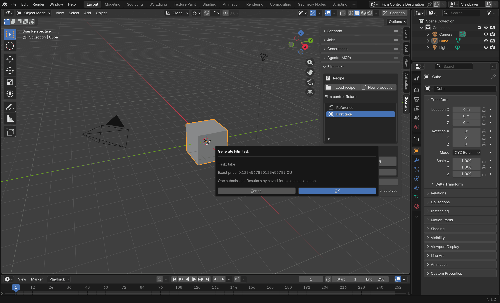

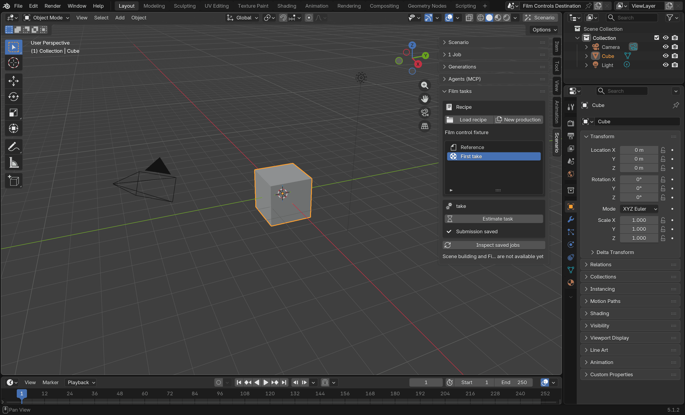

These are offline interaction checks, not live pricing or provider acceptance.
The screenshots and desktop evidence above predate the current stale-price and
saved-row review fixes. Those changes have separate installed native regression
coverage; fresh physical input and screenshot proof remain pending.
They do not establish other OS desktop behavior, Film scene construction/capture,
finishing/export, resolution of #263 or integrated release acceptance.

### Film shot controls

The **Shots** child panel uses saved shot rows and a stable selected index.
**Prepare shot** presents saved GLB choices per hero before local verification;
**Build shot** requires a second confirmation naming the shot, recipe scene and
hero count. The build preserves the working scene. **Discard review** confirms
discarding unapproved work. **Save build receipt** never repeats a scene build.
**Acknowledge inspection** requires a checkbox and cannot clear saved uncertainty.
**Shot error details** wraps the complete cached error and offers copying.
Drawing uses cached status and never starts a session or polls storage/workers.

Installed synthetic tests cover UI/MCP handle sharing, source/build cancellation,
changed destinations, receipt-only recovery, strict inspection acknowledgement,
saved shot selection and read-only drawing. Exact ZIP SHA-256
`f590b4ef5a601e984d1d0b950f0b5119b764347bd3e3aa4e2b8cc5b26ab14c09`
passes 855 installed tests on each macOS arm64 Blender 5.0.1, 5.1.2 and 5.2.1.

Desktop interaction with that same ZIP passes on macOS arm64 Blender 5.1.2 in
an isolated profile. The fixture supplies two saved synthetic hero GLBs and
blocks external Python sockets. Native mouse input expands Film and opens the
source review; Escape cancels it without creating a review or claiming jobs.
Return confirms local verification. Cancelling the separate Build shot dialog
preserves the ready review, jobs and scenes. Confirmed Discard review retires
only that unapproved review.

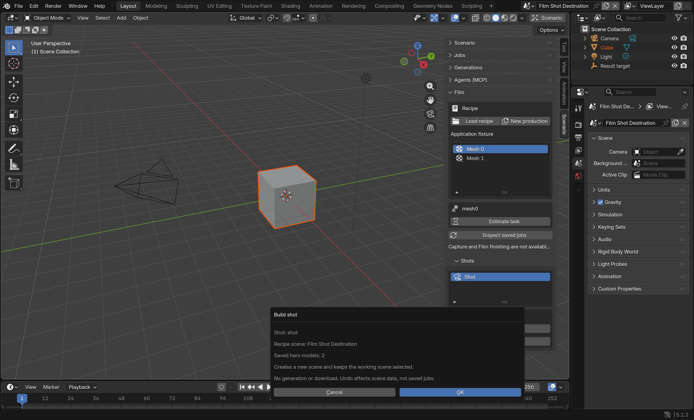

Fresh verification and explicit build confirmation create exactly one shot scene
and save both application receipts while preserving the selected working scene
and its objects. Edit > Undo removes that shot; Edit > Redo restores it. Neither
action rewinds the saved job receipts or permits reuse of the consumed review.
After history invalidates the original scene handles, the panel offers fresh
preparation. A viewport click selects the light and Home frames the scene,
confirming focus and keyboard navigation. The native scene selector opens the
built shot and returns to the intact working scene.

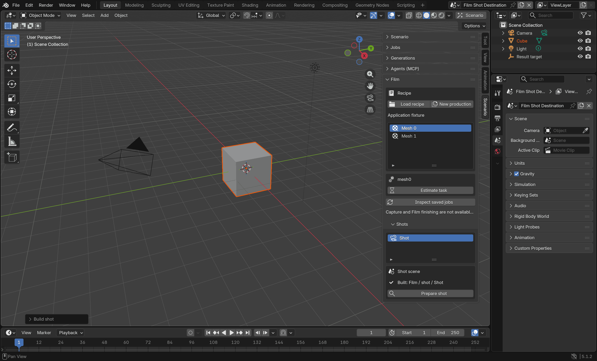

The run records zero service requests and downloads, exits cleanly, removes its
disposable profile and leaves the normal profile unchanged. This establishes the
synthetic shot-control interaction, not live provider compatibility, motion/audio
review, other OS/DPI combinations, timeline/capture/finishing or release acceptance.

### Film capture controls

The **Capture** child panel uses the shot selected in **Shots**. **Render capture**
confirms a matching local scene, still/video, color mode, dimensions and exact
editorial timing. It names optional video tools and distinguishes generated
source duration/trim from captured frames. Cancelling is inert. Prepared MCP
reviews expose **Render prepared capture** with the same exact settings.

Completed output offers **Open capture** and a separate **Upload capture**
confirmation showing size, timing, dimensions and full content hash.
**Cancel capture** retains frames after stopping work. **Discard capture**
confirms deleting only private capture files after work ends; saved uploads
remain. Failed work exposes its retained directory and wrapped cached error.
Drawing reads cached review status, never starts work or mutates properties.
The shared maintenance pump owns progress even with the panel closed.

Installed synthetic tests cover commands, cancellation, read-only drawing and
byte-checked upload handoff. Exact ZIP SHA-256
`50ab56cd3e12fa2991fb0cd3189cca3e9a7d3d700f4c9d13cfbee75bf64a4a85`
passes 892 installed tests on each macOS arm64 Blender 5.0.1, 5.1.2 and 5.2.1.

Desktop interaction with that same ZIP passes on macOS arm64 Blender 5.1.2 in
an isolated profile. The synthetic fixture blocks external Python sockets and
uses the real offline child renderer. Native keyboard input edits the dimensions;
Escape cancels capture approval without rendering, upload or scene changes.
A fresh dialog accepts a 128 by 128 still with material colors and one frame.

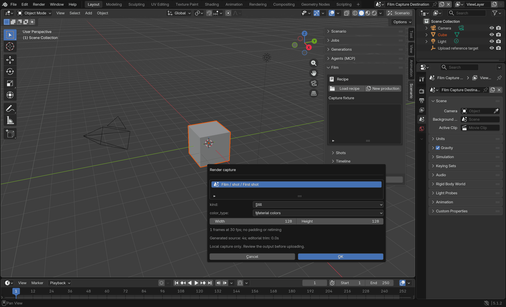

The rendered PNG's bytes match its recorded hash. All original scenes, objects,
frames and render settings remain unchanged, and no generation job is created.
Collapsing and reopening Film preserves the completed capture. The separate
upload dialog shows its size, dimensions, timing and full content hash. Escape
preserves the local capture without creating an upload or calling the transport.

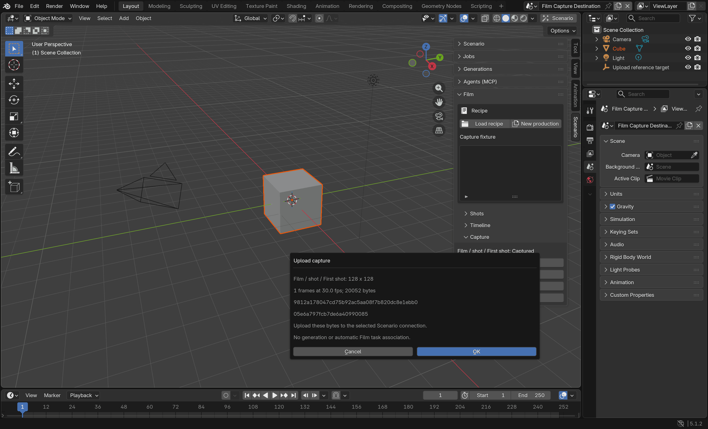

Confirmed upload uses a mocked SDK transport and one synthetic byte transfer;
the captured, staged and transferred hashes agree. The panel reports Uploaded
and the saved-upload dialog shows one imported image. Discard cancellation
preserves the capture. Confirmed discard removes only its private directory,
leaving the imported upload record and separately staged bytes intact. Native
viewport selection and zoom work after the dialogs close.

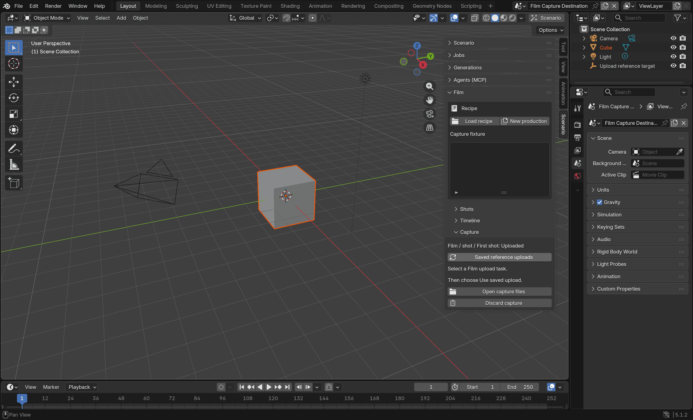

The run exits cleanly, removes its disposable profile and leaves the normal
profile unchanged. This proves bounded still-capture interaction and synthetic
upload handoff. Desktop video cancellation, sustained GPU/audio, human motion
review, live uploads, other OS/DPI combinations, finishing/export and integrated
release acceptance remain separate.

### Film timeline controls

The **Timeline** child panel offers **Build timeline**. Its confirmation lists
the editorial frame count/rate and a local scene choice for each recipe shot.
Missing choices explain that the shot must be built first. The dialog explains
that it creates a new sequence, keeps the working scene selected and references
live scenes whose later edits affect the timeline. Cancel creates no review.
The confirmed selection uses the same session command as local MCP. Build is
disabled outside Object Mode in a Blender window, while MCP preparation remains
available in Edit Mode.

Known rollback errors remain readable and copyable. Incomplete cleanup hides
the build action and requires **Discard timeline review** with its inspection
checkbox; this never deletes Blender data. Dismissed reviews no longer show
their status or Copy error action in the panel; MCP can still inspect the saved
review error. Ordinary status matches the current production and recipe; a
reload hides prior built/error status without hiding unresolved partial cleanup.
Drawing only reads cached status.
Native source/destination guards and single-use approval have synthetic installed
coverage. Exact ZIP SHA-256
`aef03c55e607a3ea99eb839bd4cdef2cc4c7e6517aa5ca5152d302744874f402`
passes 869 installed tests on each macOS arm64 Blender 5.0.1, 5.1.2 and 5.2.1.

Desktop interaction with that same ZIP passes on macOS arm64 Blender 5.1.2 in
an isolated profile. The local fixture supplies two recipe shots and a second
take for one shot, with external Python sockets blocked. Native mouse input
opens the panel and confirmation, which displays 180 frames at 30 fps. Selecting
the nondefault scene for the second shot and pressing Escape leaves every scene
and saved job unchanged and creates no review. A fresh dialog accepts the same explicit scene
choice, and Return confirms the build.

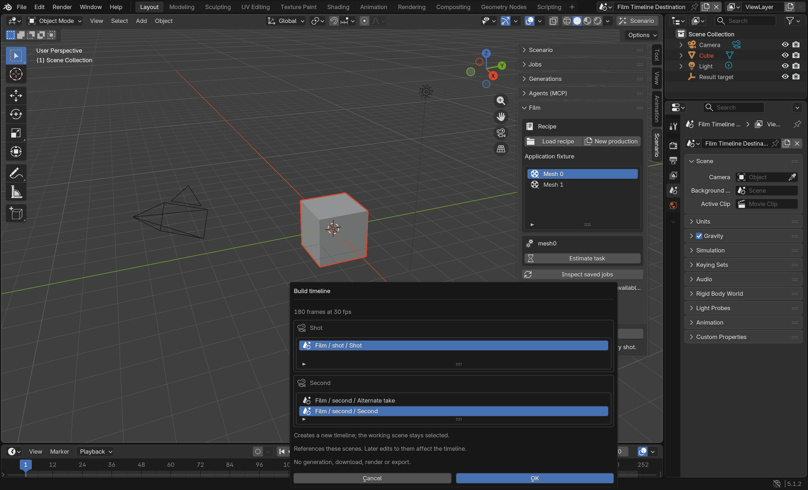

Exactly one new timeline contains the selected shots at frames 1–120 and 121–180,
with the working scene still selected and its objects intact. Saved jobs and
application receipts are unchanged. Edit > Undo removes only the new timeline;
Edit > Redo restores the exact scene sources and frame boundaries. The consumed
review stays consumed. After history invalidates its scene handle, the panel
requires a fresh approval for another build.

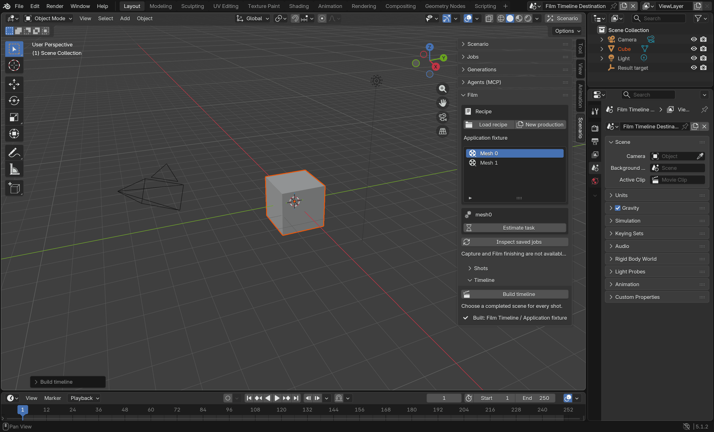

Viewport Light selection and Home framing work after the dialogs. The native
scene selector opens the built timeline. Selecting that scene in the Video
Sequencer's own scene selector displays the two editable scene strips.

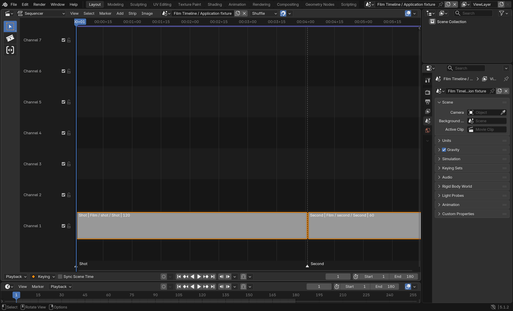

The run records zero service requests and downloads, exits cleanly, removes its
disposable profile and leaves the normal profile unchanged. This establishes the
synthetic timeline interaction, not live provider compatibility, human motion/audio
review, other OS/DPI combinations, capture/finishing/export or release acceptance.

Review follow-up ZIP SHA-256
`c008687d12a1dc370e841e0daf34abade5d7960d3bbf1458ecb03bca929eba20`
passes 958 installed tests on each macOS arm64 Blender 5.0.1, 5.1.2 and 5.2.1.
A fresh isolated desktop check on Blender 5.1.2 supplies a synthetic incomplete
cleanup. Mouse input opens **Discard timeline review**, checks the inspection
acknowledgement and Return confirms dismissal. The old error and Copy error
control disappear, while explicit MCP inspection retains the discarded error.
Dismissal preserves existing scene data, including the partial fixture scene,
and saved jobs.

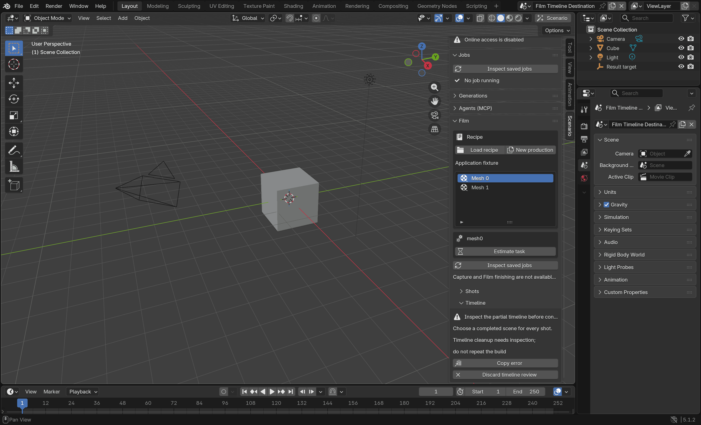

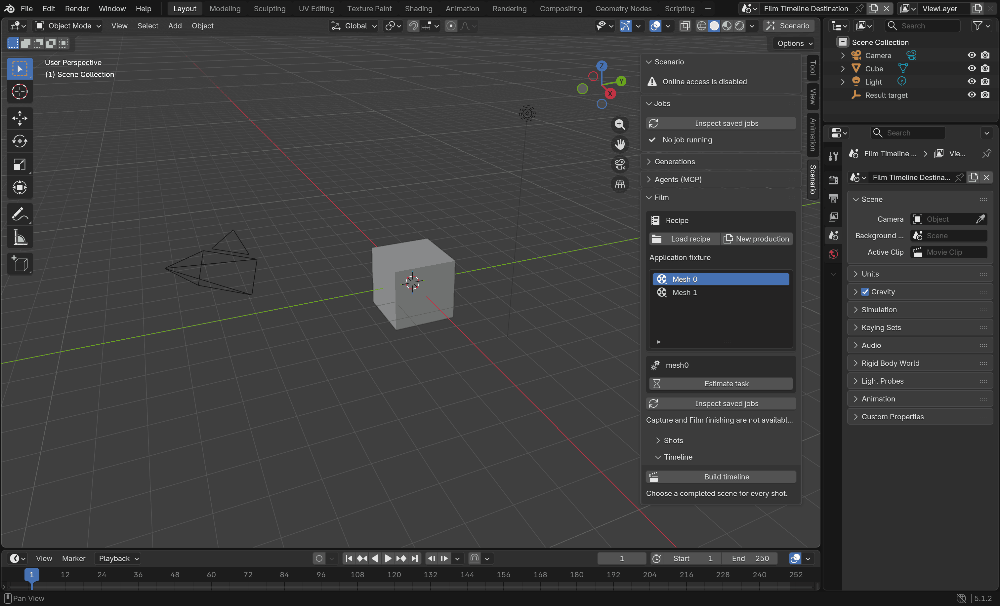

Viewport selection and Tab enter Edit Mode, where **Build timeline** is visibly
disabled. A main-thread probe of the shared command still prepares a ready
review; approval rejects Object Mode absence without consuming it or building.

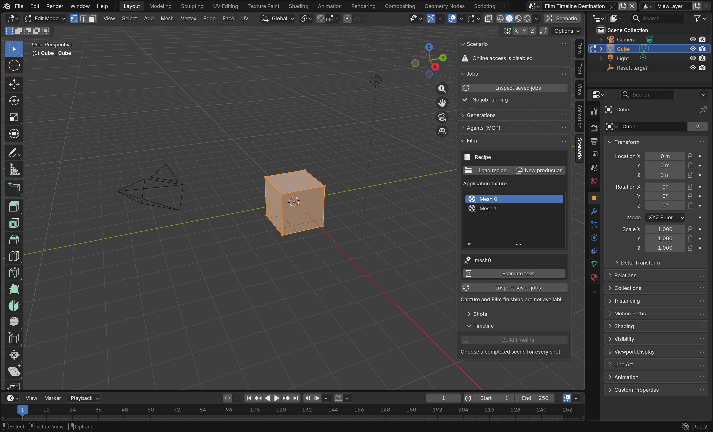

This follow-up records zero service requests/downloads, clean exit, disposable
profile cleanup and an unchanged normal profile. Its physical evidence covers
dismissal, viewport focus and Edit Mode gating; it does not repeat the earlier
build, Undo/Redo, missing-choice or Sequencer journeys.

Recipe-status validation uses exact ZIP SHA-256
`eea65caf46764ed36dae6717c5339da472127d668b389f0564e156c9b8024bc8`,
with 960 installed tests passing on each macOS arm64 Blender 5.0.1, 5.1.2 and
5.2.1. The isolated 5.1.2 desktop fixture displays a built timeline, then calls
the MCP recipe-load handler on the main thread with a replacement recipe. The
old Built label disappears; the prior review and scene data remain inspectable.
Viewport selection and Home framing work. A synthetic incomplete cleanup stays
visible and blocks preparation across another recipe reload. Mouse input opens
its discard dialog, checks inspection and Return dismisses it, clearing the panel.

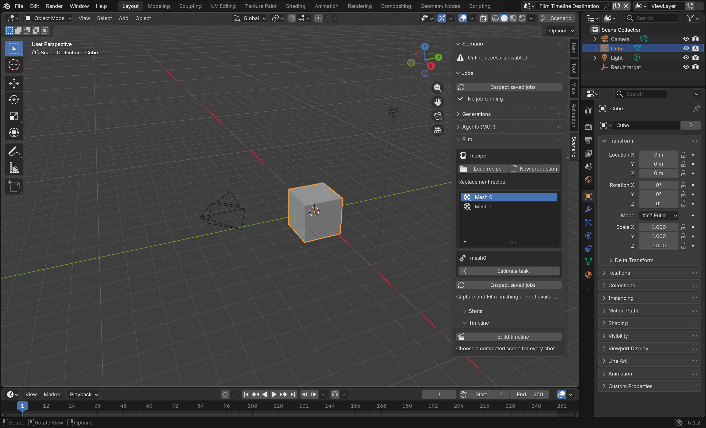

Saved jobs remain unchanged, with zero service requests/downloads, clean exit,
disposable-profile cleanup and normal-profile preservation. This check covers
recipe-status filtering and retained uncertainty, not a new build/Undo journey
or the native recipe file chooser.

### Film composition controls

The **Composition** child panel uses equal Final/Previs segments, then **Prepare
composition**, **Request price** and a separate **Generate** confirmation. The
confirmation shows the original scene, timing, source/layer counts and full exact
CU cost. Discard requires confirmation; cancellation affects only preparation or
the pending price. Saved jobs remain available after either action. Error details
wrap the complete cached error and support copying. Drawing only reads cached
status; the existing runtime maintenance owns progress.

Installed synthetic tests exercise native operator execution/dialog construction,
MCP parity and read-only drawing. The corrected navigation implementation passes
916 installed tests on each of Blender 5.0.1, 5.1.2 and 5.2.1 on macOS arm64.

Final/Previs is temporary WindowManager UI state, shared across the current
Blender session and excluded from saved scene data. Native edits to a scene-owned
custom property tag its owning scene, which invalidated retained quotes even
though the recipe was unchanged. Direct Python assignment in the earlier
regression did not reproduce that native update. The corrected installed
regression also tags the property's owner, preserving the same quote without
service requests after navigation. Frame changes still invalidate the captured
scene revision; that guard is unchanged.

An isolated macOS arm64 Blender 5.1.2 desktop check installed exact ZIP SHA-256
`6f932e81a802f8569378c38ad3d4b820da779a1f86090272585c9b1db8e1335f`.
All 136 packaged Python files matched the reviewed source. Native input cancelled
preparation, cancelled and confirmed discard, prepared a fresh review and requested
its exact synthetic price. Final → Previs → Final preserved the same review,
quote, scene and request count. Editing the current frame invalidated the review
without another request; the full error was readable in its details dialog.

The separate Generate confirmation displayed the original destination, 120 frames
at 30 fps, one source/layer and full synthetic price `0.10000000000000001` CU.
Cancelling preserved the quote with no submission. Confirming created exactly one
mocked durable master; discarding its review preserved that job, visible through
**Inspect saved jobs**. Viewport selection and zoom worked after leaving the
controls. Recipe and source bytes stayed unchanged. The process exited cleanly,
removed its disposable profile and left the normal profile unchanged.

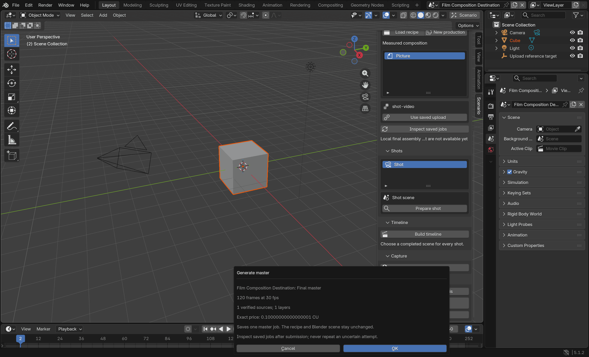
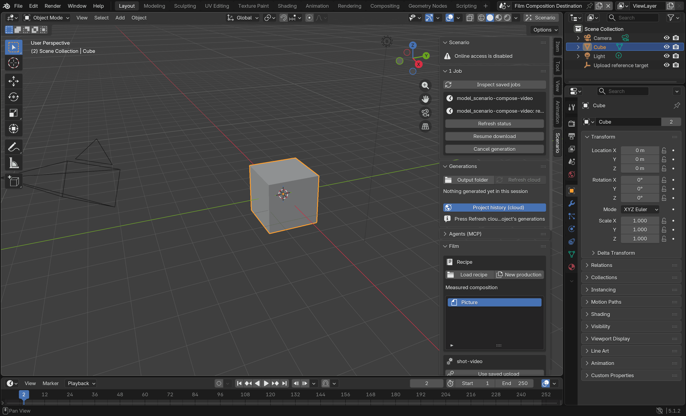

SDK transport and media metadata were mocked, and external socket/DNS calls were
disabled. This proves the scoped native interaction flow, not real media probing,
live provider quality, other OS/DPI behavior, local final assembly/export or
complete Film/release acceptance.

## Explicit Studio view

The viewport header has a separate **Studio** button. It opens a native popup
with Create, Film, Workflows, Library, Jobs, Results and Connection pages.
Opening, closing or switching pages does not start a job or select another
account/project. No startup or file-load handler opens it. The existing **Scenario** button still
opens the sidebar; the compact composer remains the default creation surface.

Studio reuses the actual native panel controls and their operators. Create keeps
the same scene form, model, prompt, references and parameters. Film separates
Tasks, Shots, Capture, Timeline and Composition; each keeps its existing
confirmation boundary. Results reuse the saved-result and explicit application
controls. Connection names the selected credential source/project and links to
Preferences and local agent setup without displaying credentials.

Navigation is an unsaved WindowManager property group. Native navigation edits
must not tag a scene or invalidate its exact quote. Before opening, focused
composer text is committed only if its original scene, lane and previously
synchronized prompt still match. A conflicting form rejects opening and retains
both texts. Opening Studio never commits pending text into another scene with
an identical old prompt.

The requested popup width is bounded by the invoking area, window and UI scale;
narrow requests use rows of at most three equal navigation segments. Clicking
outside a focused composer commits its text and passes that same click to Blender,
so the Studio header button opens on the first click. Installed tests cover this handoff,
registration, shared drawing, quote preservation, pending-text ownership and
continued admitted work.

An isolated offline desktop check on macOS 27.0.1 arm64, Blender 5.1.2, used exact
ZIP SHA-256 `32d81f8cbbc59023dcac10d71c1e87fc70a04265c8791e373639cef53c97c253`.
Native paste entered `Café 雪 Studio test` in the compact composer. One header
click opened Studio and preserved that text; Film navigation and Escape dismissal
worked. Camera selection, wheel zoom and the front-view shortcut worked afterward.
The default-size captures show readable two-row navigation without overlap.
The test app used a distinct bundle identity and development signature; the
installed extension and ZIP stayed unchanged. The process exited cleanly with
no Python network violations and the normal profile unchanged.

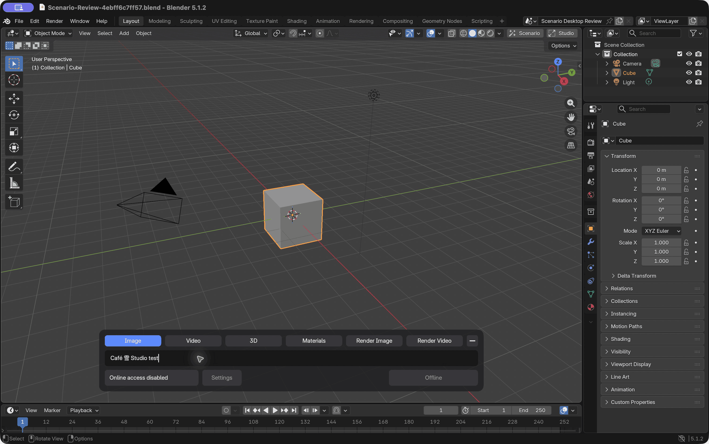
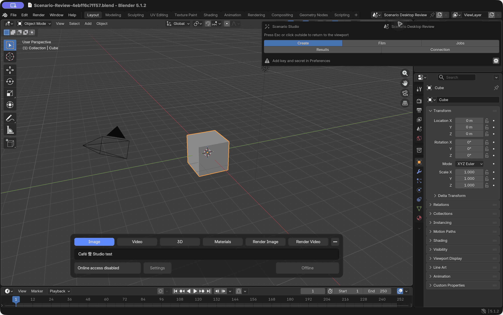
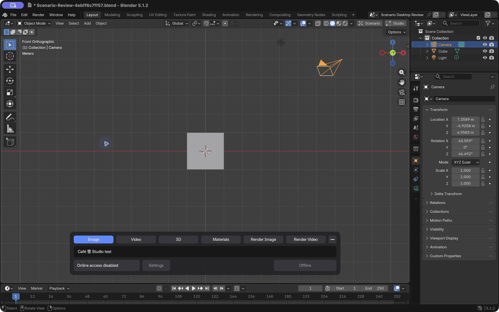

A second offline fixture on that same ZIP populated the actual shared model form
with a prompt, reference and enough settings to require scrolling. The SDK used
an in-memory transport; a running synthetic job was seeded in the local saved
store and resumed without invoking submission. Native navigation through Create,
Film, Jobs, Results and Connection retained the quote identity and exact cost
`0.1234567890123456789`, model, prompt and reference. The same job owner continued
polling while the popup opened, changed pages and closed. No submission occurred.

At Blender window dimensions 1512 × 917 and 1018 × 671, with UI scale 2.0,
the populated popup remained readable and scrollable without horizontal clipping.
Native Home/Shift-End selection, Unicode paste, Enter and Escape changed the
Studio prompt to `Café 雪 Studio edited`; the compact composer showed the same
text afterward, and the shared runtime produced a fresh ready quote. The repeat
exited cleanly with no Python network violations and the normal profile unchanged.
An earlier selection-shortcut attempt exited Blender and hit a test-fixture
credential cleanup error during shutdown; that run is not clean-exit evidence.

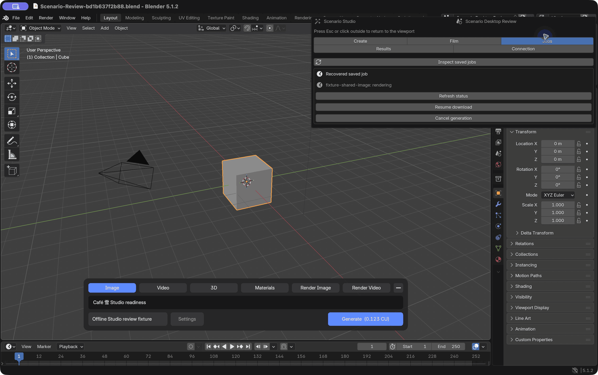
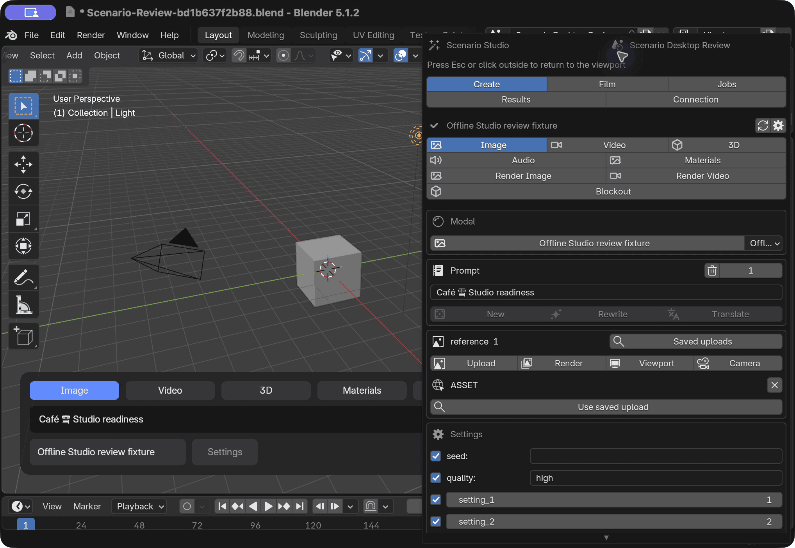

These checks supersede the window-attachment and populated-form evidence gaps.
Alternate-DPI interaction and IME composition remain unverified: Preferences
opened, but the attempted scale edit did not change the observed UI scale, and
Unicode paste is not IME composition. Track those native checks under #66 as
acceptance follow-ups; they do not block review of this scoped change. The complete
select/capture/estimate/generate/inspect/apply journey and other-platform desktop acceptance remain separate under #66/#68.

Blur and Studio opening now share the same focused-prompt ownership guard.
A conflicting scene, lane or sidebar prompt keeps both texts and focus intact;
the outside click is consumed with a warning before any native handoff. With no
focused prompt, blur writes nothing. Valid edits still commit and pass the same
click to Blender. Installed modal-path regressions reproduce all four overwrite
cases on the preceding ZIP and pass on fixed ZIP SHA-256
`15f730160c62c2e7a700b25ac6c8a7a1d134122c30ef3e5c85842912c463777b`.
That ZIP passes 1,088 installed tests on each macOS arm64 Blender 5.0.1, 5.1.2 and
5.2.1 (two Windows-only skips per run). A new isolated desktop attempt displayed
the correct fixture, but control-tool clicks did not visibly activate the composer
or Studio. It supplies no new physical-input acceptance; the screenshots and
interaction results above remain evidence for their explicitly identified ZIP.

The main-thread pump refreshes the live temporary popup region with
`tag_refresh_ui()`: normal area redraw alone can leave a completed asynchronous
quote showing as loading. Popup ownership is weak and removed regions are
discarded. The [desktop regression checks](#studio-and-library-desktop-regression-checks)
record the earlier scoped input evidence for this behavior.

This view exposes existing creation/Film/result controls and the workflow form
below, plus Library browsing and model-reference reuse. Interactive workflow
nodes and complete retained Studio acceptance remain separate.

### Workflow controls

Studio's Workflows page has explicit private/public refresh actions, a local
name search and a Workflow ID fallback. Loading inputs asks for confirmation
before replacing the form. A saved per-scene schema drives labeled text, numeric,
boolean, fixed-choice and structured fields. Structured values remain editable
as JSON; file fields name the requirement for uploaded asset IDs. A field's
inclusion checkbox omits it from the request, allowing declared defaults.

**Request workflow price** starts a shared session quote. **Generate** opens a
separate confirmation with normalized inputs, scene and the full exact CU price.
Cancel submits nothing; confirmation rechecks the form, scene, selected session
and original quote. Drawing is read-only and never starts catalog or job workers.
Page search/navigation use unsaved WindowManager state; scene form edits require
a new price. The maintenance pump completes metadata and quote requests even
after the popup closes. Saved jobs use the existing Jobs and Results controls.

Always-required fields use the shared parsed requirement rules, including
`required: {always: true}`, and start included. Catalog lists have session-only
delivery authority: editing a form while listing does not discard the catalog
or permit it to overwrite the form. Input loads and prices keep their original
scene/form checks. At the 32-view cache limit, opening another scene reclaims an
idle projection and its unused price; saved inputs and admitted jobs remain.
Pending requests are never evicted. Returning to an evicted price requires a
fresh estimate.

Installed tests verify synthetic native registration, shared UI/MCP quote use,
changed-input rejection, view changes, continued work and saved-form reload.
The desktop regression checks below record prompt editing, exact price refresh,
cancel/confirm and saved-job visibility with a synthetic service on their named
candidate. Broader DPI, IME and platform acceptance remains tracked under #66/#68
separately from review readiness.
Interactive nodes, integrated workflow reference upload and live outputs remain
outside this implementation.

## Native Library controls

Studio's explicit **Library** page has Search, Public assets and Collection ID
filters, Refresh, and separate Previous/Next actions. Native navigation uses at
most three tabs per row in narrow views. Filter edits do not start a read or tag
the scene; changed filters require Refresh before page continuation. Reads use
the shared session and application pump, so unrelated scene edits and closing the
view do not discard the requested page. Connection retirement clears the view.

Each asset shows its name and MIME type. **Use as reference** opens a separate
confirmation for the selected scene, generation form, model and compatible input.
No existing reference is silently replaced. Unknown MIME types cannot attach;
known file inputs respect their kind and capacity. Confirmation checks the
unchanged destination, adds a scoped asset reference and invalidates its price.
The dialog displays a captured scene name, so deleting the scene while it is
open cannot break redraw; confirmation still rejects the unavailable destination.
Drawing never starts requests or mutates RNA. Organization writes are separate
work. Dynamic input choices are retained by the live dialog and resolved through
its RNA properties; Blender passes `OperatorProperties` to the enum callback,
not the Python operator carrying the prepared approvals. Installed tests exercise
that registered callback as well as state and command boundaries. The desktop
checks below record native browsing and reference confirmation for their named
candidate. Remaining desktop acceptance stays under #66/#68 separately from
review readiness.

## Workflow reference selection

Library's **Reference destination** dropdown explicitly chooses Model or Workflow.
Choosing Workflow needs a loaded workflow form, not a selected generation model.
The reference dialog names the original scene, workflow and matching input before
attachment. Preserve existing file values; only empty single inputs and arrays
with capacity can receive a selection. Adding an array item may leave the form
incomplete, but Request workflow price must still enforce its full requirements.

Workflow file inputs use asset text/JSON plus Library selection; allowed-value
constraints remain active even when a file field declares enumerated IDs. Both
`file_array` and `file` with `array: true` use JSON arrays. Previously saved
file-enum forms retain their selected choice until explicitly cleared or reloaded;
changing that choice invalidates the price. Confirmed attachment to an empty
selection switches it to the Library-managed asset value. Each
Library-managed input stores its selected connection and canonical value. Edited
or cross-connection marked values require explicit clearing and selection again;
unchecked inputs retain the binding for re-enabling. **Clear reference(s)** asks
for confirmation of the original unchanged form, empties and unchecks the input,
and states that unchecked inputs use workflow defaults. A saved file retains the
binding, while price/confirmation handles retain their existing session lifetime.
No attachment, clearing or drawing action starts a generation or transfer.
Native reference selection has the scoped desktop evidence below. Installed
fixtures and that single environment do not establish full DPI/platform acceptance.

### Studio and Library desktop regression checks

The exact candidate ZIP SHA-256
`024b7654346463d89cb80e149c278254d9ac9de022447b90b1101f6d9c915351`
passed 1,132 installed tests with two Windows-only skips on each macOS arm64
Blender 5.0.1, 5.1.2 and 5.2.1. On macOS 27.0.1 / Blender 5.1.2, native desktop
clicks and keyboard input in an isolated profile reproduced and then verified
fixes for the Library enum error and Studio's stale loading display.

The same open popup now displays a completed workflow quote's full decimal
price. Editing its prompt disables the old approval; Cancel submits nothing,
and confirming a fresh quote creates one synthetic saved job. Native Library
search, Next/Previous, destination selection, reference Cancel/Confirm and
attachment to both workflow and model forms worked. Unicode prompt text survived
closing and reopening Studio. Escape restored viewport selection and keyboard
frame navigation. The popup also retained its shared form in a resized
2,214 by 1,456 pixel window, after scrolling the native viewport header to Studio.
Screenshots were inspected during these interactions.

These desktop checks use synthetic service responses with external sockets
blocked. They establish native input and popup refresh behavior, not live
workflow quality, full compact capture-to-apply acceptance, IME composition,
multiple DPI settings, other OS interaction, sustained GPU/audio behavior or
human media review. Those remain separate release gates under #68.
