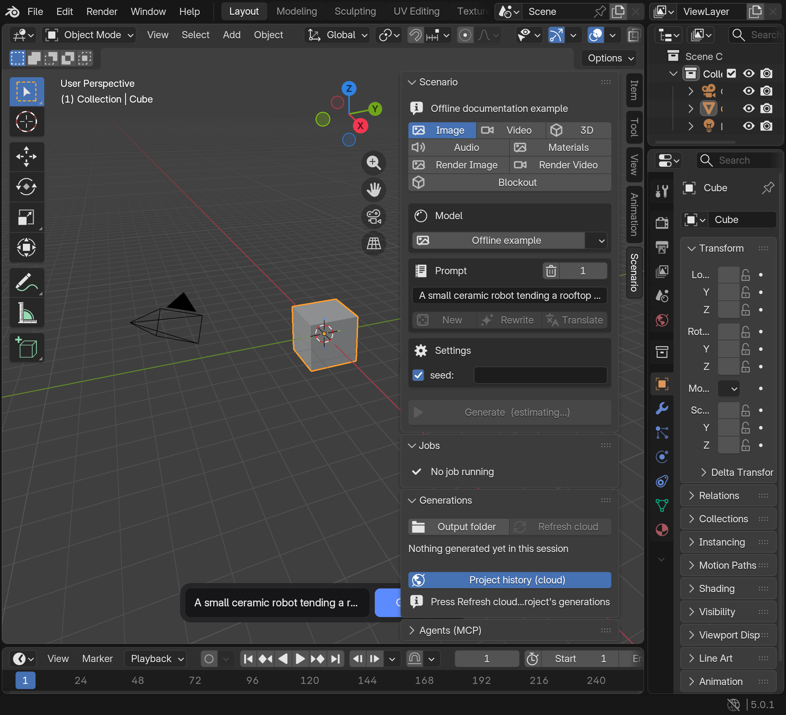
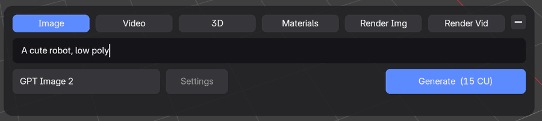
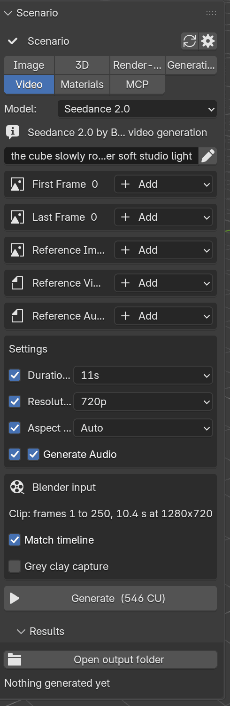
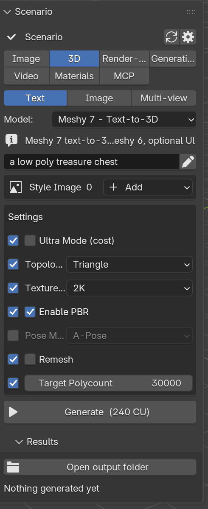
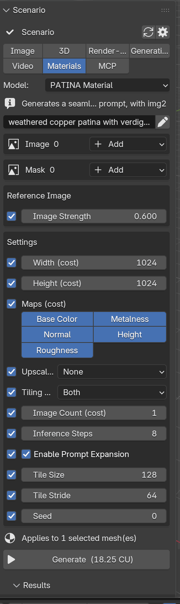
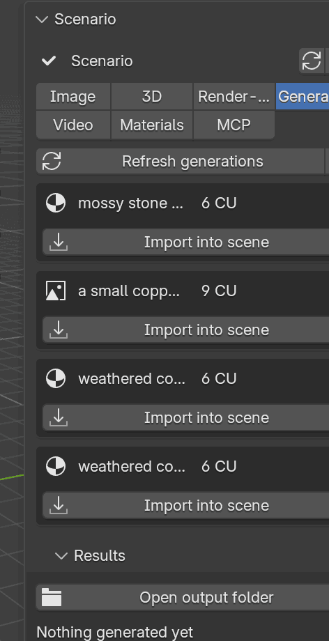
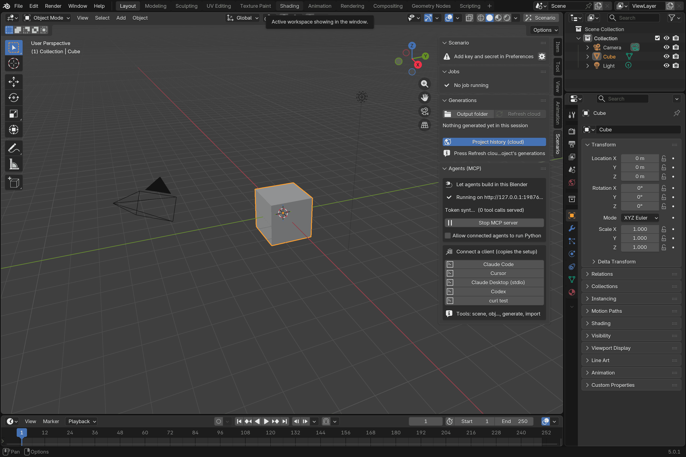

# Scenario for Blender: user guide

See the [documentation index](index.md) for current integration boundaries and technical guidance.

Blender 5.0 or newer, a Scenario account with API access (Pro plan or above), an internet connection.

## What it does

Scenario for Blender puts Scenario's generation models inside Blender's 3D viewport. From one tab you generate images, videos, 3D models, PBR materials and audio, render your scene as a finished still or clip, and edit the meshes you already have (remesh, retexture, UV unwrap, rigging, animation, parts). The inputs come from your scene (a viewport capture, the scene camera, a playblast of your animation, the selected mesh); the results come back where you work: images as datablocks and textures, meshes at the 3D cursor or next to their original, materials on the selected objects, videos and audio in your output folder (audio also drops on the sequencer). Every generation shows its price in Creative Units (CU) before you press Generate, charged to the Scenario workspace of your API key.

The add-on also runs a small local MCP server, so an agent such as Claude Code, Cursor or Claude Desktop can read your scene, run tools in Blender (including planning a camera move) and generate with Scenario.

## Install

1. Download `scenario-<version>.zip` from the [releases page](https://github.com/scenario-labs/blender-plugin/releases) (or build it with `uv run --locked --no-env-file python tools/build.py`). Keep it zipped.
2. Drag the zip onto any Blender window, or use Edit > Preferences > Get Extensions > Install from Disk. Blender installs it into your user extensions and enables it. Updating: install the new zip the same way; Blender replaces the old version. Restart Blender after an update so the new code loads.
3. Create an API key in Scenario: Team > API Keys, Project or Team scope, role Editor. The secret is shown once.
4. Edit > Preferences > Add-ons > Scenario: leave Credentials set to **Saved in Blender**, paste the key and the secret, and press Test connection. Pick an Output Folder (default `~/Downloads/Scenario`). Blender's Allow Online Access must be on (System preferences).

For automation, select **Credentials > Environment** to use `SCENARIO_API_KEY`
and `SCENARIO_API_SECRET` from the environment that launched Blender. Both are
required. Environment values never override **Saved in Blender**, and an incomplete
pair never borrows from the other source. Secrets are masked in the preferences;
Blender saves entered credentials with its preferences, not in an OS keychain.
The account strip names the selected source when its key or secret is missing.

Expand Scenario under Edit > Preferences > Get Extensions to find its Website link; it opens the project on GitHub, with the user guide and issue tracker.

### Verify your download

Releases produced by the automated pipeline include `SHA256SUMS` and a build provenance attestation. GitHub Actions builds the ZIP from the release commit with Blender 5.0 and validates the same archive on 5.0, 5.1 and 5.2 before publishing. These checks validate the package format, not runtime compatibility. Historical `v*` releases do not include checksums or attestations.

For automated releases, download the ZIP and `SHA256SUMS` into the same directory. Check the ZIP with `sha256sum -c SHA256SUMS` (macOS: `shasum -a 256 -c SHA256SUMS`) and, with the GitHub CLI, `gh attestation verify scenario-<version>.zip -R scenario-labs/blender-plugin`.

Where things are:
- The **Scenario tab** in the 3D viewport sidebar (press `N`, pick the Scenario tab). It holds four panels: Scenario, Jobs, Generations, Agents (MCP).
- The **Scenario button** in the viewport header opens that sidebar tab.
- The **floating composer**, a pill at the bottom of every 3D viewport: the quick path (prompt and Generate with the current lane's settings).

## The four panels

- **Scenario**: what to generate. Lane tabs with Scenario's modality icons, laid out Image / Video / 3D, Audio / Materials, Render Image / Render Video. Below the tabs, the form of the lane.
- **Jobs**: what is running, all lanes together, with a count in the header: "Prompt Spark is writing the look", "uploading and submitting", "rendering 40%".
- **Generations**: what came back. Each entry has a header (type icon, start of the prompt, price, a collapse arrow), the model, the asset id (click it to copy), a failure marker when something went wrong, the output thumbnail and the actions of its kind (images: View image, Use as reference (3D image to 3D, Image, Video, Render Image style, Render Video style), Remove background, Apply as texture, Add as plane; 3D: Add to scene, Select, Delete; video: Play, Play in Blender; audio: Play, Add to sequencer; materials: Tiling). The refresh button **reloads the parameters**: lane, model, prompt, every setting sent and the references come back into the form, ready to tweak and generate again. Objects a generation created are stamped with its id on import, so Select and Delete find them after renames. The info button opens Details: the full prompt, the settings sent, the references with their asset ids, the result assets, the files, the errors. Collapse an entry to keep only its icon and prompt. Then, with the Project history (cloud) checkbox on, the project's cloud history: generations made on the web app, by agents or on another machine, with Download and open; a cloud generation that also exists on this machine is drawn like a session entry, with the same actions.
- **Agents (MCP)**: the local MCP server, its token, one-click client setups, the Python permission.

## The form

From top to bottom:
- **Account strip**: your team and project, a refresh button for the model list, a shortcut to the preferences.
- **Model**: a button showing the current model. It opens the model picker, laid out like Scenario's "Choose a Model": modality tabs (Image, Video, Audio, 3D) and the web app's category chips (Image: All, Generate, Edit, Expand, Upscale, Vectorize, Remove Background, Tools; Video: All, Generate, Edit, Lipsync, Upscale, Reframe, Remove Background, Tools; Audio: All, Speech, Music, SFX, Tools; 3D: All, Generate, Splat, Remesh, Retexture, UV Unwrap, Rigging, Animate, Parts), a search field, the list with thumbnails and the description of the highlighted model. Scenario's trained LoRAs are not listed anywhere; the lists hold the third-party models and Scenario's tools. Picking a model of another modality switches to that lane. The small arrow next to the button is the plain dropdown.
- **Prompt**: its own box, like Scenario's. The prompt lives in the field; drag the small size control in the header to make the box taller. Below it, three equal full-width buttons with Scenario's icons: **New** (dice, Prompt Spark writes a prompt for the model), **Rewrite** (sparkles, Prompt Spark improves yours), both up to 3.75 CU with the Scenario LLM stepping in when Prompt Spark has no usable answer, and **Translate** (to English, Scenario LLM, 0.5 CU). They run in the background; the field updates when the answer arrives.
- **References**: one box per file input the model accepts (image, video, audio, 3D), with a thumbnail per file. Add offers File, Viewport still, Camera still, Viewport clip, Camera clip and Render Result. Captures happen when you press Generate. Pinned rows are inputs the lane adds itself (the capture, the selected mesh).
- **Parameters**: built from the model's own schema. A checkbox in front of an optional parameter means "send this value"; unchecked, Scenario uses its default. `(cost)` marks parameters that change the price.
- **Generate (N CU)**: the exact price of this form, refreshed as you edit (a dry run, free). "from N CU" means the quote excludes references that will only be uploaded at generate time; "Price shown after the upload" means the model needs the mesh or the capture first.

Results are saved under the Output Folder, one folder per kind and per day, and the file name carries the Scenario asset id: `3d/20260828/20260828_230353_hitem-3d-split_asset_ccpDR7Ga1…_00.glb`.

## Lanes

### Image
Text or reference images to images (GPT Image 2, Gemini 3.1, Seedream, Z-Image, FLUX 2, Qwen and any other txt2img / img2img model; video-to-image tools too). Results open in an Image Editor (fitted to the window, whole image visible) and appear in Generations with **View image**, **Use as reference** (3D image to 3D: the 3D tab opens in Image mode with the picture attached, ready to generate a mesh; or the Image, Video, Render Image or Render Video lane), **Remove background** (runs a background removal model, Bria or 851 Labs or Photoroom, the cut-out lands in Generations), **Apply as texture** (a material with the image as Base Color on the active mesh) and **Add as plane** (a view-facing plane at the 3D cursor).

### Video
Text, images or your Blender scene to video (Seedance 2.0 and 2.5, Kling, Veo, Wan, LTX and the other video models, including audio-to-video).

- **Viewport clip** / **Camera clip** references playblast your timeline at 1280x720 (overlays hidden) when you press Generate; a camera clip is captured through the viewport in camera view, so your Material Preview or Rendered shading comes along. **Grey clay capture** forces solid single-colour shading so the model reads motion rather than materials.
- **Match timeline** keeps the clip and the video the same length: the model's duration follows your frame range (a choice list such as Seedance's 4 to 15 s picks the first value that fits; a numeric range such as Minimax H3's 5 to 15 s takes the clip length rounded up and clamped), the duration field is locked while it drives, the box states "Video duration 6 s, same as the clip" or the padding or trimming applied, and the playblast is padded or cut to that exact duration. Seedance prompts get their `@video1` / `@image1` mentions automatically.
- Results: **Play** (system player) or **Play in Blender**.

### 3D
Four modes: **Text**, **Image** (one picture), **Multi-view** (several views of the same object, first one is the front) and **Edit** (Scenario's 3D tools on the selected mesh).

Generate: Meshy 7 and Rodin Gen-2.5 for text; Tripo 3.1, Tripo P1, Meshy 7, Hunyuan 3.1 Pro, Rodin 2.5 for images; Meshy 7 Multi Image, Tripo 3.1 Multi View, Hunyuan 3.1 Pro Multiview and Rodin for multi-view; worlds (Marble, HY World, TripoSplat) through the picker. Worlds come back as Gaussian splats (`.spz`, millions of splats): Blender cannot render splats, so the add-on loads them as a coloured point cloud (splat centres with their colours, sized points through a Geometry Nodes modifier, one million points kept for interactivity). The result is imported at the 3D cursor into a "Scenario" collection and the viewport switches to Material Preview so the textures show. Providers return several variants of one result (Meshy: GLB, OBJ and texture PNGs; Rodin with `material=All`: a shaded and a PBR mesh): the add-on imports one primary mesh (the textured GLB) and lists the other files in Generations with an **Add** button. Rodin defaults to PBR. **Add to scene** imports the primary mesh again at the cursor; **Select** selects the objects the job created.

Edit mode:
1. Select the mesh (or several) in the viewport.
2. Pick the task: **Remesh** (Tripo Retopology, Meshy Remesh, Hunyuan Polygen), **Retexture** (Meshy 7 Retexture, Tripo Texturing, Trellis 2 Retexture, Tencent Texture Edit, Rodin Hyper3D Bang!, Tripo Stylization, Hitem3D Multicolor), **UV Unwrap** (Meshy, Tencent), **Rigging** (Meshy, Tripo 2.5, Cartwheel), **Animate** (Meshy Animation, Cartwheel Text to Motion), **Parts** (Tripo Segmentation, Hunyuan 3D Part, Hitem3D Split, Rodin Bang), or **All**.
3. Fill the model's own parameters and Generate. The selection is exported as a GLB at generate time (modifiers applied, materials embedded) and uploaded; the result is imported next to the original, bottoms aligned, named after it.

### Materials
Patina turns a prompt (or a photo) into a seamless PBR set: base color, normal, roughness, metalness, height.

Select the meshes to texture, describe the material, choose the maps and size, Generate. The material arrives as a Principled BSDF with UV mapping and displacement and is applied to the meshes you had selected. **Tiling** in Generations scales the mapping. Three models: PATINA Material (prompt, with variation and inpainting), PATINA Image to Maps (a flat texture or photo to maps), PATINA Material Extract (isolate one material from a photo).

### Audio
Speech, music and sound effects: ElevenLabs Music v2, Google Lyria 3, ACE-Step 1.5, Minimax Music 3.0, ElevenLabs 3 (speech), Gemini 3.1 Flash TTS, ElevenLabs Sound Effects 2, Sonilo (text or video to SFX and music), and every other text-to-audio, audio-to-audio or video-to-audio model through the picker. Results go to `audio/<date>/` in the output folder; in Generations, **Play** opens them with the system player and **Add to sequencer** drops a sound strip at the current frame on a free channel.

### Render Image
Your view, rendered as a finished still by an image edit model. Everything that shapes the look lives in one collapsible **Rendering Style** box: the look prompt, the Prompt Spark options and the style images (the capture is image 1).

- **Scene to render**: Viewport (what you see) or Scene camera; Grey clay capture if the model should ignore your materials.
- **Model**: GPT Image 2 by default, then Gemini 3.1, Seedream 5.0 Pro, FLUX 2 (Max / Pro), Reve Remix, Qwen Edit 2511, MAI Image 2.5 Pro Edit, Grok Imagine Image 2.0, Z-Image; any other img2img model through the picker. Inputs and parameters that belong to another use of the model (Gemini's video input and frame rate) are hidden.
- **Look**: what the render should look like ("weathered steampunk copper, overcast light"). Leave it empty and **Prompt Spark** writes it: a capture of the view is sent to Scenario's prompt writer (0.75 CU), which describes the materials, lighting and mood to render; the look it wrote is shown on the lane and kept with the result.
- **Style images**: optional references for palette, materials and lighting. The capture is always image 1.
- The prompt the model receives states the role of every input: image 1 is the exact scene (every object, its position, the camera, the framing and the perspective are frozen; nothing may be added, moved or removed), the other images are look references only and none of their content may appear. The result lands in Generations and becomes the first frame of Render Video.

### Render Video
A playblast of your timeline, rendered as a finished clip by a video model that takes a reference video. The look, the style images (reference frames) and the video first frame live in one collapsible **Rendering Style** box; the model's own first/last-frame inputs are handled there, so only the reference frames are offered.

- **Clip to render**: Viewport clip or Camera clip, frame range and duration, Grey clay capture, Match timeline.
- **Camera path**: the planner works with editable markers. Type the shot you want ("slow ellipse 2, 8 s, 35mm") and press **Plan**, or pick a move from the library: Orbits (orbit, orbit high, orbit low, spiral in), Ellipses (three variants), Dolly & truck (dolly in / out, truck left / right, pedestal up / down, zoom in), Crane & arcs (crane, arc left / right, top down), Other (pan, flyover). **Place markers** turns the move into numbered `Shot` markers around the subject (small cameras; move them, or select one to set its own focal length and hold time). You can also add markers yourself with **At cursor** and **From view**. Set **Duration (s)**, **Focal (mm)** and the **Start frame**; the resulting frame range is shown. **Closed loop** (on for orbits and ellipses) brings the camera back exactly to its first marker. **Build camera path** creates the `Scenario Shot Camera`, keyframes it through the markers, aims it at the subject and sets the frame range; building over an existing path asks first. **Clear path** removes the camera, target and markers. **Preview** plays it in camera view. Camera clip then records exactly that move.
- **Model**: Seedance 2.0, Minimax H3, Seedance 2.5 and Mini, Runway Aleph 2, Happy Horse Video Edit, Gemini Omni Edit, Grok Edit Video first; every other video2video model through the picker. These models accept the video plus images, often many.
- **Look**: as in Render Image; empty means Prompt Spark writes it from a still of the first frame.
- **First frame**: the latest Render Image result is proposed automatically; the toggle sends it as the first frame (Seedance's `image`, H3's `firstFrameImage`) so the clip starts exactly from your rendered still. Any image result offers **Use as video first frame**.
- **Style images**: extra look references.
- The prompt names the playblast as the exact scene, camera move and timing to reproduce, the first frame as the look to match through the whole clip, and the other images as style only (with `@video1` / `@image1` tags for Seedance, plain words for the others).

### Generations
This session's results (collapsible entries with the asset id and a Details dialog), then the project's cloud history: prompt, kind, price, status, asset id. **Import into scene** brings a result into Blender (downloading it if needed), also for generations made on the web app or by an agent. **Load older** pages back in time. This is also the recovery path when a download failed: the job is still there, import it again.

### Agents (MCP)
The add-on serves the Model Context Protocol on `http://127.0.0.1:9876/mcp` with a token that changes every Blender session.

- Pick a client and press its button: the setup is copied to the clipboard (the snippet includes this session's token): Claude Code command, Cursor `mcp.json`, Claude Desktop stdio snippet, Codex command, or a curl test.
- **Allow connected agents to run Python** gates the `execute_python` tool. It is OFF by default; connected agents keep the other tools: scene summary, object detail, select, set frame, screenshots, quick renders, camera path (any move of the library, a description or waypoints), list models, model schema, cost estimate, generate (every lane, audio included), job status, wait, import result, capture a viewport reference, list generations.
- Native clients may omit Origin. Browser requests require a valid HTTP(S) loopback Origin (127.0.0.1, localhost or ::1); other origins receive 403 and CORS preflights are refused. The session bearer token remains required for MCP operations.
- Python execution is refused when Scenario preferences are unavailable, as well as when the toggle is off. Screenshot and render files are created in private temporary directories and removed after encoding, including failure paths.
- Headless: `blender --background scene.blend --command scenario_blender --port 9876 --token <token>`.

## The floating composer

The pill at the bottom of the viewport shows the current prompt in a field and a Generate button, in the same style as the expanded card. Drag it anywhere in the viewport; a click without moving expands it. The expanded card moves the same way (drag its background), resizes from the grip in its bottom-right corner, and a double-click on its background puts it back in place; the position is remembered in the preferences. Click the pill to expand: lane tabs (Image, Video, 3D, Materials, Render Image, Render Video), the prompt, the model chip (opens the model picker), a **Settings** chip (opens a dialog with the lane's full form: model, prompt, references, parameters) and Generate with the price. The composer is the quick path: it uses the settings of the current lane as they stand in the sidebar or in that dialog. The bottom-right corner resizes the card (a resize cursor appears when the pointer reaches it).

Editing the prompt: click to place the caret, drag or Shift+arrows to select, double-click selects a word, Home/End, Ctrl/Cmd+A selects all, Ctrl/Cmd+C copies, Ctrl/Cmd+X cuts, Ctrl/Cmd+V pastes, typing replaces the selection, Enter generates, Esc leaves. The minus button in the top-right corner collapses the card; clicking outside also does. If drawing ever fails repeatedly the composer switches itself off; re-enable it in Preferences (Floating composer in the viewport).

## Costs

Prices are in CU and depend on the model and its cost-marked parameters. Observed during the build (August 2026): an image 9 to 17 CU, a Patina material 6 to 18 CU, Tripo 3.1 image to 3D 45 CU, Rodin 2.5 80 CU, Meshy 7 text to 3D 240 CU, Seedance 2.0 76 CU for 4 s at 480p and 546 CU for 11 s at 720p, Prompt Spark 0.75 CU for a look (generic) and 3.75 CU for Spark / Rewrite on a model, Translate 0.5 CU. The quote on the Generate button is exact for the form you see; the Prompt Spark call is added when the look is empty.

## Troubleshooting

- **"Loading models..." does not end**: check the key and secret in Preferences (Test connection), and Blender's Allow Online Access. A Retry button appears when the catalog request failed.
- **"Prompt is required" / "Add a reference to see the cost"**: the quote needs a valid form; fill the prompt or add the required reference.
- **"Select the mesh to edit"**: the 3D tab in Edit mode needs a mesh object selected (or active) in the viewport.
- **"This model takes no image/video input"**: the picked model cannot receive the capture; choose another one in the Render lane.
- **The result does not appear**: open Generations. A job that failed shows a warning marker and the reason; Details lists the download errors; use Import into scene to fetch it again. After installing an update, restart Blender so the new version loads.
- **A 3D model looks untextured**: switch the viewport to Material Preview (the add-on does this on import), and check Details for the imported file name.
- **The rendered image moved things around**: the prompt already freezes the layout; give the model a cleaner capture (Grey clay capture, a camera view rather than a wide viewport) and fewer style images, and keep the look description about materials and light, not about content.
- **Nothing generates from Enter or a click**: with `SCENARIO_GUI_PROBE=1` in the environment (used by the automated screenshot tool) all Generate paths are disabled.
- **The sidebar and the dialogs do not look like the composer**: they are drawn by Blender with your Blender theme; the composer is custom drawing. Their layout follows the composer (tabs, chips, header rows) but their colours are the theme's.
- **Where are the logs**: Blender's system console (Window > Toggle System Console on Windows, the terminal on macOS/Linux), messages are prefixed `scenario`.
- **None of this helps**: see [Support](https://github.com/scenario-labs/blender-plugin/blob/main/SUPPORT.md) for where to ask and what to include.

## What leaves your machine

With online access and credentials enabled, cost previews send your prompt and
parameters to `https://api.cloud.scenario.com` while you edit, before Generate.
Generating or using prompt helpers can send reference files, captures and exported
meshes and spend credits. Catalogs and thumbnails load from Scenario; cloud history
loads when requested. Saved credentials, prompts, job state and media remain on
your machine. A connected local agent can read the scene and request paid work.
See [Privacy and data handling](PRIVACY.md) for destinations, storage, clipboard use
and the current limits of online-access and agent controls.

## Files and folders

- Results: your Output Folder (`~/Downloads/Scenario` by default), `<kind>/<YYYYMMDD>/<date>_<model>_<asset id>_<n>.<ext>`.
- Captures, Prompt Spark stills and Edit 3D exports: the extension cache (`captures/`, `exports/` under Blender's extension user directory), thumbnails of models in `thumbs/`.
- Job registry, recent models and model cache: the extension's own user directory under Blender's extensions folder; delete it yourself for a clean removal.
- Your key: saved as plain text in Blender's `userpref.blend` preferences file. Select Credentials > Environment to use `SCENARIO_API_KEY` and `SCENARIO_API_SECRET` instead; switching sources does not erase saved values. Clear both saved fields and save preferences to remove them; rotate the key in Scenario if it leaks.

## Known limits

See [known limitations](KNOWN_LIMITATIONS.md) for current runtime, authentication, interface and verification boundaries. The [architecture map](architecture/runtime.md) distinguishes existing components from unfinished UI/MCP integration.
