# Scenario for Blender: user guide

See the [documentation index](index.md) for current integration boundaries and technical guidance.

Blender 5.0 or later, a Scenario account with API access (see the [Scenario documentation](https://docs.scenario.com)) and an internet connection are required. This guide follows the current extension implementation; [release notes](../CHANGELOG.md) describe the changes available in each release. The extension remains experimental; check the [known limitations](KNOWN_LIMITATIONS.md).

## What it does

Scenario for Blender puts Scenario's generation models inside Blender's 3D viewport. From one tab you generate images, videos, 3D models, PBR materials and audio, render your scene as a finished still or clip, and edit the meshes you already have (remesh, retexture, UV unwrap, rigging, animation, parts). The inputs come from your scene (a viewport capture, the scene camera, a playblast of your animation, the selected mesh); the results come back where you work: images as datablocks and textures, meshes at the 3D cursor or next to their original, materials on the selected objects, videos and audio in your output folder (audio also drops on the sequencer). The Generate button displays the available estimate in Creative Units (CU). A "from" amount excludes references uploaded later; see [Costs](#costs). Requests use the credentials selected in the extension preferences.

The add-on also runs a small local MCP server, so an agent such as Claude Code, Cursor or Claude Desktop can read your scene, run tools in Blender (including planning a camera move) and generate with Scenario.

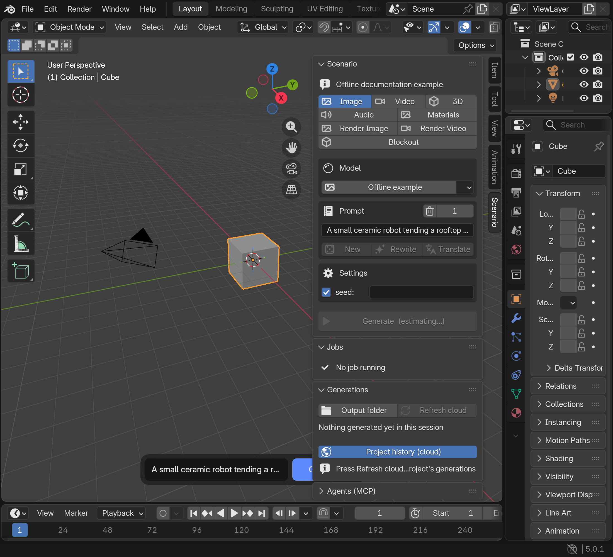

*The Image form is an offline illustration, not a live model response or price quote.*

Other lane images illustrate existing workflows and may show earlier layouts.
Use the control descriptions below for current behavior; visible prices are examples,
not current quotes.

## Install

This handbook follows current development, which can be ahead of downloadable
releases. Check [native download availability](https://blender.scenario.com/repo/)
and the release notes before installing. Historical `v*` ZIPs are earlier
experimental builds: their features, controls and Blender requirements may differ
from this guide. Use the requirements and instructions attached to that release.

1. Download `scenario-<version>.zip` from the [releases page](https://github.com/scenario-labs/blender-plugin/releases). Keep it zipped.
2. Drag the zip onto any Blender window, or use Edit > Preferences > Get Extensions > Install from Disk. Blender installs it into your user extensions and enables it. Updating: install the new zip the same way; Blender replaces the old version. Restart Blender after an update so the new code loads.
3. In Scenario, open Organization settings > API Keys > Add API Key and obtain the key and its secret. Follow the [API-key quick start](https://docs.scenario.com/get-started/documentation/quick-start-guide/step-1-obtain-your-api-key) for current account and access requirements.
4. Edit > Preferences > Add-ons > Scenario: leave Credentials set to **Saved in Blender**, paste the key and the secret, and press Test connection. Pick an Output Folder (default `~/Downloads/Scenario`). Blender's **Allow Online Access** must be on under Edit > Preferences > System > Network; network operators refuse to run while it is off.

For automation, select **Credentials > Environment** to use `SCENARIO_API_KEY`
and `SCENARIO_API_SECRET` from the environment that launched Blender. Both are
required. Environment values never override **Saved in Blender**, and an incomplete
pair never borrows from the other source. Secrets are masked in the preferences;
Test connection runs in the background. Its success status verifies model access
with the selected credentials, including when the model list is empty. It does
not identify an account or project. Repeated clicks while checking share the same
request; changing credentials or project discards the previous check's result.

**Project ID (optional)** applies to both saved and environment credentials. Leave
it blank to use the API key's server-defined default scope, or enter a project ID
you are allowed to use. This is an explicit override, not account discovery or an
access grant. A URL or malformed ID is rejected locally; service permission errors
remain errors rather than falling back to the default project.

Changing the project clears visible catalog/history and prices and retires pending
approvals. Already submitted work retains its original credential/project scope.
Switch back to that same scope to inspect or recover its saved jobs; use a fresh
quote for new generation. Changing only surrounding whitespace keeps the same
scope. Legacy unscoped jobs cannot make requests while an override is selected;
use the shared saved-job recovery controls. The selected ID is saved with Blender
preferences, independently of the credential source.

Blender saves entered credentials with its preferences, not in an OS keychain.
The account strip names the selected source when its key or secret is missing.

Expand Scenario under Edit > Preferences > Get Extensions to find its Website link;
it opens this handbook at [blender.scenario.com](https://blender.scenario.com/),
with installation instructions, update guidance and links to support.

### Updates

The public handbook is at [blender.scenario.com](https://blender.scenario.com/).
The official native repository uses `https://blender.scenario.com/repo/index.json`.
Check the [downloads page](https://blender.scenario.com/repo/) before setting up
the repository. Until the first verified adopted-package release is published,
the index is intentionally unavailable and native checks cannot succeed.
Historical `v*` releases are available only as manual ZIP downloads.

Open Edit > Preferences > Add-ons > Scenario > **Updates** to see the installed
version and whether the official repository is configured. Enable **Allow Online
Access** in System preferences, then choose **Set up official repository**.
Repeating setup reuses the same repository. **Check for updates** refreshes only
the official repository; it does not install anything. **Open Get Extensions**
opens Blender's native manager, where you choose whether to install or update.
Blender displays download errors there and filters releases for your Blender
version and platform. If no compatible release appears, keep your installed
version and inspect the release notes. Retry a failed check after connectivity
returns. A failed refresh can leave the previous listing visible; that cached list
does not confirm that you are up to date. Restart Blender when requested after an
update.

If Scenario's Updates controls disappear after disabling its repository,
open Edit > Preferences > Get Extensions > **Repositories** and enable the
existing Scenario repository again. Disabling a repository unloads its extensions;
Scenario cannot re-enable its own repository while unloaded. Re-enable the
existing entry to recover its saved settings, then check for updates. Do not
remove the repository or install a second copy as a recovery step.

For a fresh native installation, add the repository URL through Get Extensions >
Repositories > Add Remote Repository, then find and install Scenario. Updates to
that installation stay in the same repository and keep its preferences and storage.
Save Blender preferences if automatic preference saving is disabled.

A copy installed from a manual ZIP belongs to Blender's local repository. Adding
the official repository does not move that copy, its credentials or its stored
jobs. Continue updating that copy with **Install from Disk**, selecting the same
local repository, and restart Blender. Do not install a second copy expecting its
settings or history to transfer. There is no prototype-data migration.

Native controls target Blender 5.0, 5.1 and 5.2. Production install/update and state
preservation evidence remains part of the first adopted-release acceptance; a
local preview or a synthetic update test is not evidence of a published release.

### Verify your download

Releases produced by the automated pipeline include `SHA256SUMS` and a build provenance attestation. GitHub Actions builds the ZIP from the release commit with Blender 5.0 and validates the same archive on 5.0, 5.1 and 5.2 before publishing. These checks validate the package format, not runtime compatibility. Historical `v*` releases do not include checksums or attestations.

For automated releases, download the ZIP, `scenario-handbook-<version>.html` and `SHA256SUMS` into the same directory. Check the ZIP with `sha256sum -c SHA256SUMS` (macOS: `shasum -a 256 -c SHA256SUMS`) and, with the GitHub CLI, `gh attestation verify scenario-<version>.zip -R scenario-labs/blender-plugin`.

Where things are:

- The **Scenario tab** in the 3D viewport sidebar (press `N`, pick the Scenario tab). It holds four panels: Scenario, Jobs, Generations, Agents (MCP).
- The **Scenario button** in the viewport header opens that sidebar tab.
- The **floating composer**, a pill at the bottom of every 3D viewport: the quick path (prompt and Generate with the current lane's settings).

## The four panels

- **Scenario**: what to generate. Lane tabs with Scenario's modality icons, laid out Image / Video / 3D, Audio / Materials, Render Image / Render Video, Blockout. Below the tabs, the form of the lane.
- **Jobs**: what is running, all lanes together, with a count in the header: "Prompt Spark is writing the look", "uploading and submitting", "rendering 40%".
- **Generations**: what came back. Each entry has a header (type icon, start of the prompt, price, a collapse arrow), the model, the asset id (click it to copy), a failure marker when something went wrong, the output thumbnail and the actions of its kind (images: View image, Use as reference (3D image to 3D, Image, Video, Render Image style, Render Video style), Remove background, Apply as texture, Add as plane; 3D: Add to scene, Select, Delete; video: Play, Play in Blender, Add video strip; audio: Play, Add to sequencer; materials: Tiling). The refresh button **reloads the parameters**: lane, model, prompt, every setting sent and the references come back into the form, ready to tweak and generate again. Objects a generation created are stamped with its id on import, so Select and Delete find them after renames. The info button opens Details: the full prompt, the settings sent, the references with their asset ids, the result assets, the files, the errors. Collapse an entry to keep only its icon and prompt. **Collapse all / Expand all** changes every entry from the panel header. A failed entry has a red error control: hover for the message, or click to read and copy the full text. Then, with the Project history (cloud) checkbox on, the project's cloud history: generations made on the web app, by agents or on another machine, with **Save for recovery** for completed model jobs. Saved jobs use explicit download and destination approval; see [Generations](#generations).

- **Agents (MCP)**: the local MCP server, its token, one-click client setups, the Python permission.

**Remove background** prepares the Image form with a background-removal model and
the selected local image. It does not start generation. Click **Upload reference**,
review the resulting exact price and settings, then choose **Generate**. Preparing
this action replaces the Image form's previous prompt, settings and references;
it does not cancel existing jobs. If the model description is still loading,
retry the action once it is available.

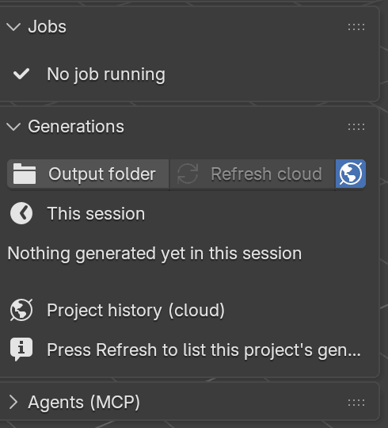

*Jobs, Generations (session results, then cloud history) and Agents.*

## The form

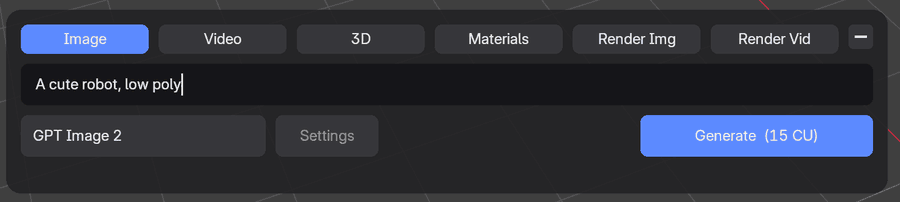

From top to bottom:

- **Account strip**: the connection or credential status, a refresh button for the model list and a shortcut to the preferences. Project overrides are selected in Preferences; browser sign-in and account discovery remain subject to the [known limitations](KNOWN_LIMITATIONS.md).
- **Model**: a button showing the current model. It opens the model picker, laid out like Scenario's "Choose a Model": modality tabs (Image, Video, Audio, 3D) and the web app's category chips (Image: All, Generate, Edit, Expand, Upscale, Vectorize, Remove Background, Tools; Video: All, Generate, Edit, Lipsync, Upscale, Reframe, Remove Background, Tools; Audio: All, Speech, Music, SFX, Tools; 3D: All, Generate, Splat, Remesh, Retexture, UV Unwrap, Rigging, Animate, Parts), a search field, the list with thumbnails and the description of the highlighted model. Availability depends on the selected credentials and the model catalog. See the [known limitations](KNOWN_LIMITATIONS.md) for trained/custom-model integration boundaries. Picking a model of another modality switches to that lane. The small arrow next to the button is the plain dropdown.
- **Prompt**: its own box, like Scenario's. The prompt lives in the field; drag the small size control in the header to make the box taller. Below it, three equal full-width buttons with Scenario's icons: **New** (dice, Prompt Spark writes a prompt for the model), **Rewrite** (sparkles, Prompt Spark improves yours), and **Translate** (to English). Each helper first requests a free server price. Review the CU amount below the row, then click **Approve New prompt**, **Approve Rewrite** or **Approve Translate** to submit once. The background result updates only the original, unchanged prompt field; changing its text, model, scene or credentials prevents stale delivery. An uncertain submission stays in saved jobs for inspection and must not be repeated. The trash button confirms before clearing the prompt and is disabled when it is empty.
- **References**: one box per file input the model accepts (image, video, audio, 3D), with a thumbnail per file. Add offers File, Viewport still, Camera still, Viewport clip, Camera clip and Render Result. Choose **Upload reference** to capture and upload a still or clip before pricing. For an empty 3D input, **Upload selected mesh** exports and uploads the current selection. Render forms provide **Capture and upload scene** and, for a chosen video first frame, **Upload first frame**. Generate never captures or uploads implicitly.
- **Parameters**: built from the model's own schema. A checkbox in front of an optional parameter means "send this value"; unchecked, Scenario uses its default. `(cost)` marks parameters that change the price.
- **Generate (N CU)**: the current exact server estimate for this form, refreshed as you edit (a dry run, free). Generate consumes that unchanged quote once and saves the submission for recovery. Pending files, captures or Prompt Spark preparation must finish first; a partial price cannot authorize generation.

CU labels use up to three decimal places without trailing zeros, with compact
notation from 10,000 CU (`12.3K CU`). The approval retains the original server
quote even when its displayed amount is rounded.

New form generations appear in the shared saved jobs. Image imports supported PNG/EXR results into its original scene; other lanes retain downloaded results for explicit application. Saved video/audio results now offer the confirmed strip insertion described below. The lane descriptions below also describe retained prototype capabilities whose shared result application is still being integrated. Live Prompt Spark acceptance, result application and Film acceptance remain release blockers.

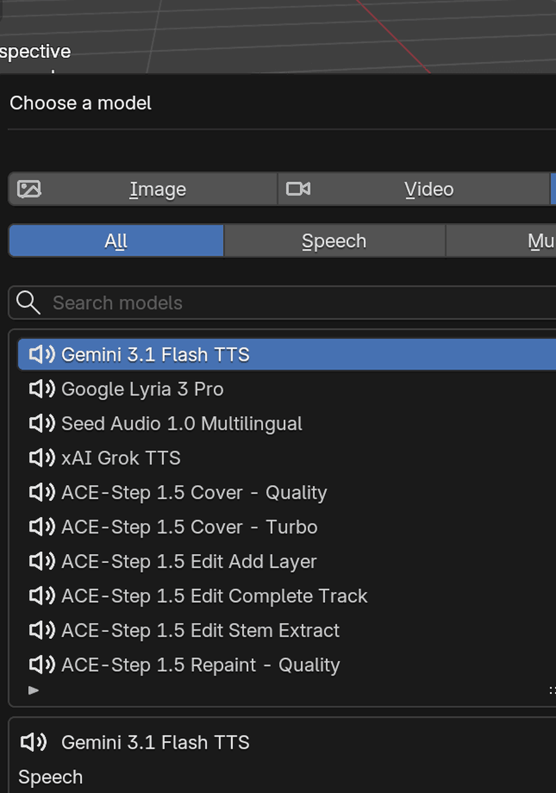

*The model picker follows Scenario's "Choose a Model": modality tabs, category chips, search, description.*

## Lanes

Model names below are examples, not a fixed catalog or an account entitlement.
Available models, accepted inputs and settings depend on your access and the
current model schema. Existing screenshots illustrate controls; model choices
and prices can change.

- **Image**: text and image references to a picture.
- **Video**: text, images or a scene clip to a video.
- **3D**: generate a mesh, or edit an exported selection.
- **Materials**: create a PBR map set for selected meshes.
- **Audio**: create speech, music or sound effects.
- **Render Image**: use a scene capture as the layout for an image.
- **Render Video**: use a playblast as the motion and framing for a clip.
- **Blockout**: describe a scene layout, then refine or rebuild its primitives.

### Image

Choose an image model and describe the result. For a local file, viewport,
camera still or Render Result reference, first add it to the form, then click
**Upload reference**. This sends the chosen image snapshot to Scenario. Once it
finishes, the reference is marked as uploaded and the form requests a fresh price.
**Generate** uses that exact approved input and price; uploading alone never
starts generation.

Keep the scene, model and reference slot unchanged while the upload finishes.
If they change, a late upload cannot replace the new selection. **Inspect uploads**
shows saved progress and lets you refresh a known upload, cancel an unsubmitted
preparation or clean up its finished staging copy. Cleanup keeps your original file.
An uncertain upload is preserved without sending its bytes again.

To reuse an imported image after reopening a file or changing a reference, choose
**Use saved upload** on the reference, or **Saved uploads** on its input. Choose
**Use this reference**, then confirm the displayed scene, form, model and reference slot.
Changing the destination while confirmation is open requires another review.
Attachment requests a fresh price; it does not start generation. Uploaded
references are bound to the selected credentials, and later edits to the original
file do not change the uploaded snapshot.

The same **Upload reference** and **Saved uploads** controls support audio,
video and 3D files wherever a generation form offers a matching input. For
example, a Video model's audio input accepts an audio file, not a still capture.
An upload stays attached to its original form when you change tabs. Pending
uploads must finish or be reviewed before generation can continue. Still captures
serve image inputs, viewport/camera clips serve video inputs, and **Upload selected
mesh** creates a GLB snapshot for an empty 3D input. Render forms use explicit scene/first-frame slots. An empty look can request a
separate Prompt Spark price from those uploaded images; approve the look before
reviewing the final render price.

This pre-release path imports supported PNG and scanline OpenEXR results as packed
image datablocks. Select them in Blender's Image Editor. Saved-job controls can
refresh/download or explicitly import recovered images into a reviewed destination;
see the [current runtime limits](architecture/runtime.md#active-sdk-cost-previews-and-model-submission).
Other generation lanes and result actions retain their earlier integration and
need their own acceptance checks.

### Video
Text, images or your Blender scene to video (Seedance 2.0 and 2.5, Kling, Veo, Wan, LTX and the other video models, including audio-to-video).

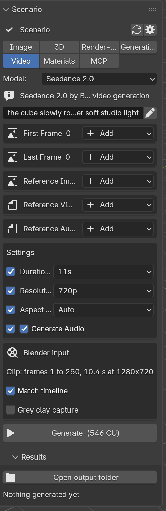

- **Viewport clip** / **Camera clip**: add the reference, then choose **Upload reference**. This captures a silent 1280x720 MP4 over the preview range when enabled, otherwise the scene frame range. A camera clip uses the scene camera through the viewport; viewport shading is retained unless **Grey clay capture** is enabled. The capture restores scene settings and the current frame afterwards.
- The uploaded clip is an immutable snapshot. It is not trimmed or padded automatically, and later timeline or model-duration changes do not recapture it. Set the intended range before uploading; replace the reference to capture again. Review the model's input and duration requirements before generation. **Match timeline** remains a model-duration aid, not a guarantee that an uploaded clip matches the output duration.
- For new shared jobs, choose **Add video strip (N)** in saved-job controls.
  Confirm the scene and current frame before insertion. MP4 and WebM are supported
  up to 512 MiB. A scene or frame change requires a fresh confirmation. This adds
  one chosen result on an unused channel without regenerating. After completion,
  a fresh approval can insert another saved variant or reuse the same one. Select the destination
  scene in the Sequencer header to see the strip. The independent local media
  copy must remain available if you move or share the blend file.
- Retained prototype results offer **Play** (system player), **Play in Blender**,
  or **Add video strip**.
  Add video strip inserts the downloaded picture frames at the current frame on
  an unused, unlocked and unmuted sequencer channel. It fits the picture inside
  the scene resolution and leaves existing strips, frame rate, frame range and
  color settings intact. Embedded audio is omitted; source frames play at the
  scene frame rate, so a different source rate changes playback speed. Use
  Blender Undo to remove the insertion. Missing or undecodable files and full
  channels report an error without leaving a partial strip. No external ffmpeg
  executable is needed for this native import. The action selects the destination
  in an empty sequencer scene selector. If the sequencer already shows another
  scene, select the destination scene in its header to see the inserted strip.

### 3D

For newly generated shared jobs, choose **Import model (N)** for one
saved GLB. Confirm the scene and cursor position. The importer adds a new group
with its bottom center at that cursor, retains the model hierarchy/materials,
packs embedded textures and preserves your current objects and selection.
One selected result consumes the job's application claim; variants and maps stay
saved. A changed cursor or scene requires a new confirmation.

This path accepts GLBs with one scene and embedded files, up to 256 MiB. It keeps
rigs, skin weights, shape keys and node animation clips. The first clip is active;
other clips are retained in muted NLA tracks. Clip timing uses your scene frame
rate, with time zero at frame zero. Your current frame and timeline range stay
unchanged; adjust the range yourself to play the full clip. External files,
pointer-based animation, other model formats and replacing an existing mesh are
not supported by this new import action. Large models may briefly pause Blender
while loading. Save the blend file yourself after import; this command does not
add a global Undo step.

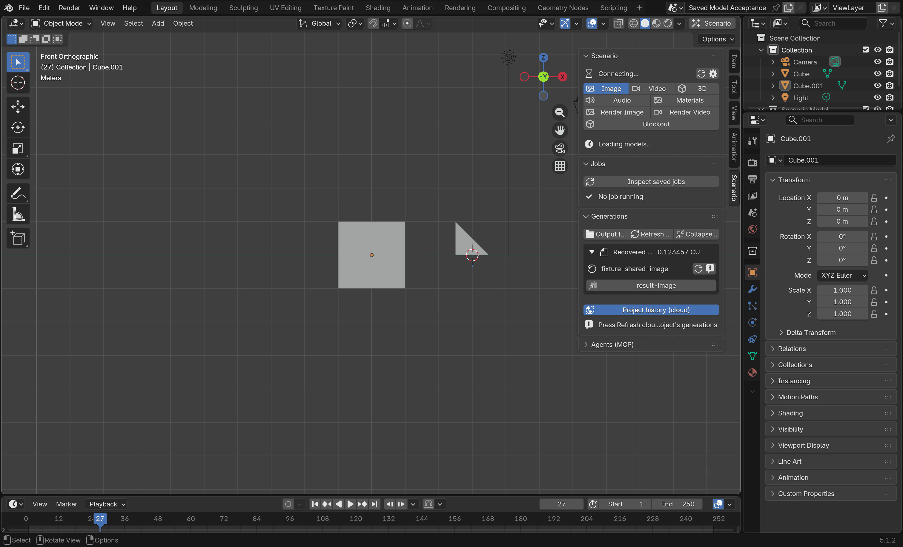

The following descriptions include retained prototype generation and import
features whose full shared-runtime acceptance remains open.
Four modes: **Text**, **Image** (one picture), **Multi-view** (several views of the same object, first one is the front) and **Edit** (Scenario's 3D tools on the selected mesh).

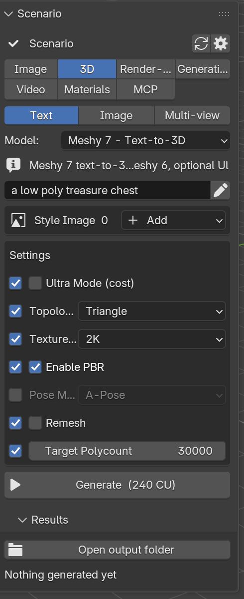

Generate: Meshy 7 and Rodin Gen-2.5 for text; Tripo 3.1, Tripo P1, Meshy 7, Hunyuan 3.1 Pro, Rodin 2.5 for images; Meshy 7 Multi Image, Tripo 3.1 Multi View, Hunyuan 3.1 Pro Multiview and Rodin for multi-view; worlds (Marble, HY World, TripoSplat) through the picker. Worlds come back as Gaussian splats (`.spz`, millions of splats): Blender cannot render splats, so the add-on loads them as a coloured point cloud (splat centres with their colours, sized points through a Geometry Nodes modifier, one million points kept for interactivity). The result is imported at the 3D cursor into a "Scenario" collection and the viewport switches to Material Preview so the textures show. Providers return several variants of one result (Meshy: GLB, OBJ and texture PNGs; Rodin with `material=All`: a shaded and a PBR mesh): the add-on imports one primary mesh (the textured GLB) and lists the other files in Generations with an **Add** button. Rodin defaults to PBR. **Add to scene** imports the primary mesh again at the cursor; **Select** selects the objects the job created.

Edit mode:

1. Select the mesh (or several) in the viewport.
2. Pick the task: **Remesh** (Tripo Retopology, Meshy Remesh, Hunyuan Polygen), **Retexture** (Meshy 7 Retexture, Tripo Texturing, Trellis 2 Retexture, Tencent Texture Edit, Rodin Hyper3D Bang!, Tripo Stylization, Hitem3D Multicolor), **UV Unwrap** (Meshy, Tencent), **Rigging** (Meshy, Tripo 2.5, Cartwheel), **Animate** (Meshy Animation, Cartwheel Text to Motion), **Parts** (Tripo Segmentation, Hunyuan 3D Part, Hitem3D Split, Rodin Bang), or **All**.
3. Choose **Upload selected mesh** to export one GLB snapshot with modifiers applied and materials embedded. Wait for its uploaded asset, fill the model's parameters, review the price and choose Generate. Later scene edits do not alter that snapshot; remove the reference and upload again to replace it. Result placement remains subject to the current generation/application integration.

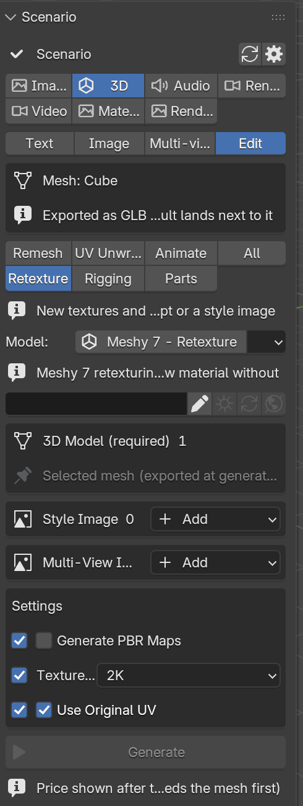

*3D tab, Edit mode: the selected mesh is pinned as the model input; task tabs pick the tool.*

### Materials
Patina turns a prompt (or a photo) into a seamless PBR set: base color, normal, roughness, metalness, height.

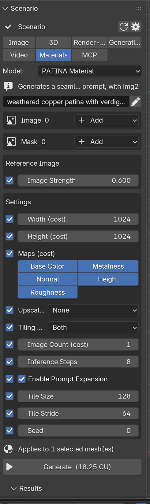

Select the meshes to texture, describe the material, choose the maps and size, Generate. The material arrives as a Principled BSDF with UV mapping and displacement and is applied to the meshes you had selected. **Tiling** in Generations scales the mapping. Three models: PATINA Material (prompt, with variation and inpainting), PATINA Image to Maps (a flat texture or photo to maps), PATINA Material Extract (isolate one material from a photo).

For an unapplied saved texture set, select a local mesh with UVs and choose
**Apply saved material**. Confirm its scene, mesh, material slot and listed maps.
The new material packs the verified images and replaces only that slot. Existing
material datablocks and other slots stay unchanged. Height uses bump; AO/edge
maps are retained for manual wiring. This does not regenerate or spend credits.

The mesh must have one object user and belong to one scene. Duplicate map roles,
multiple texture sets, missing base color, unsupported files and changed targets
require review. Already-imported Image results cannot be re-claimed here. There
is no global undo entry; preserve any old material you want to keep and save the
blend file yourself. See [material application](MATERIAL_APPLICATION.md) for limits.

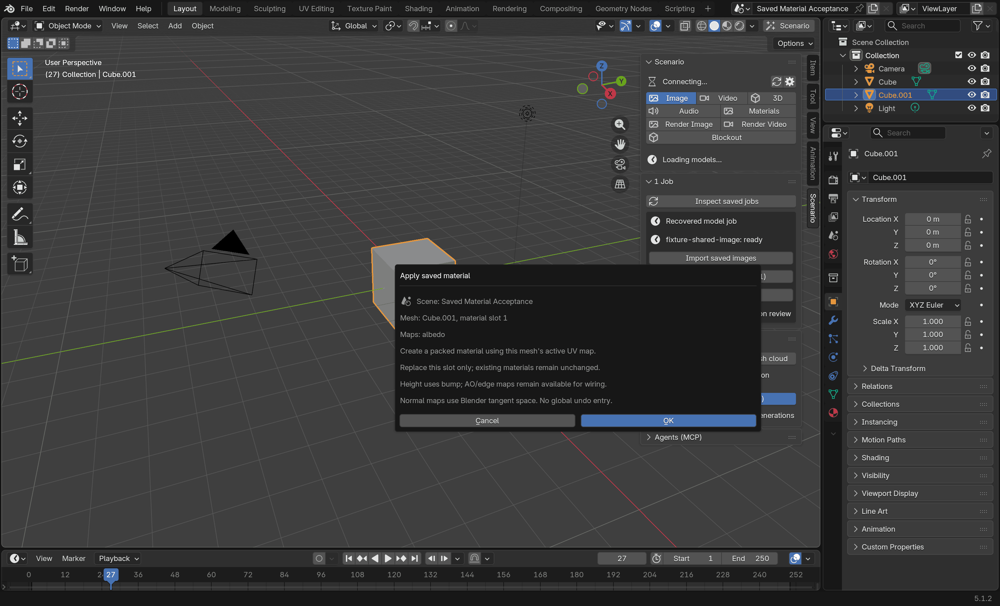

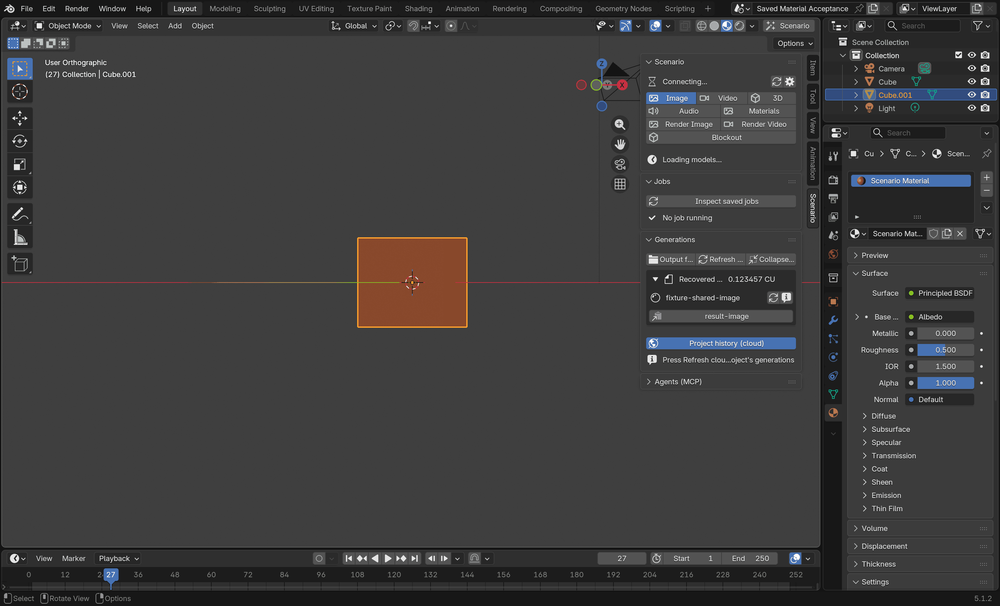

### Audio

For new shared jobs, **Add audio strip (N)** confirms one saved MP3, WAV or OGG
result, the destination scene and current frame. It uses an unused channel,
preserves existing strips and timing, and makes no new service request. The
same size, fresh-approval and local-file requirements as saved video apply.
Select the destination scene in the Sequencer header to inspect the strip.

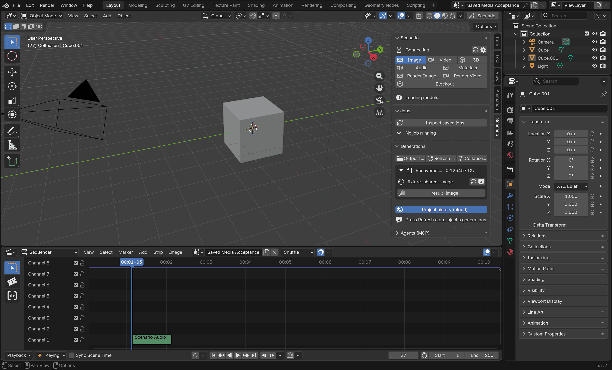

The following playback and preview controls describe retained prototype results.
Speech, music and sound effects: ElevenLabs Music v2, Google Lyria 3, ACE-Step 1.5, Minimax Music 3.0, ElevenLabs 3 (speech), Gemini 3.1 Flash TTS, ElevenLabs Sound Effects 2, Sonilo (text or video to SFX and music), and every other text-to-audio, audio-to-audio or video-to-audio model through the picker. Results go to `audio/<date>/` in the output folder; in Generations, **Play** opens them with the system player and **Add to sequencer** drops a sound strip at the current frame on a free channel.

For a downloaded result, **Preview waveform** shows a local snapshot without
playing or submitting anything. Select another result to replace the preview;
**Cancel** stops a loading preview without changing the file or the Play/Add
actions. The preview scales with the sidebar and shows separate channels for
stereo audio. Select Preview again to capture a file that changed on disk.
Loading times out after 30 seconds. Try another file after a timeout. If the error
says readers remain occupied, retry when the storage responds or restart Blender;
Cancel cannot interrupt a stuck operating-system file read.

Preview supports uncompressed integer PCM WAV: 8, 16, 24 or 32-bit mono/stereo,
up to 32 MiB, ten million frames, ten minutes and 192 kHz. Missing, corrupt,
compressed or unsupported audio shows an error; Play and Add remain available
for formats supported by their respective players.

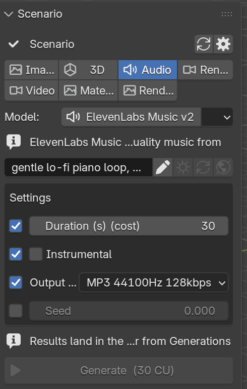

*Audio lane: ElevenLabs Music v2, 30 s, quoted before generating.*

### Render Image

Agents can prepare these same render forms with the local MCP `render_form`
tool, then obtain and approve an exact render price. See the
[agent preparation sequence](MCP.md#preparing-render-image-and-render-video).

Your view, rendered as a finished still by an image edit model. Everything that shapes the look lives in the **Rendering Style** section (always open): the look prompt, the Prompt Spark options and the style images (the capture is image 1).

- **Scene to render**: choose Viewport or Scene camera and optional Grey clay capture, then **Capture and upload scene**. Wait for the uploaded snapshot before reviewing its generation price. Remove the reference to capture a new view; later scene edits do not change the uploaded image.
- **Model**: GPT Image 2 by default, then Gemini 3.1, Seedream 5.0 Pro, FLUX 2 (Max / Pro), Reve Remix, Qwen Edit 2511, MAI Image 2.5 Pro Edit, Grok Imagine Image 2.0, Z-Image; any other img2img model through the picker. Inputs and parameters that belong to another use of the model (Gemini's video input and frame rate) are hidden.
- **Look**: describe the result, for example "weathered steampunk copper, overcast light". An empty look uses the photoreal default when **Prepare look with Prompt Spark** is off. With it enabled, finish uploading the scene and style images to request a separate Spark price. Approve that quote to prepare the look, then review and approve the render's own price. **New** requests a fresh look price after edits or a preparation error; inspect any uncertain saved job first.
- **Style images**: optional references for palette, materials and lighting. The capture is always image 1.
- The prompt the model receives states the role of every input: image 1 is the exact scene (every object, its position, the camera, the framing and the perspective are frozen; nothing may be added, moved or removed), the other images are look references only and none of their content may appear. The shared job saves verified results for explicit application; automatic Render Image-to-Video result handoff remains separate integration.

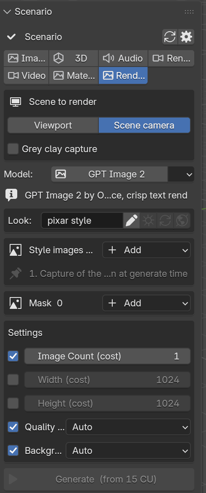

*Earlier Render Image layout. The current form uses Capture and upload scene; the uploaded scene remains image 1 and style images follow.*

### Render Video
A playblast of your timeline, rendered as a finished clip by a video model that takes a reference video. The look, the style images (reference frames) and the video first frame live in the **Rendering Style** section (always open); the model's own first/last-frame inputs are handled there, so only the reference frames are offered.

- **Clip to render**: choose Viewport or Scene camera, build any camera path, review the displayed preview/scene range, then **Capture and upload scene**. The silent 1280x720 clip uses that range without implicit padding or trimming. Match timeline links duration settings; it does not alter an uploaded snapshot.
- **Camera path**: the planner works with editable markers. Type the shot you want ("slow ellipse 2, 8 s, 35mm") and press **Plan**, or pick a move from the library: Orbits (orbit, orbit high, orbit low, spiral in), Ellipses (three variants), Dolly & truck (dolly in / out, truck left / right, pedestal up / down, zoom in), Crane & arcs (crane, arc left / right, top down), Other (pan, flyover). **Place markers** turns the move into numbered `Shot` markers around the subject (small cameras; move them, or select one to set its own focal length and hold time). End a description with "hold 2 s", "pause 2" or "stay for 3 seconds" to pause on arrival. Select a Shot marker to edit its **Hold at Shot N (s)** field. You can also add markers yourself with **At cursor** and **From view**. Set **Duration (s)**, **Focal (mm)** and the **Start frame**; the resulting frame range is shown. **Closed loop** (on for orbits and ellipses) brings the camera back exactly to its first marker. **Build camera path** creates the `Scenario Shot Camera`, keyframes it through the markers, aims it at the subject and sets the frame range; building over an existing path asks first. **Clear path** removes the camera, target and markers. **Preview** plays it in camera view. Camera clip then records exactly that move.
- **Model**: Seedance 2.0, Minimax H3, Seedance 2.5 and Mini, Runway Aleph 2, Happy Horse Video Edit, Gemini Omni Edit, Grok Edit Video first; every other video2video model through the picker. These models accept the video plus images, often many.
- **Look**: as in Render Image. Enter a look, or disable automatic Spark to use the photoreal default.
- **First frame**: choose an image with the file field or its folder picker, then choose **Upload first frame**. The field is visible even before an image is selected. Once uploaded, it is sent to the model's first-frame input (or first image in its image-reference array). Disabling or clearing the chosen first frame omits it from the request and preserves the upload for inspection. Choosing a different path requires removing the old slot and uploading again. Shared result-to-first-frame handoff remains separate integration.
- **Style images**: extra look references.
- Prompt Spark look preparation requires an enabled, uploaded first-frame image. It uses that first frame and uploaded style images, never the video asset as an image. Without a first frame, enter a look yourself or disable Spark to use the photoreal default.
- The prompt names the playblast as the exact scene, camera move and timing to reproduce, the first frame as the look to match through the whole clip, and the other images as style only (with `@video1` / `@image1` tags for Seedance, plain words for the others).

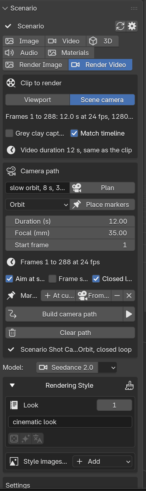

*Earlier Render Video layout. Current forms require explicit scene/first-frame uploads; automatic Spark preparation remains unavailable.*

### Blockout

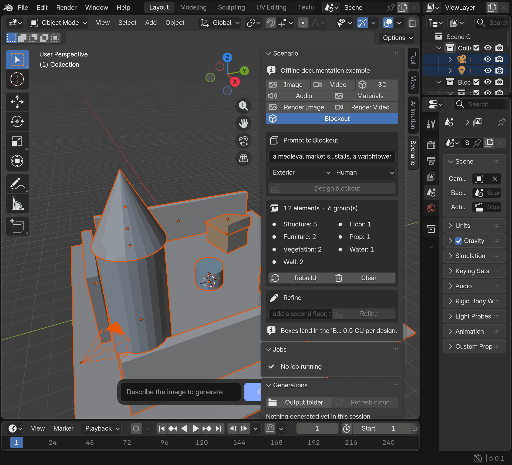

*Earlier layout with a stored sample plan. Current controls separate price, generation and local building as described below.*

Turn a scene description into a greybox layout made of coloured primitives in a
`Blockout` collection, grouped by the generated plan.

1. Choose **Blockout** in the Scenario sidebar. Describe the scene and choose its
   **Type** and **Scale**, then press **Get design price**. This requests a quote
   without generating a plan or changing geometry.
2. Review the exact quoted cost and choose **Generate plan**. Changing the fields,
   previous plan, scene or credentials invalidates the approval. One durable job
   is saved before submission; an uncertain response is never retried automatically.
3. A complete result updates the unchanged original scene's stored plan. Choose
   **Build plan** to create the geometry locally. To refine it, describe the change,
   choose **Get refinement price**, approve that separate quote, then build the
   resulting plan when ready.
4. **Clear** asks for confirmation before removing this scene's generated
   collection and stored plan. Build and Clear support native Blender undo.

The stored plan uses boxes, cylinders, planes, wedges, cones and spheres.
Groups become subcollections; category colours distinguish Floor, Wall, Structure,
Prop, Furniture, Vegetation, Vehicle, Water, Light and Other. The summary shows
element/group counts and category counts. You can use generated 3D assets to
replace individual blocks as your scene develops.

Only **Build plan** replaces this scene's generated collection. Creation is
staged before the previous build is removed; another scene's collection or an
unrelated collection with the same name is preserved. Shared collections or
unrelated objects added to a generated collection block rebuilding/clearing until
you preserve them elsewhere. Manual edits to generated objects are not written
back to the stored plan and will be replaced on an explicit rebuild.

After an uncertain submission or read failure, use **Inspect saved jobs**. Do not
repeat generation to recover a completed result. Local MCP `read_model_text` can
retrieve the full saved output after restart without applying it to another
scene. For native recovery, select the destination scene, inspect saved jobs and
choose **Read saved Blockout plan**. When reading finishes, choose **Use saved
Blockout plan**. The dialog names the destination, shows the element/group counts
and warns when its existing stored plan will be replaced. Cancel preserves the
old plan; confirming changes only the stored plan. Blender's **Edit > Undo** and
**Edit > Redo** restore or reapply that stored-plan change. Use **Build plan**
separately to update geometry. If you change scenes or edit the destination during
review, read and review it again. Recovery reads never generate another plan.

### Generations
This session's results appear first, followed by cloud history with prompt, kind,
price, status and asset identity. **Load older** pages back in time.

For a job saved by this extension's shared runtime, choose **Inspect saved jobs**.
Use its explicit recovery controls to resume a download, then review the selected
destination before applying a result. This also works after restarting Blender.
Opening the saved job does not generate again, resume an inactive download or
import into the current scene. An older cached copy cannot bypass its result approval.

For a completed cloud model job without a saved record, choose **Save for
recovery**. This reads the job into local saved history without downloading files
or changing your scene. Then use **Inspect saved jobs**, resume its download and
review the result destination before applying. Repeated reads preserve the same
record. A read error permits another read, never another paid generation.
Cloud recovery does not recover an original mesh-edit target from another session.
Native desktop interaction and live provider acceptance remain separate checks.

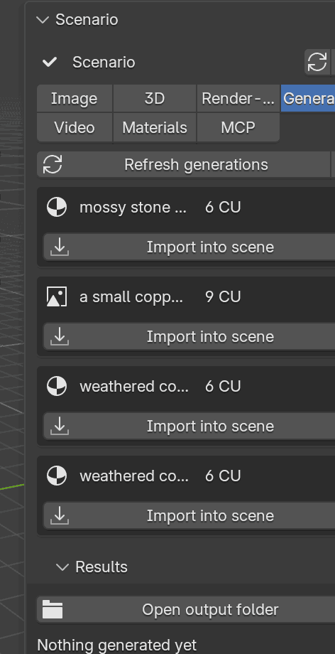

### Agents (MCP)
The local `scenario-blender` server connects agents to the open scene and
generation into it. The hosted `mcp.scenario.com` server provides platform-wide
collections, training, workflows and usage; connect both when needed.

Copy the client setup from the Agents panel. The copied snippet contains the
live session bearer token; keep it out of screenshots, shared logs and source
control. **Allow connected agents to run
Python** is off by default; other authorized scene and generation actions remain
available. The [MCP reference](MCP.md) documents tools, complete client examples,
headless setup, token handling and the security model.
For headless use, run `blender --background scene.blend --command scenario_blender`;
see the reference for token configuration and online-access requirements.

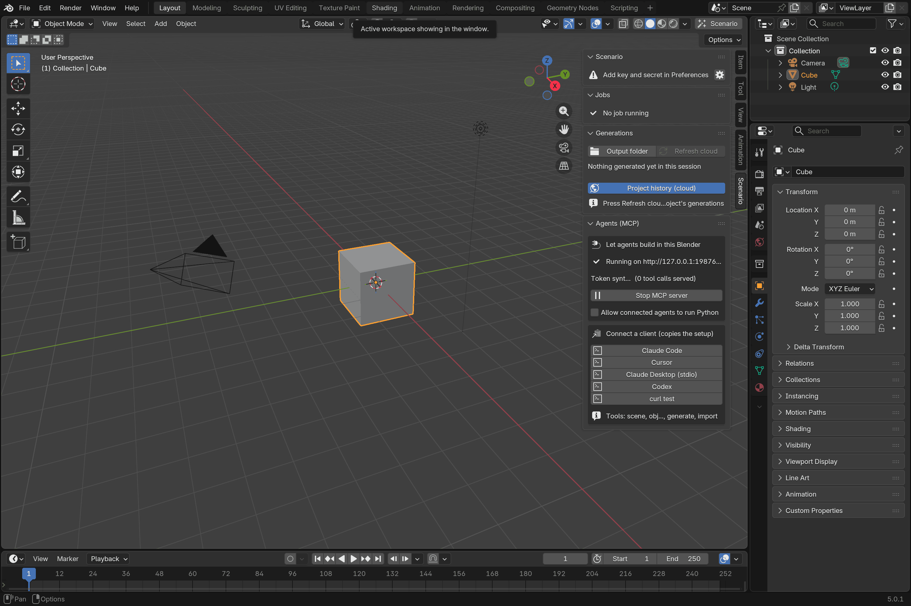

## Apply a saved panorama to World

For a saved PNG or EXR result, choose **Set panorama as World (N)**.
Confirm the scene and current World. The image must be a supported 2:1 panorama;
Blender uses it as an equirectangular environment, packs it and keeps the original
World untouched. PNG is LDR. EXR can store HDR, but its format alone says nothing
about the actual range or seamless edges. An ordinary nonpanoramic image reports
a local error and leaves the original World in place.

After success, **Restore previous World** offers a separate confirmation in the
same session. Edited/replaced World or image data prevents restoration so your
changes are preserved. Save the blend file yourself. A restart or file load loses
this restore action; retained Worlds can still be selected manually in Blender.
Neither application nor restoration regenerates the image or spends credits.

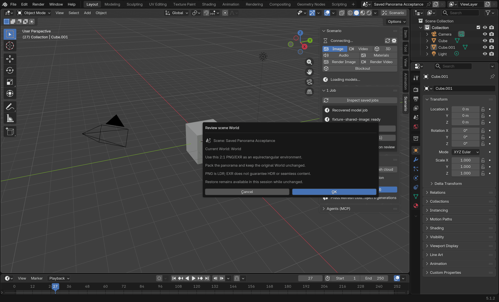

Already imported images can use this action through a fresh local approval.
After repeated World assignments from the same job, restoration covers only its
most recent assignment in the current session.

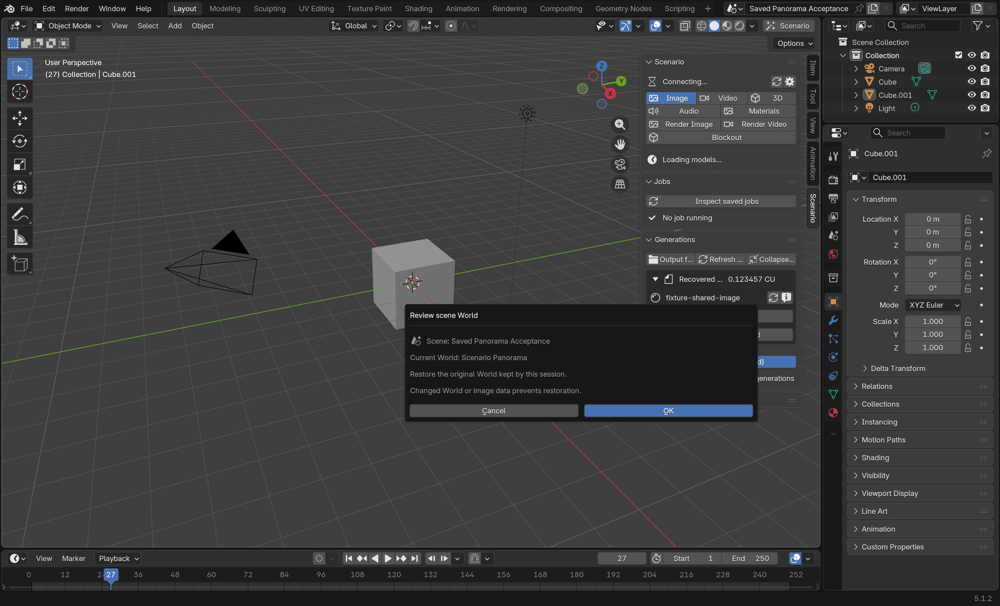

## Reuse saved results

Completed shared jobs offer **Reuse saved results** in their saved-job controls.
Choose another image import, supported media/model import, World assignment or
material assignment. Each action reviews the current destination again and uses
verified saved files without another generation or credit spend. For example,
an automatically imported image with an albedo role can become a material on a
selected UV mesh; a supported 2:1 image can become a World.

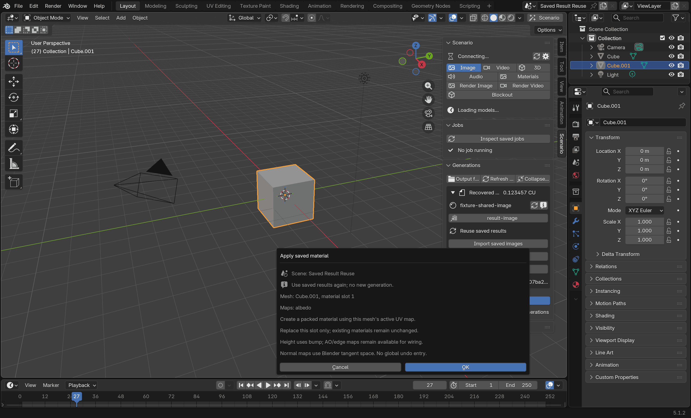

The original generation stays completed. Each reuse has a separate saved outcome.
A changed destination or competing approval requires a new review. If Blender
cannot confirm whether scene changes finished, inspect the scene; the job blocks
further reuse. **Save import receipt** records a known outcome without importing
again. There is no automatic reset after restart and no global undo entry.
A job retains up to 128 reuse attempts, including confirmed failures; reaching
that limit disables additional reuse without discarding the history.

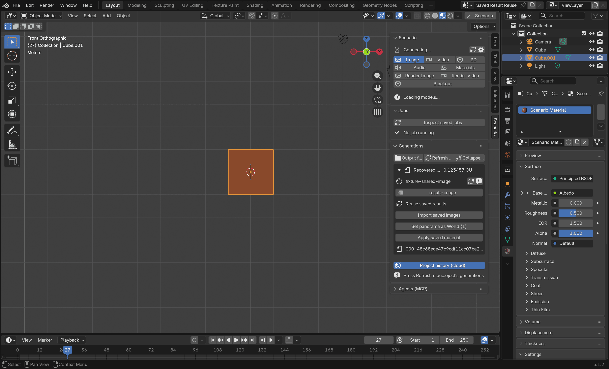

## The floating composer

The pill at the bottom of the viewport shows the current prompt in a field and a Generate button, in the same style as the expanded card. Drag it anywhere in the viewport; a click without moving expands it. The expanded card moves the same way (drag its background), resizes from the grip in its bottom-right corner, and a double-click on its background puts it back in place; the position is remembered in the preferences. Click the pill to expand: lane tabs (Image, Video, 3D, Materials, Render Image, Render Video), the prompt, the model chip (opens the model picker), a **Settings** chip (opens a dialog with the lane's full form: model, prompt, references, parameters) and Generate with the price. Audio, the 3D Edit mode and Blockout live in the sidebar. The composer is the quick path: it uses the settings of the current lane as they stand in the sidebar or in that dialog. The bottom-right corner resizes the card (a resize cursor appears when the pointer reaches it).

Editing the prompt: click to place the caret, drag or Shift+arrows to select, double-click selects a word, Home/End, Ctrl/Cmd+A selects all, Ctrl/Cmd+C copies, Ctrl/Cmd+X cuts, Ctrl/Cmd+V pastes, typing replaces the selection, Enter generates, Esc leaves. The minus button in the top-right corner collapses the card; clicking outside also does. If drawing ever fails repeatedly the composer switches itself off; re-enable it in Preferences (Floating composer in the viewport).

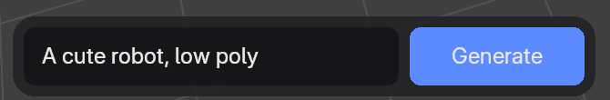

*Collapsed: the same field and button, ready for the next prompt.*

## Costs

Prices are in Creative Units (CU) and depend on the model, parameters and
references. Read the current estimate instead of relying on prices in screenshots.
A **Generate (N CU)** quote describes the current form; **from N CU** excludes
references that have not been uploaded. **Price shown after the upload** means
required mesh or capture inputs are still missing from the estimate. Prompt
helpers and Blockout design/refinement are separate paid operations. An empty
Render Image/Video look with automatic Spark enabled requires its own displayed
price and approval, then guarded look delivery before the render price. Disable
that option to use the photoreal default without a Spark request. See the [known limitations](KNOWN_LIMITATIONS.md) for current spend
confirmation and shared-runtime boundaries.

## Troubleshooting

- **"Loading models..." does not end**: check the key and secret in Preferences (Test connection), and Blender's Allow Online Access. A Retry button appears when the catalog request failed.
- **"Prompt is required" / "Add a reference to see the cost"**: the quote needs a valid form; fill the prompt or add the required reference.
- **"Select the mesh to edit" / "Price shown after the upload"**: the 3D tab in Edit mode needs a mesh object selected (or active) in the viewport.
- **"This model takes no image/video input"**: the picked model cannot receive the capture; choose another one in the Render lane.
- **The result does not appear**: open Generations. A job that failed shows a warning marker and the reason; Details lists the download errors; use Import into scene to fetch it again. After installing an update, restart Blender so the new version loads.
- **A 3D model looks untextured**: switch the viewport to Material Preview (the add-on does this on import), and check Details for the imported file name.
- **The rendered image moved things around**: the prompt already freezes the layout; give the model a cleaner capture (Grey clay capture, a camera view rather than a wide viewport) and fewer style images, and keep the look description about materials and light, not about content.
- **The sidebar and the dialogs do not look like the composer**: they are drawn by Blender with your Blender theme; the composer is custom drawing. Their layout follows the composer (tabs, chips, header rows) but their colours are the theme's.
- **Where are the logs**: Blender's system console (Window > Toggle System Console on Windows, the terminal on macOS/Linux), messages are prefixed `scenario`.
- **None of this helps**: see [Support](https://github.com/scenario-labs/blender-plugin/blob/main/SUPPORT.md) for where to ask and what to include.

## What leaves your machine

With online access and credentials enabled, cost previews send your prompt and
parameters to `https://api.cloud.scenario.com` while you edit, before Generate.
Generating or using prompt helpers can send reference files, captures and exported
meshes and spend credits. Catalogs and thumbnails load from Scenario; cloud history
loads when requested. Saved credentials, prompts, job state and media remain on
your machine. A connected local agent can read the scene and request paid work.
See [Privacy and data handling](PRIVACY.md) for destinations, storage, clipboard use
and the current limits of online-access and agent controls.

## Files and folders

- Results: your Output Folder (`~/Downloads/Scenario` by default), `<kind>/<YYYYMMDD>/<date>_<model>_<asset id>_<n>.<ext>`.
- Captures, Prompt Spark stills and Edit 3D exports: the extension cache (`captures/`, `exports/` under Blender's extension user directory), thumbnails of models in `thumbs/`.
- Job registry, recent models and model cache: the extension's own user directory under Blender's extensions folder; delete it yourself for a clean removal.
- Your key: saved as plain text in Blender's `userpref.blend` preferences file. Select Credentials > Environment to use `SCENARIO_API_KEY` and `SCENARIO_API_SECRET` instead; switching sources does not erase saved values. Clear both saved fields and save preferences to remove them; rotate the key in Scenario if it leaks.

## Known limits

See [known limitations](KNOWN_LIMITATIONS.md) for current runtime, authentication, interface and verification boundaries. The [architecture map](architecture/runtime.md) distinguishes existing components from unfinished UI/MCP integration.

## Licence

Scenario for Blender's first-party extension code is free software under the
GNU General Public License, version 3 or (at your option) any later version
(GPL-3.0-or-later), without any warranty. The full text is in
[LICENSE](https://github.com/scenario-labs/blender-plugin/blob/main/LICENSE).
Bundled dependencies, adopted sources and assets retain their original licences
and notices; see the [repository licence notice](https://github.com/scenario-labs/blender-plugin#licence).

Blender is a registered trademark of the Blender Foundation. Scenario for Blender is an independent extension, not published by or affiliated with the Blender Foundation. Trademark notes: https://github.com/scenario-labs/blender-plugin/blob/main/TRADEMARKS.md

## Apply a saved mesh edit

Select a local mesh in Object Mode, inspect the shared saved job, then choose
**Apply mesh edit (N)** for one GLB result. Check the named scene, mesh and saved
result before confirming. **Replace geometry** replaces geometry, UVs and mesh
materials; **Replace active UVs** requires exactly matching indexed topology and
positions. **Replace textures** keeps geometry and non-UV attributes while
replacing all UV layers and mesh materials from the saved GLB. It also requires
exactly matching indexed topology and positions; incompatible results leave the
source intact. These three policies require a single static mesh.
**Replace with parts** accepts 2 to 128 static meshes in one GLB and replaces
the source geometry with an empty mesh parent containing named child parts.
Choose the segmented artifact: every mesh in that GLB becomes a part, including
any variants or helpers it contains. Rigs and animation remain unsupported.
Existing source children remain in place. For further editing or mesh export,
select a child part or the retained original; the empty parent has no surface
geometry and cannot receive another parts group.

**Attach rig** keeps the source geometry, UVs, materials and other supported mesh
attributes, then adds matching bone weights and the returned armature with its
animation clips. It requires one mesh/rig, exactly matching indexed geometry and
normalized weights. It rejects morphs, mesh animation, constraints and additional
modifiers. The source must be unrigged. The new named rig group shares the
source's existing parent; move that group and source together afterward. Clips
use the scene frame rate without changing the current frame or playback range.
This does not retarget an existing rig or automatically match different vertices.

Choose **Scene coordinates** to keep the imported result's scene positions, or
**Object local coordinates** to interpret those positions in the source's local
axes. The extension does not fit or realign the result automatically. It preserves
the source object's name, transforms, parenting and collections. **Keep original**
is enabled by default and leaves an unselected copy. In desktop Blender, Undo and
Redo restore the scene before and after this edit when Global Undo is enabled
with at least two steps. Blender's history limits still apply. Undo does not
reverse a generation charge or reset the saved job; Redo does not generate again.
Save the blend file to preserve your work across restart.

Changing the source or scene invalidates approval; cancel and review again.
Application uses the saved file without another generation. Completed jobs get a
separate local application record. An uncertain application must be inspected,
never repeated blindly; a pending success receipt can be saved without applying
again. This local workflow does not establish provider alignment or complete the
Edit 3D generation workflow.

## Film tasks

Expand **Film** in the Scenario sidebar to load a validated JSON recipe,
associate saved uploads and estimate/approve individual model tasks. Save the
blend file to retain the recipe and production identity. Reloading a recipe keeps
that identity; another take needs another task name. **New production** starts a
deliberately separate production while retaining old jobs.

Each model task requires its own exact price and separate Generate confirmation.
Results remain in saved jobs for explicit application. Opening the panel or
inspecting a recipe never resumes uncertain work. See [Film task controls](FILM_PLAN.md#native-and-mcp-task-controls)
for the equivalent MCP commands and recovery boundaries.

Under **Shots**, select a recipe shot and choose **Prepare shot** to select and
verify its saved hero models. After verification, **Build shot** asks for separate
approval before creating a new scene; the working scene stays selected. Neither
action generates or downloads anything. Discard unapproved reviews, save known
build receipts, or explicitly acknowledge inspection when an outcome is uncertain.
Unresolved saved claims remain blocked. Full errors are available through
**Shot error details**. See [shot controls](FILM_PLAN.md#native-and-mcp-shot-controls).
Synthetic desktop checks on macOS Blender 5.1.2 cover these shot controls and
Undo/Redo; see [the interaction evidence](UI_STYLE.md#film-shot-controls). Live
provider, other OS/DPI and integrated release acceptance remain separate.

Under **Timeline**, **Build timeline** lets you choose a completed local scene
for every shot and confirm the frame count/rate. It creates a new editable
sequence and keeps the working scene selected. The strips reference those scenes;
later edits to a shot affect the sequence. Save the blend file. A partial build
must be inspected before dismissing its review; dismissal never deletes data.
See [timeline approval](FILM_PLAN.md#editable-timeline-approval) for MCP equivalents.
To inspect the result, select the new timeline scene in the Video Sequencer's
scene selector. Synthetic desktop selection, cancellation and Undo/Redo pass on
macOS Blender 5.1.2; see [the evidence and limits](UI_STYLE.md#film-timeline-controls).

Under **Capture**, **Render capture** asks you to choose a completed local scene,
still/video, colors and size for the selected shot. Stills capture its first frame;
silent clips use its editorial range without padding. Video requires installed
ffmpeg and ffprobe. You can close the panel while it renders.

Use **Open capture** to review the output, then **Upload capture** to confirm
sending those exact bytes to your selected Scenario connection. After import,
select a Film upload task and choose **Use saved upload**. Each later
generation still needs its own price and approval. Inspect uncertain uploads
instead of submitting them again.

**Cancel capture** stops local rendering and retains completed frames.
**Open capture files** shows its diagnostics. **Discard capture** deletes its
private local files after work stops, preserving saved uploads. Capture files
also expire when the session shuts down; upload the desired output or copy it
elsewhere before that. Captures do not resume automatically after restart.
See [capture approval](FILM_PLAN.md#shared-capture-and-upload-approval) for limits
and MCP equivalents. Local final assembly and Film export remain unavailable.
Desktop still capture, approval cancellation, synthetic upload and cleanup pass
on macOS Blender 5.1.2; see [the evidence and limits](UI_STYLE.md#film-capture-controls).
Live uploads, desktop video cancellation, other OS/DPI and integrated release
acceptance remain separate.

**Film > Composition** prepares a final or previs master from saved source media.
Choose **Prepare composition**, wait for verification, then **Request price**.
Review the separate **Generate** confirmation and its exact CU price. The master
is saved as a job; your recipe and Blender scene remain unchanged. Missing saved
media or `ffprobe` stops preparation. Cancel stops inspection or discards a pending
price; discarding a review keeps saved media and jobs. After an error or restart,
use **Inspect saved jobs** instead of repeating an uncertain generation. See
[composition controls](FILM_PLAN.md#native-and-mcp-composition-controls) for MCP,
source requirements and acceptance limits. Synthetic desktop interaction passes
on macOS Blender 5.1.2; live provider and other OS/DPI acceptance remain pending.
